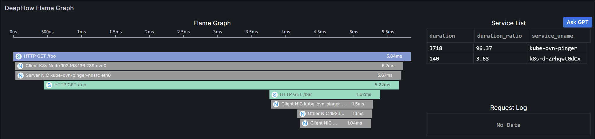
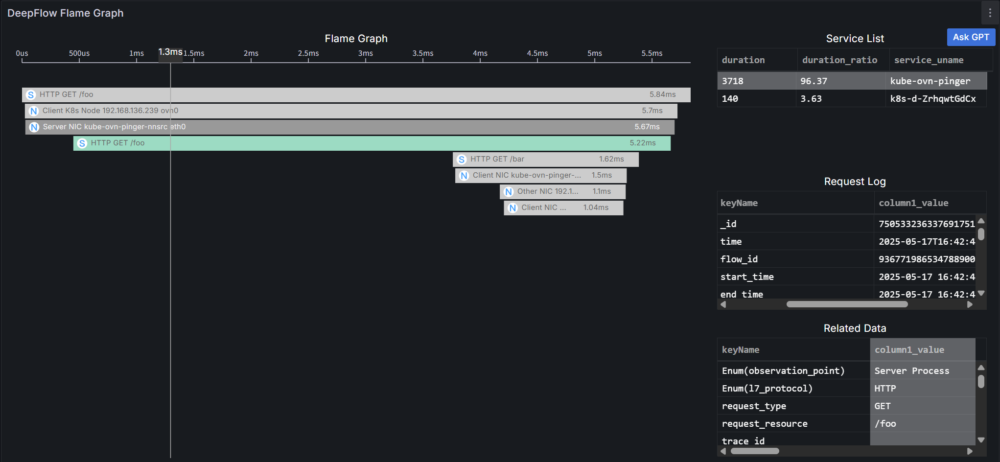

# Alauda Observability with DeepFlow

## Overview

This guide provides the installation and deployment process of DeepFlow on Alauda Container Platform(ACP), and thoroughly explain how to leverage DeepFlow's powerful tracing, metrics, and logging capabilities to achieve comprehensive observability for the ACP platform and its running applications. By following this guide, readers will master best practices for DeepFlow within the ACP environment, thereby significantly enhancing operational efficiency and ensuring business continuity.

> NOTICE: All the commands mentioned in this document MUST be executed in a master node of the cluster where you want to install DeepFlow.

## Prerequisites

1. Alauda Container Platform installed.
2. Kubernetes Cluster managed by ACP.
3. A Network File System(NFS) is Provisioned for ACP. 

## Chapter 1. Installation Deepflow

### Step 1: Download Packaging Tool

The packaging and listing tool called `violet` is used to upload artifacts to the Alauda Container Platform.

Alauda Container Platform provides a download link in form of *<PLATFORM_URL>/platform/tools/download/violet/violet_linux_amd64*.

Assuming the ACP platform URL is *https://43.138.134.22*, the download link is *https://43.138.134.22/platform/tools/download/violet/violet_linux_amd64*. You execute the following command to download the tool:

```shell
curl -k -O https://43.138.134.22/platform/tools/download/violet/violet_linux_amd64
```

Then you need to execute the following commands to make the binary executable:

```shell
mv violet_linux_amd64 /usr/local/bin/violet
chmod +x /usr/local/bin/violet
```

Execute command `violet version` to check whether the tool works as expected. Here is an example:

```shell
[root@master01 ~]# violet version
violet v3.0.0
```

### Step 2: Uploading Artifacts

There are two artifacts required. One is for DeepFlow, and the other is for NFS CSI plugin. In this example, their file names are `deepflow-v3.19.0-fix.49.27.gb547cdc5-dbs.tgz` and `nfs.amd64.v4.0.2.tgz`.

Upload the files to the node where you are working on, then execute the following command to upload the artifacts:

```shell
# the following variable values MUST be set according to your actual environment
PLATFORM_URL="https://43.138.134.22"
USERNAME="admin@cpaas.io"
PASSWORD="07Apples@"

violet push --platform-address $PLATFORM_URL --platform-username $USERNAME --platform-password $PASSWORD nfs.amd64.v4.0.2.tgz
violet push --platform-address $PLATFORM_URL --platform-username $USERNAME --platform-password $PASSWORD deepflow-v3.19.0-fix.49.27.gb547cdc5-dbs.tgz
```

### Step 3: Installing NFS CSI Plugin

Execute the following command to install NFS CSI plugin:

```shell
# optional environment variable
export KUBECONFIG="/etc/kubernetes/admin.conf"

# install NFS CSI plugin
cat <<EOF | kubectl apply -f -
apiVersion: cluster.alauda.io/v1alpha1
kind: ClusterPluginInstance
metadata:
  annotations:
    cpaas.io/display-name: nfs
  labels:
    create-by: cluster-transformer
    manage-delete-by: cluster-transformer
    manage-update-by: cluster-transformer
  name: nfs
spec:
  pluginName: nfs
EOF

# wait for ars to be created
while true; do
  if kubectl -n cpaas-system get ars -o name | grep -w nfs >/dev/null; then
    break
  fi
  echo "Waiting for ars/nfs to be created..."
  sleep 3
done

# wait for the NFS CSI plugin to be ready
kubectl -n cpaas-system wait --for=condition=Health=true ars/nfs
```

### Step 4: Creating NFS Storage Class

Create a storage class named `nfs`:

```shell
# optional environment variable
export KUBECONFIG="/etc/kubernetes/admin.conf"

# the following variable values MUST be set according to your actual external NFS server
NFS_SERVER="10.100.0.4" # NFS server address
NFS_PATH="/nfs"         # NFS share path

# create storage class
cat <<EOF | kubectl apply -f -
apiVersion: storage.k8s.io/v1
kind: StorageClass
metadata:
  labels:
    project.cpaas.io/ALL_ALL: "true"
    project.cpaas.io/name: ""
  name: "nfs"
mountOptions:
  - hard
  - nfsvers=4.1
parameters:
  server: "${NFS_SERVER}"
  share: "${NFS_PATH}"
provisioner: nfs.csi.k8s.io
reclaimPolicy: Delete
volumeBindingMode: Immediate
EOF
```

### Step 5: Installing DeepFlow

Execute the following commands to install DeepFlow:

```shell
# optional environment variable
export KUBECONFIG="/etc/kubernetes/admin.conf"

# DeepFlow chart version
VERSION="v3.19.0-fix.49.27.gb547cdc5-dbs"
# name of the cluster where you are installing DeepFlow
CLUSTER_NAME="clsuter1"
# initial username/password of the DeepFlow Grafana web UI
USERNAME="admin"
PASSWORD="deepflow"
# storage class name
SC_NAME="nfs"
# storage size used by MySQL
MYSQL_PVC_SIZE="50Gi"
# storage size used by ClickHouse
CK_PATH_PVC_SIZE="100Gi"
CK_STORAGE_PATH_PVC_SIZE="200Gi"

cat <<EOF | kubectl apply -f -
apiVersion: app.k8s.io/v1beta1
kind: Application
metadata:
  name: deepflow
  namespace: cpaas-system
  annotations:
    app.cpaas.io/chart.source: public-charts/deepflow-plugin
    app.cpaas.io/chart.version: ${VERSION}
    app.cpaas.io/chart.values: |
      {
        "global": {
          "storageClass": "${SC_NAME}"
        },
        "server": {
          "service": {
            "type": "ClusterIP"
          }
        },
        "deepflow-agent": {
          "clusterNAME": "${CLUSTER_NAME}"
        },
        "grafana": {
          "adminUser": "${USERNAME}",
          "adminPassword": "${PASSWORD}",
          "service": {
            "type": "ClusterIP"
          },
          "grafana.ini": {
            "server": {
              "root_url": "%(protocol)s://%(domain)s/clusters/${CLUSTER_NAME}/deepflow",
              "serve_from_sub_path": true
            }
          }
        },
        "mysql": {
          "storageConfig": {
            "persistence": {
              "size": "${MYSQL_STORAGE_SIZE}"
            }
          }
        },
        "clickhouse": {
          "storageConfig": {
            "persistence": [
              {
                "accessModes": [
                  "ReadWriteOnce"
                ],
                "name": "clickhouse-path",
                "size": "${CK_PATH_PVC_SIZE}",
                "storageClass": "{{ .Values.global.storageClass }}"
              },
              {
                "accessModes": [
                  "ReadWriteOnce"
                ],
                "name": "clickhouse-storage-path",
                "size": "${CK_STORAGE_PATH_PVC_SIZE}",
                "storageClass": "{{ .Values.global.storageClass }}"
              }
            ]
          }
        }
      }
    cpaas.io/display-name: 'DeepFlow'
  labels:
    sync-from-helmrequest: 'true'
EOF

# wait for DeepFlow to be ready
# this step may take several minutes
kubectl -n cpaas-system wait --for=jsonpath='{.spec.assemblyPhase}'=Succeeded application deepflow
kubectl -n cpaas-system rollout status statefulset deepflow-clickhouse
kubectl -n cpaas-system rollout status deployment deepflow-mysql
kubectl -n cpaas-system rollout status deployment deepflow-server
kubectl -n cpaas-system rollout status deployment deepflow-app
kubectl -n cpaas-system rollout status deployment deepflow-grafana
kubectl -n cpaas-system rollout status daemonset deepflow-agent

# configure ingress for DeepFlow Grafana web UI
cat <<EOF | kubectl apply -f -
apiVersion: networking.k8s.io/v1
kind: Ingress
metadata:
  annotations:
    nginx.ingress.kubernetes.io/backend-protocol: http
    nginx.ingress.kubernetes.io/enable-cors: "true"
  name: deepflow-grafana
  namespace: cpaas-system
spec:
  ingressClassName: cpaas-system
  rules:
  - http:
      paths:
      - backend:
          service:
            name: deepflow-grafana
            port:
              number: 80
        path: /clusters/${CLUSTER_NAME}/deepflow($|/)(.*)
        pathType: ImplementationSpecific
EOF
```

> In the example above, DeepFlow requires a total 350Gi storage space. You MUST ensure the storage class has enough storage capacity.

## Chapter 2. DeepFlow Usage

### Login to Grafana

DeepFlow dashboards are installed in a Grafana deployment. URL of the Grafana web UI if in format of *<PLATFORM_URL>/clusters/<CLUSTER_NAME>/deepflow*.

Assuming the ACP platform URL is *https://43.138.134.22*, and DeepFlow is installed in cluster *cluster1*, the URL is *https://43.138.134.22/clusters/cluster1/deepflow*.

Visit the Grafana URL in your browser, and you will see a login page:


You can login to Grafana with the username and password specified in step 5. **We strongly recommend that you change Grafana's default password.**

### DeepFlow Dashboards

In the Grafana web UI, enter the **Dashboards** menu:


Enter the DeepFlow Templates folder, and you will see available dashboards:


### Troubleshooting with DeepFlow

Here are two example about how to troubleshoot DNS failure and chained HTTP requests.

#### DNS Failure

If your application is facing DNS failures, you can open the **Distributed Tracing** dashboard:


In the variable selections, choose namespace and workload of your application, and then input domain name; In the time settings, choose the time span you need.

Here is an example:


Click the **Refresh** button, and you can view DNS requests in the **Request List** panel:


The DNS request domain and status are also available:


> *Client Error* means the requested domain does not exist.

#### Chained HTTP requests

Assuming the are two HTTP GET requests chained with HTTP header *X-Request-ID*: Node -> Pod (/foo) -> External (/bar).

In the **Distributed Tracing** dashboard, you can see the request logs:


Click the request log, and you can see a flame graph in the **DeepFlow Flame Graph** panel:



> "S" means the request is captured on the system process side, and "N" means captured on network nic side.

The flame graph shows that:

1. A process on node *192.168.136.239* sent an HTTP GET request with URL */foo* to pod *kube-ovn-pinger-nnsrc*;
2. After receiving the request, pod *kube-ovn-pinger-nnsrc* sent an HTTP GET request with URL to an external server *192.168.152.146*;

Click a span in the flame graph, you can see some more details, including start time, end time and status code:


