# Application High Availability Testing Solution

# 1. Test Environment Preparation

## 1.1 Deployment Architecture


## **1.2 Resource Preparation**

| Resources                    | **DC-A**                                                     | **DC-B**                                                     |
| ---------------------------- | ------------------------------------------------------------ | ------------------------------------------------------------ |
| Workload Clusters Count      | 2                                                            | 2                                                            |
| Node Count                   | 3 matsers +3 workers                                         | 3 matsers +3 workers                                         |
| Node Role Planning           | - Kubernetes Roles (Master/Worker) <br>-Infrastructure Roles (ALB/Istio Gateway/Egress) | - Kubernetes Roles (Master/Worker) <br/>-Infrastructure Roles (ALB/Istio Gateway/Egress) |
| CPU Specification            | 16C                                                          | 16C                                                          |
| Memory Specification         | 32GB                                                         | 32GB                                                         |
| NIC  Specification           | 10Gbps                                                       | 10Gbps                                                       |
| Operating System             | redhat810-enable_security-boot_disable-nopasswd-20250509-v2  | redhat810-enable_security-boot_disable-nopasswd-20250509-v2  |
| Namespace                    | Application namespace：ha-cluster-ns                         | Application namespace：cluster-ns                            |
| Metal LB                     | Matelb Protocol：ARP（L2）<br>IP Address Range：192.168.170.0/24<br>Deployment Specification：deafult | Matelb Protocol：ARP（L2）<br/>IP Address Range：192.168.170.0/24<br/>Deployment Specification：deafult |
| Istio Gateway                | Container Network Mode: 2 Replicas<br>Deployment Specification：1C/1G | Container Network Mode: 2 Replicas<br/>Deployment Specification：1C/1G |
| Sidecar proxy                | Deployment Specification：deafult                            | Deployment Specification：deafult                            |
| East-West Gateway            | Container Network Mode: 2+ Replicas<br>Deployment Specification：2c/2G | Container Network Mode: 2+ Replicas<br/>Deployment Specification：2c/2G |
| Egress gw                    | Near-Source Egress（Local Egress）                           | Near-Source Egress（Local Egress）                           |
| Data Center Network Latency  | <50 ms                                                       | <50 ms                                                       |
| Network Whitelist Activation | Ensure the centralized gateway node can access the database  | Ensure the centralized gateway node can access the database  |
| Load Balancer                | HAproxy                                                      | HAproxy                                                      |

## 1.3 Configuration Description

| Resources                                          | Configuration Information                                    |
| :------------------------------------------------- | :----------------------------------------------------------- |
| DNS                                                | TTL < 5m                                                     |
| GSLB(HAProxy)                                      | With 4 backend servers load balanced in round-robin;<br>Marked as unavailable if 5 consecutive health checks fail. |
| Istio Mesh Circuit Breaking Policy                 | Detects every 10 seconds. If there are 5 consecutive 5XX errors, 100% of the instance will be circuit-broken for 300 seconds. |
| Region Tag Configuration                           | Create DC-A and DC-B region tags;<br>Business clusters c1 and c2 are bound to DC-A, c3 and c4 are bound to DC-B. |
| Create Microservice Applications Based on the Mesh | Sequentially create the application's Deployment, Service, and MicroService resources. |
| ovn Egress                                         | Configure near-source egress.                                |
| Configure Monitoring Dashboard                     | Create ASM Performance Monitoring Dashboard;<br>Create Traffic Metrics Charts. |

# 2. Testing Data Preparation

## 2.1  Create Regions & Configure Regions

**Create Regions**:

- Click "**Regions**" in the left navigation under "**System Settings**" on the Administrator Page.
- On the list page, click the "**Create**" button. On the creation pop-up page, enter "dc-a" in the Name input box, then click the "**Create**" button
- Continue to click the "**Create**" button. Create Region with name "dc-b" through the same step.

**Cluster Region Configuration**:

- Click "**Clusters"** in the left navigation under "Clusters" on the Administrator Page.
- Click the first cluster "dbs-dca-c1" to access its details page. Click the "**Set Region**" button, select "dc-a", and click the "**Settings**" button.
- Click the second cluster "dbs-dca-c2" to access its details page. Click the "**Set Region**" button, select "dc-a", and click the "**Settings**" button.
- Click the third cluster "dbs-dca-c3" to access its details page. Click the "**Set Region**" button, select "dc-b", and click the "**Settings**" button.
- Click the fourth cluster "dbs-dca-c4" to access its details page. Click the "**Set Region**" button, select "dc-b", and click the "**Settings**" button.


## 2.2 Create Testing Services

### Step 1. Create Deployment

```bash
#!/bin/bash
 
set -euo pipefail  # More Secure Mode of Script Execution
 
# Define Variables
project="ha-cluster"                            # Project name (generally no need to change).
namespace="ha-cluster-ns"                       # Namespace name (generally no need to change).
registry="152-231-registry.alauda.cn:60070"     # Needs to be consistent with the environment.
services=("service-a" "service-b" "service-c")  # Define service list (generally no need to change)
 
# General Deployment Template Function
generate_deployment() {
  local service_name=$1
  cat <<EOF
apiVersion: apps/v1
kind: Deployment
metadata:
  annotations:
    cpaas.io/creator: admin@cpaas.io
    cpaas.io/display-name: ""
    cpaas.io/operator: admin@cpaas.io
  labels:
    asm.cpaas.io/msname: ${service_name}
  name: ${service_name}
  namespace: ${namespace}
spec:
  progressDeadlineSeconds: 600
  replicas: 2
  revisionHistoryLimit: 10
  selector:
    matchLabels:
      project.cpaas.io/name: ${project}
      service.cpaas.io/name: deployment-${service_name}
  strategy:
    rollingUpdate:
      maxSurge: 1
      maxUnavailable: 1
    type: RollingUpdate
  template:
    metadata:
      labels:
        project.cpaas.io/name: ${project}
        service.cpaas.io/name: deployment-${service_name}
    spec:
      affinity:
        podAntiAffinity:
          requiredDuringSchedulingIgnoredDuringExecution:
          - labelSelector:
              matchExpressions:
              - key: service.cpaas.io/name
                operator: In
                values:
                - deployment-${service_name}
            topologyKey: "kubernetes.io/hostname"
      containers:
        - command:
            - http-server
          image: ${registry}/asm/asm-test-image:latest
          imagePullPolicy: Always
          name: ${service_name}
          resources:
            limits:
              cpu: "1"
              memory: 1Gi
            requests:
              cpu: 500m
              memory: 512Mi
          terminationMessagePath: /dev/termination-log
          terminationMessagePolicy: File
      dnsPolicy: ClusterFirst
      restartPolicy: Always
      schedulerName: default-scheduler
      securityContext: {}
      terminationGracePeriodSeconds: 30
EOF
}
 
# Generate and Apply All Deployment Configurations
for service in "${services[@]}"; do
  echo "Applying deployment for ${service}..."
  generate_deployment "${service}" | kubectl apply -f -
   
  # Check if kubectl command executed successfully
  if [ $? -ne 0 ]; then
    echo "Error: Failed to apply the Deployment configuration for ${service}."
    exit 1
  fi
done
 
echo "All deployment configurations applied successfully."
```

Execute the script above,

```bash
bash deployment.sh
```

### Step 2. Create Service

```bash
#!/bin/bash
set -euo pipefail
 
# Configure Constants
readonly PROJECT="ha-cluster"
readonly NAMESPACE="ha-cluster-ns"
readonly SERVICES=("service-a" "service-b" "service-c")
 
 
# Generate General Service Configuration
generate_service() {
  local service_name=$1
  local port_config=""
  local selector_name="deployment-${service_name}"
 
  # Special Handling for Fortio Service Port Configuration
  if [[ "${service_name}" == "fortio" ]]; then
    port_config=$(cat <<EOS
    - appProtocol: http
      name: http-80-8080
      port: 80
      protocol: TCP
      targetPort: 8080
EOS
    )
  else
    port_config=$(cat <<EOS
    - appProtocol: http
      name: http-80-80
      port: 80
      protocol: TCP
      targetPort: 80
EOS
    )
  fi
 
  cat <<EOF
apiVersion: v1
kind: Service
metadata:
  annotations:
    cpaas.io/display-name: ""
    resource.cpaas.io/reference: '["Deployment.${service_name}"]'
  name: ${service_name}
  namespace: ${NAMESPACE}
spec:
  ports:
${port_config}
  selector:
    project.cpaas.io/name: ${PROJECT}
    service.cpaas.io/name: ${selector_name}
  sessionAffinity: None
  type: ClusterIP
EOF
}
 
# Apply Service Configuration
apply_service() {
  local service_name=$1
  echo "Applying Service configuration for ${service_name}..."
   
  if ! generate_service "${service_name}" | kubectl apply -f -; then
    echo "Error: Failed to apply Service configuration for ${service_name}" >&2
    return 1
  fi
}
 
# Main Execution Function
main() {
  # Check if kubectl is available
  if ! command -v kubectl &>/dev/null; then
    echo "Error: kubectl is not installed or not in PATH" >&2
    exit 1
  fi
 
  # Apply All Service Configurations
  for service in "${SERVICES[@]}"; do
    if ! apply_service "${service}"; then
      exit 1
    fi
  done
 
  echo "All Service configurations applied successfully."
  exit 0
}
 
# Execute Main Function
main
```

Execute the script above,

```bash
bash service.sh
```

### Step 3. Create Microservice

```bash
#!/bin/bash
set -euo pipefail
 
# Configure Constants
readonly NAMESPACE="ha-cluster-ns"
readonly SERVICES=(
  "service-a"
  "service-b"
  "service-c"
  # Can continue to add more services
)
 
# Generate MicroService Configuration
generate_microservice() {
  local service_name=$1
  cat <<EOF
apiVersion: asm.alauda.io/v1beta3
kind: MicroService
metadata:
  labels:
    app.cpaas.io/microservice-type: service-mesh
    asm.cpaas.io/isolatepod: enabled
    asm.cpaas.io/mesh-discovery: disabled
  name: ${service_name}
  namespace: ${NAMESPACE}
spec:
  accessLogging:
    enabled: false
  auth: {}
  deployments:
    - name: ${service_name}
  otelJavaAgent:
    enabled: false
  services:
    - iscreatebysystem: true
      name: ${service_name}
  sidecar:
    enabled: true
    envoyLogLevel: warning
    resources:
      limits:
        cpu: 500m
        memory: 512Mi
      requests:
        cpu: 100m
        memory: 128Mi
  swagger: {}
EOF
}
 
# Apply MicroService Configuration
apply_microservice() {
  local service_name=$1
  echo "Applying MicroService configuration for ${service_name}..."
   
  if ! generate_microservice "${service_name}" | kubectl apply -f -; then
    echo "Error: Failed to apply MicroService configuration for ${service_name}" >&2
    return 1
  fi
}
 
# Main Execution Function
main() {
  # Pre-checks
  if ! command -v kubectl &>/dev/null; then
    echo "Error: kubectl is not installed or not in PATH" >&2
    exit 1
  fi
 
  # Batch Create MicroServices
  for svc in "${SERVICES[@]}"; do
    if ! apply_microservice "${svc}"; then
      exit 1
    fi
  done
 
  echo "Successfully applied ${#SERVICES[@]} MicroServices:"
  printf " - %s\n" "${SERVICES[@]}"
  exit 0
}
 
# Execution Entry Point
main
```

Execute the script above,

```bash
bash microservice.sh
```

### Step 4. Create Ingress Gateway

Perform the same steps on all four clusters to create a gateway route on each.

1. Go to the **Service Mesh** admin view, click Gateways in the left navgation.

2. Click "**Deploy Gateway**", fill out:

```
- Name: test-lb-gateway
- Namespace: ha-cluster-ns   
- Deploy Nodes: Select "node-role.kubernetes.io/master"
```

​	Click "**Create**" Button.

3. Go to the "test-lb-gateway" details page , click the "**Gateway Configuration**" tab, then "**Create Gateway Configuration**" Button. Fill out:

```
- Name: test
- Port HTTP: 80
- Host: *
```

​	Click "**Create**" Button.

4. Again, go to "test-lb-gateway" details page, click the "**Virtual Service**" tab, then "**Create Routing Configuration**". Fill out:

```
- Name: test
- Namespace: ha-cluster-ns
- Destination: ha-cluster-ns service-a 80
```

​	Click "**Create**" Button.


### Step 5. Configure haproxy

After deploying HAProxy, we need to configure the ingress gateway addresses for the 4 clusters. The access addresses can be found in "Step 4: Create Ingress Gateway." 

For example:


### Step 6. Deploy fortio

```bash
#!/bin/bash
 
set -euo pipefail  # More Secure Script Execution Mode
 
# Define Variables
project="ha-cluster"
namespace="ha-cluster-ns"
registry="global-g1-z9e4vi--idp.alaudatech.net:11443" # Environment Image Repository Address
haproxyip="192.168.141.58"   # Needs to be replaced with [haproxyio]
 
cat << EOF |kubectl apply -f -
apiVersion: apps/v1
kind: Deployment
metadata:
  annotations:
    cpaas.io/creator: admin@cpaas.io
    cpaas.io/display-name: ""
  labels:
    asm.cpaas.io/msname: fortio
  name: fortio
  namespace: ${namespace}
spec:
  progressDeadlineSeconds: 600
  replicas: 1
  revisionHistoryLimit: 10
  selector:
    matchLabels:
      project.cpaas.io/name: ${project}
      service.cpaas.io/name: deployment-fortio
  strategy:
    rollingUpdate:
      maxSurge: 1
      maxUnavailable: 1
    type: RollingUpdate
  template:
    metadata:
      annotations:
        cpaas.io/creator: admin@cpaas.io
      labels:
        project.cpaas.io/name:  ${project}
        service.cpaas.io/name: deployment-fortio
    spec:
      affinity: {}
      containers:
        - args:
            - load
            - -qps
            - "40"
            - -c
            - "5"
            - -t
            - "0"
            - -H
            - "Connection: close"
            - http://${haproxyip}/call?url=http://service-b/call?url=http://service-c/call
          image: ${registry}/asm/test/fortio:istio
          imagePullPolicy: IfNotPresent
          name: fortio
          ports:
            - containerPort: 8080
              protocol: TCP
            - containerPort: 8079
              protocol: TCP
          resources:
            limits:
              cpu: 200m
              memory: 200Mi
            requests:
              cpu: 100m
              memory: 100Mi
          terminationMessagePath: /dev/termination-log
          terminationMessagePolicy: File
      dnsPolicy: ClusterFirst
      restartPolicy: Always
      schedulerName: default-scheduler
      securityContext: {}
      terminationGracePeriodSeconds: 30
EOF
 
 
echo "All deployment configurations applied successfully."
```

Execute the script above,

```
bash fortio.sh
```


## 2.3 Observability Metrics Configuration

### Step 1. Create ASM Performance Monitoring Panel

Navigate to **Administrator**, click **Operations Center** → **Monitoring** → **Monitoring Dashboard** in the left navigation. Click the **"Create"** button in the top right corner, fill out the form below, and then click the **"Create"** button at the bottom:

```
- Name: asm
- Dashboard Name: ASM Performance Monitoring Dashboard
- Folder: monitor
- Main Dashboard: on
```

### Step 2. Create East-West Traffic Metrics

#### Step 2-1. Create "Service Request TPS" Chart

In the *ASM Performance Monitoring* Dashboard, click the **"Add Chart"** button, fill out the form below, and then click the **"Save"** button:

```
Panel Settings：
- Chart Type： Trend
- Name：East-West Traffic TPS (Cluster Grouping)
- Standard setting： Custome   qps
- Legend Parameters: Legend Position Right
```

```
Indicator：
- Add Method：Native
- PromQL: sum by (source_app,destination_app) (rate(istio_requests_total{reporter="destination", source_app!="unknown", source_app!="fortio",source_app!="fortio-lb",destination_app=~"service-.*"}[5m]))
- Legend Parameters：{{.source_app}}->{{.destination_app}}
```


#### Step 2-2. Create "Service Request Success Rate" Chart

In the *ASM Performance Monitoring* Dashboard, click the **"Add Chart"** button, fill out the form below, and then click the **"Save"** button:

```
Panel Settings：
- Chart Type： Trend
- Name：East-West Traffic Success Rate (2xx/3xx Ratio)
- Standard setting： Other %
- Legend Parameters: Legend Position Right
```

```
Indicator：
- Add Method：Native
- PromQL: sum by (source_app,destination_app) (rate(istio_requests_total{reporter="destination",response_code=~"2..|3.."}[5m]) )  /  sum by (source_app,destination_app) (rate(istio_requests_total{reporter="destination"}[5m]))
- Legend Parameters：{{.source_app}}->{{.destination_app}}
```


#### Step 2-3. Create "Service Latency" Chart

In the *ASM Performance Monitoring* Dashboard, click the **"Add Chart"** button, fill out the form below, and then click the **"Save"** button:

```
Panel Settings：
- Chart Type： Trend
- Name：East-West Traffic P99 Service Latency (Cluster Grouping)
- Standard setting： Time   millisecond
- Legend Parameters: Legend Position Right
```

```
Indicator：
- Add Method：Native
- PromQL: histogram_quantile(0.99, sum by (le, source_app,destination_app) (rate(istio_request_duration_milliseconds_bucket{reporter="destination", source_app!="unknown"}[5m])))
- Legend Parameters：{{.source_app}}->{{.destination_app}}
```


### Step 3. North-South Traffic Metrics

#### Step 3-1. Create "Service Request TPS" Chart

In the *ASM Performance Monitoring* Dashboard, click the **"Add Chart"** button, fill out the form below, and then click the **"Save"** button:

```
Panel Settings：
- Chart Type： Trend
- Name：North-South Traffic TPS (Cluster Grouping)
- Standard setting： Custome    qps
- Legend Parameters: Legend Position Right
```

```
Indicator：
- Add Method：Native
- PromQL:  sum by (source_app,destination_app) (rate(istio_requests_total{reporter="destination",source_app="test-lb-gateway"}[5m]))
- Legend Parameters：{{.source_app}}->{{.destination_app}}
```


#### Step 3-2. Create "Service Request Success Rate" Chart

In the *ASM Performance Monitoring* Dashboard, click the **"Add Chart"** button, fill out the form below, and then click the **"Save"** button:

```
Panel Settings：
- Chart Type： Trend
- Name：North-South Traffic Success Rate (2xx/3xx)
- Standard setting： Other %
- Legend Parameters: Legend Position Right
```

```
Indicator：
- Add Method：Native
- PromQL: sum by (source_app,destination_app) (rate(istio_requests_total{source_app="test-lb-gateway",reporter="destination",response_code=~"2..|3.."}[5m]))  /  sum by (source_app,destination_app) (rate(istio_requests_total{source_app="test-lb-gateway",reporter="destination"}[5m]))
- Legend Parameters：{{.source_app}}→{{.destination_app}}
```


#### Step 3-3. Create "Service Latency" Chart

In the *ASM Performance Monitoring* Dashboard, click the **"Add Chart"** button, fill out the form below, and then click the **"Save"** button:

```
Panel Settings：
- Chart Type： Trend
- Name：North-South Traffic P99 Service Latency (Cluster Grouping)
- Standard setting： Time   millisecond
- Legend Parameters: Legend Position Right
```

```
Indicator：
- Add Method：Native
- PromQL: histogram_quantile(0.99, sum by (le, source_app,destination_app) (rate(istio_request_duration_milliseconds_bucket{source_app="test-lb-gateway", reporter="destination"}[5m])))
- Legend Parameters：{{.source_app}}->{{.destination_app}}
```


### Step 4. Multi-cluster Traffic Distribution Indicator

In the *ASM Performance Monitoring* Dashboard, click the **"Add Chart"** button, fill out the form below, and then click the **"Save"** button:

```
Panel Settings：
- Chart Type： Trend
- Name：Multi-cluster Traffic Distribution
- Standard setting： Custom qps
- Legend Parameters: Legend Position Right
```

```
Indicator：
- Add Method：Native
- PromQL: sum by (destination_cluster) (rate(istio_requests_total{reporter="source",destination_cluster!="unknown"}[5m]) )
- Legend Parameters：{{.destination_cluster}}
```


## 2.4 Benchmark Testing

The benchmark test results serve as a crucial indicator for identifying abnormal fluctuations during subsequent traffic shifts in the test environment.

### Case 1: DC-A ↔ DC-B Traffic Scheduling Test

**Test Steps:**

- Open Operations Center→Monitor→Dashboards on Administrator page
- In the top navigation bar, select the four business clusters respectively and record the ASM monitoring dashboard.

**Expected Results:**

- Each cluster sends requests at 10 qps, with load balancing of these requests between the two clusters in the same region.
- Service request success rate (percentage of 2xx/3xx responses) = 100%.

**Actual Results:**

- Cluster monitoring for the core cluster dbs-dca-c1 in region DC-A.

  The core cluster dbs-dca-c1 processes requests at 10 qps.

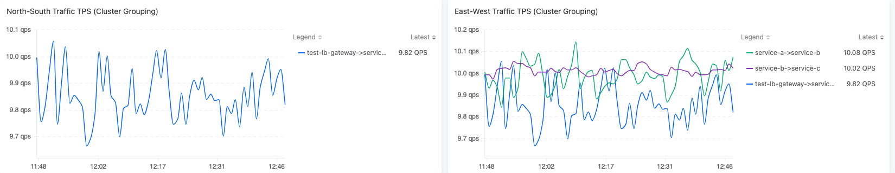


- 10 qps load balancing of these requests between the two clusters in the same region.

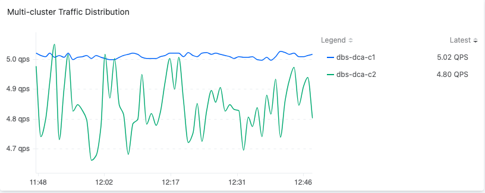

Service Request Success Rate:

***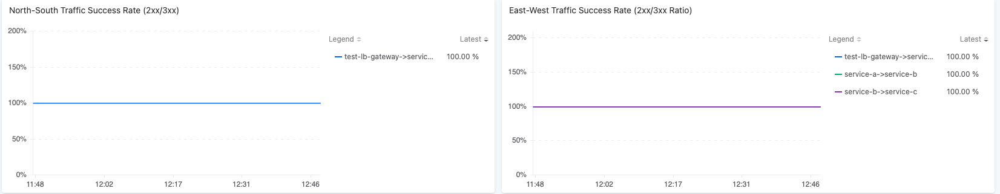***

P99 Service Latency:


# 3. Test Scenario 1: Data Center Level Switchover


## 3.1 Test Goals

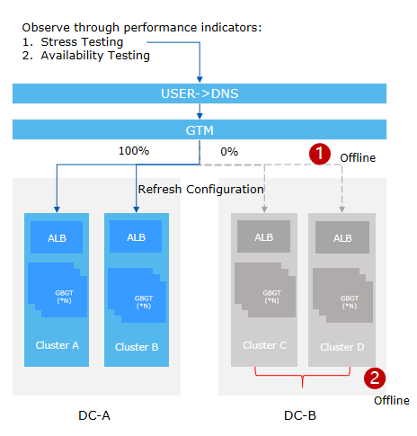

Verify cross-region data center-level failover capability, with RTO ≤ 90s and RPO = 0.

| Metrics | Description                                                  | Standards |
| ------- | ------------------------------------------------------------ | --------- |
| RTO     | The maximum acceptable time for the system to fully recover business functions from the time of failure. | RTO≤90s   |
| RPO     | The maximum tolerable data loss during a failure, typically measured in time. | RPO=0     |

## 3.2 Test Preconditions

* The Fortio performance testing tool accesses haproxy at 40 qps, and haproxy distributes the traffic to 4 business clusters at 10 qps.
* The service access chain is as follows: haproxy → metalab → ingress gateway → service-a → service-b → service-c.

## 3.3 Observability Metrics Preparation

| Metrics                                                      | Description                                                  | Standards                             |
| ------------------------------------------------------------ | ------------------------------------------------------------ | ------------------------------------- |
| Service Request TPS (Cluster Grouping)                       | The number of calls to service a (a→b-c) per second using the Fortio performance testing tool. | The traffic fluctuates around 10 qps. |
| P99 Service Latency (Cluster Grouping)                       | P99 Service Latency                                          | Jitter < 5%                           |
| Service Request Success Rate (Proportion of 2xx/3xx Responses) | Service Request Success Rate                                 | 100%                                  |

## 3.4 Test Cases

### Case 1: DC-A Failover Test

**Test Steps**：

- Shut down all nodes of all clusters in DC-A, wait for 10 minutes.
- Open Operations Center→Monitor→Dashboards on Administrator page.
- In the top navigation bar, select the first business cluster from the DC-B region and record the ASM monitoring dashboard.

**Expected Results**：

- When the primary center DC-A experiences a power outage and initiates disaster recovery, the backup center DC-B takes over the traffic.
- Service Request Success Rate (Percentage of 2xx/3xx Responses) Jitter < 5%

**Actual Results**：

- After all clusters in DC-A suffers power-outage , haproxy directs requests to the two clusters in region DC-B, each of which will experience a 10 QPS increase in traffic.


- The 20 qps traffic of each cluster will be load-balanced between the two clusters in the same region.


- Service Request Success Rate


- P99 Service Latency

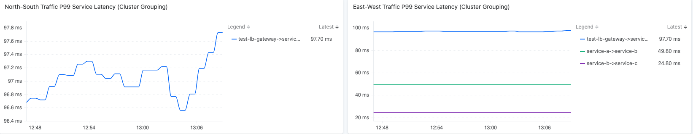

- Summary of results

| Expectation                                  | Real Testing Result                                          | Meet Expectation |
| -------------------------------------------- | ------------------------------------------------------------ | ---------------- |
| Backup center DC-B takes over the traffic    | The 20 qps traffic was load-balanced between 2 clusters in DC-B | ✅                |
| Percentage of 2xx/3xx Responses remains 100% | Success Rate 100%                                            | ✅                |
| P99 Service Latency Jitter < 5%              | Real Jitter 1%                                               | ✅                |


### Case 2: DC-A Recovery Test

**Test Steps**：

- Power on all clusters in region DC-A and wait for 10 minutes.
- Open Operations Center→Monitor→Dashboards on Administrator page.
- In the top navigation bar, select the first business cluster from the DC-B region and record the ASM monitoring dashboard.

**Expected Results**：

- During the failback process, the backup center DC-B releases a portion of the traffic to DC-A.
- During the failback process, the primary center DC-A gradually takes over the traffic.

**Actual Results**：

- The backup center DC-B releases a portion of the traffic to DC-A.

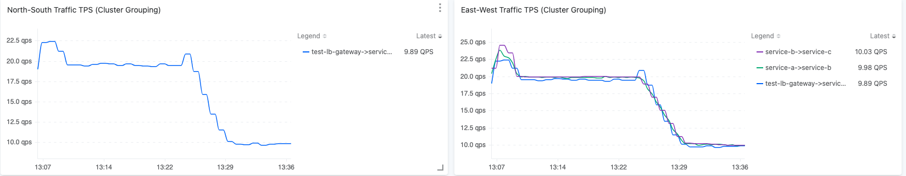

Service Request Success Rate 


P99 Service Latency


- The primary center DC-A gradually takes over the traffic.


Service Request Success Rate 

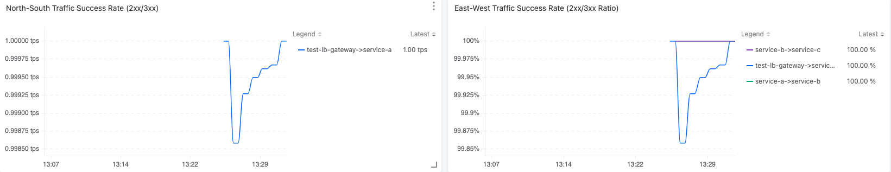

P99 Service Latency


- Summary of results

| Expectation                           | Real Testing Result                           | Meet Expectation |
| ------------------------------------- | --------------------------------------------- | ---------------- |
| DC-B takes release part of traffic    | Each gateway had a 10 QPS decrease in traffic | ✅                |
| DC-A gradually takes over the traffic | Each gateway had a 10 QPS increase in traffic | ✅                |


# 4. Test Scenario 2: Cluster Level Switchover

## 4.1 Test Goals


Verify the dual - center core cluster application single - node failure data failover capability.

| Metrics | Description                                                  | Standards |
| ------- | ------------------------------------------------------------ | --------- |
| RTO     | The maximum acceptable time for the system to fully recover business functions from the time of failure. | RTO≤90s   |
| RPO     | The maximum tolerable data loss during a failure, typically measured in time. | RPO=0     |

## 4.2 Test Preconditions

- The Fortio performance testing tool accesses haproxy at 40 qps, and haproxy distributes the traffic to 4 business clusters at 10 qps.
- The service access chain is as follows: haproxy → metalab → ingress gateway → service-a → service-b → service-c.

## 4.3 Observability Metrics Preparation

| Metrics                                                      | Description                                                  | Standards                             |
| ------------------------------------------------------------ | ------------------------------------------------------------ | ------------------------------------- |
| Service Request TPS (Cluster Grouping)                       | The number of calls to service a (a→b-c) per second using the Fortio performance testing tool. | The traffic fluctuates around 10 qps. |
| P99 Service Latency (Cluster Grouping)                       | P99 Service Latency                                          | Jitter < 5%                           |
| Service Request Success Rate (Proportion of 2xx/3xx Responses) | Service Request Success Rate                                 | 100%                                  |

## 4.4 Test Cases

### Case 1: DC-B c4 Cluster Failure

**Test Steps**：Power outage at all the nodes of cluster dbs-dca-c4 in the DC-B region

**Expected Results**：The traffic of the cluster dbs-dca-c4 is redirected to the hot standby cluster in the same region.

**Actual Results**：

- After powering off the dbs-dca-c4 cluster, the traffic is switched to another cluster in the same region.

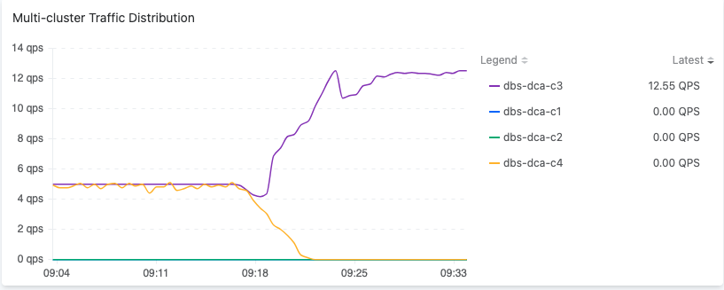

Service Request Success Rate 

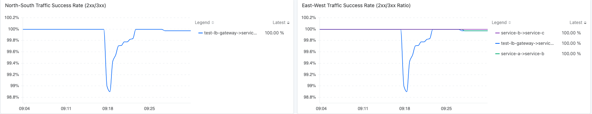

P99 Service Latency

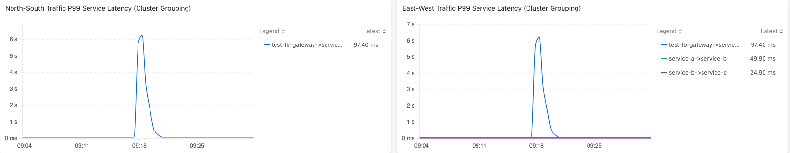


- Summary of results

| Expectation                                      | Real Testing Result                                          | Meet Expectation |
| ------------------------------------------------ | ------------------------------------------------------------ | ---------------- |
| Backup cluster c3 takes over the traffic from c4 | Traffic of c4 decrease to 0<br>Traffic of c3 increase by the same value | ✅                |


### Case 2: DC-B c4 Cluster Recovery

**Test Steps**：Power on the cluster dbs-dca-c4 in the DC-B region

**Expected Results**：After the cluster dbs-dca-c4 is fully restored, traffic continues to be load-balanced between the two clusters in the same region.

**Actual Results**：

- The traffic is load-balanced between the two clusters(dbs-dca-c3,dbs-dca-c4) in the same region.


Service Request Success Rate


P99 Service Latency 

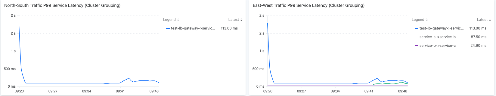


- Summary of results

| Expectation                                      | Real Testing Result                                  | Meet Expectation |
| ------------------------------------------------ | ---------------------------------------------------- | ---------------- |
| Cluster c4 takes the traffic back after recovery | Traffic continue to be load balanced between c3 & c4 | ✅                |


### Case 3: DC-B c4 Cluster istio-eastwestgateway Failure

**Test Steps**：Simulate istio-eastwestgateway Pod failure for 10 minutes on the cluster dbs-dca-c4 in the DC-B region.

```yaml
apiVersion: chaos-mesh.org/v1alpha1
kind: PodChaos
metadata:
  name: pod-failure-example
  namespace: istio-system
spec:
  action: pod-failure
  mode: one
  duration: '600s'
  selector:
    labelSelectors:
       app: istio-eastwestgateway
```

**Expected Results**：The traffic of the dbs-dca-c4 cluster is redirected to the hot standby cluster in the same region.

**Actual Results**：

- Traffic from the core cluster is taken over by the warm-standby cluster.


Service Request Success Rate 

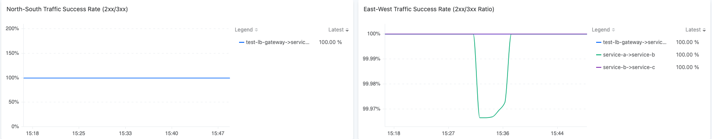

P99 Service Latency

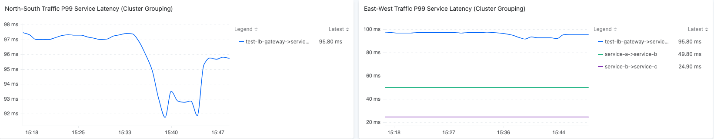

- Summary of results

| Expectation                                      | Real Testing Result                               | Meet Expectation |
| ------------------------------------------------ | ------------------------------------------------- | ---------------- |
| Backup cluster c3 takes over the traffic from c4 | Traffic of c3 increase the QPS redirected from c4 | ✅                |


# 5. Test Scenario 3: Application Level Switchover

## 5.1 Test Goals

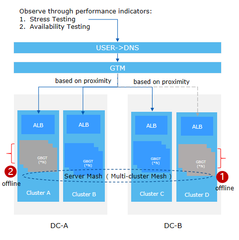

Verify the dual - center core cluster application single - node failure data failover capability.

| Metrics | Description                                                  | Standards |
| ------- | ------------------------------------------------------------ | --------- |
| RTO     | The maximum acceptable time for the system to fully recover business functions from the time of failure. | RTO≤90s   |
| RPO     | The maximum tolerable data loss during a failure, typically measured in time. | RPO=0     |

## 5.2 Test Preconditions

- The Fortio performance testing tool accesses haproxy at 40 qps, and haproxy distributes the traffic to 4 business clusters at 10 qps.
- The service access chain is as follows: haproxy → metalab → ingress gateway → service-a → service-b → service-c.

## 5.3 Observability Metrics Preparation

| Metrics                                                      | Description                                                  | Standards                             |
| ------------------------------------------------------------ | ------------------------------------------------------------ | ------------------------------------- |
| Service Request TPS (Cluster Grouping)                       | The number of calls to service a (a→b-c) per second using the Fortio performance testing tool. | The traffic fluctuates around 10 qps. |
| P99 Service Latency (Cluster Grouping)                       | P99 Service Latency                                          | Jitter < 5%                           |
| Service Request Success Rate (Proportion of 2xx/3xx Responses) | Service Request Success Rate                                 | 100%                                  |

## 5.4 Test Cases

### Case 1: DC-A c1 and DC-B c4 Dual-Center Application Single Node Failure

**Test Steps**：

- On the core cluster(dbs-dca-c1,dbs-dca-c4) in each region, use Chaos Mesh to simulate a 10-minute failure of a service-a instance.

```
apiVersion: chaos-mesh.org/v1alpha1
kind: PodChaos
metadata:
  name: pod-failure-example
  namespace: ha-cluster-ns
spec:
  action: pod-failure
  mode: one
  duration: '600s'
  selector:
    labelSelectors:
       service.cpaas.io/name: deployment-service-a
```

**Expected Results**：

- Traffic is load-balanced across standby clusters in the same region.

- Service request success rate (percentage of 2xx/3xx responses) = 100%
- After the application recovers from a failure, the traffic is load-balanced across each cluster at 10 QPS.

**Actual Results**：

- Traffic is load-balanced across standby clusters in the same region.
  The traffic monitoring for the standby cluster in the same region.


 Service Request Success Rate 

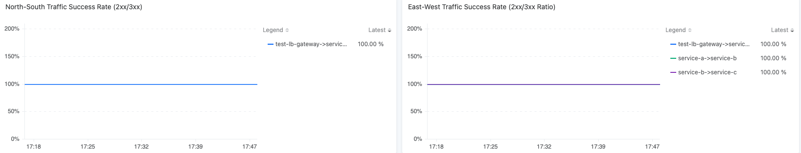

P99 Service Latency

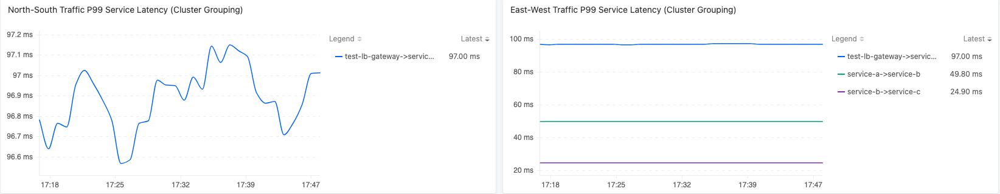


- Summary of results

| Expectation                                                  | Real Testing Result                              | Meet Expectation |
| ------------------------------------------------------------ | ------------------------------------------------ | ---------------- |
| Traffic is load-balanced across standby clusters in the same region | Traffic of ingress gateway → service-a increased | ✅                |
| Percentage of 2xx/3xx Responses remains 100%                 | Success Rate 100%                                | ✅                |
| After the application recovers from a failure, the traffic is load-balanced across each cluster | Traffic to each cluster is back to 10 qps        | ✅                |


# 6. Test Scenario 4: Service Level Switchover

## 6.1 Test Goals

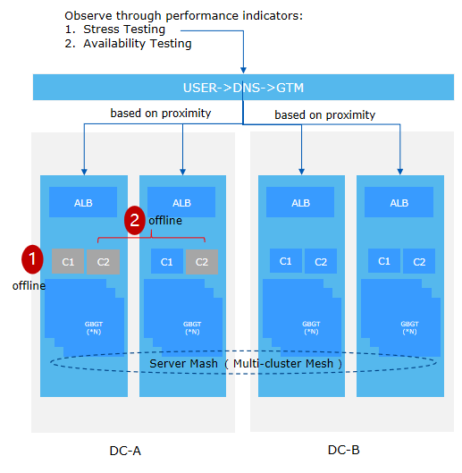

Verify the service's minimal viable survival and same-region data failover capability, with RTO ≤ 90s and RPO = 0.

| Metrics | Description                                                  | Standards |
| ------- | ------------------------------------------------------------ | --------- |
| RTO     | The maximum acceptable time for the system to fully recover business functions from the time of failure. | RTO≤90s   |
| RPO     | The maximum tolerable data loss during a failure, typically measured in time. | RPO=0     |

## 6.2 Test Preconditions

- The Fortio performance testing tool accesses haproxy at 40 qps, and haproxy distributes the traffic to 4 business clusters at 10 qps.
- The service access chain is as follows: haproxy → metalab → ingress gateway → service-a → service-b → service-c.

## 6.3 Observability Metrics Preparation

| Metrics                                                      | Description                                                  | Standards                             |
| ------------------------------------------------------------ | ------------------------------------------------------------ | ------------------------------------- |
| Service Request TPS (Cluster Grouping)                       | The number of calls to service a (a→b-c) per second using the Fortio performance testing tool. | The traffic fluctuates around 10 qps. |
| P99 Service Latency (Cluster Grouping)                       | P99 Service Latency                                          | Jitter < 5%                           |
| Service Request Success Rate (Proportion of 2xx/3xx Responses) | Service Request Success Rate                                 | 100%                                  |

## 6.4 Test Cases

### Case 1: DC-A Service Minimal Survival

**Test Steps**：

- Stop the service-a deployment on the dbs-dca-c1 cluster.
- Use Chaos Mesh on the dbs-dca-c2 cluster to simulate a 10-minute failure of one of the two service-a instances.

```yaml
apiVersion: chaos-mesh.org/v1alpha1
kind: PodChaos
metadata:
  name: pod-failure-example
  namespace: ha-cluster-ns
spec:
  action: pod-failure
  mode: one
  duration: '600s'
  selector:
    labelSelectors:
       service.cpaas.io/name: deployment-service-a
```

- Check the warm-standby（dbs-dca-c1） cluster monitoring.

**Expected Results**：

- When a service fails, traffic is taken over by a warm-standby cluster in the same region.
- Service request success rate (percentage of 2xx/3xx responses) = 100%.

**Actual Results**：

- When a service fails, traffic is taken over by a warm-standby cluster in the same region.


Service request success rate


North-South Traffic P99 Service Latency (Cluster Grouping)


- Summary of results

| Expectation                                                  | Real Testing Result                                          | Meet Expectation |
| ------------------------------------------------------------ | ------------------------------------------------------------ | ---------------- |
| Service traffic is taken over by a warm-standby cluster in the same region | Traffic to instance in the other cluster increased by 10 qps | ✅                |
| Percentage of 2xx/3xx Responses remains 100%                 | Success Rate 100%                                            | ✅                |

