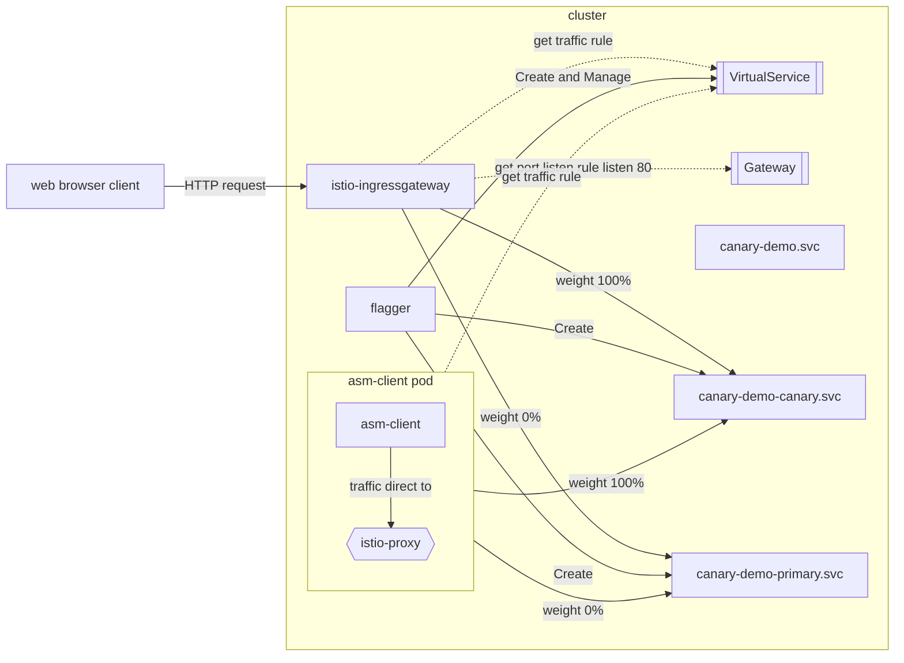
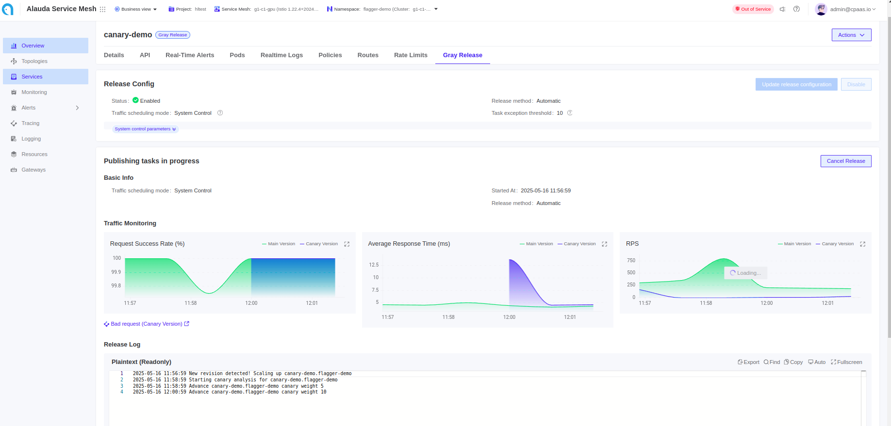
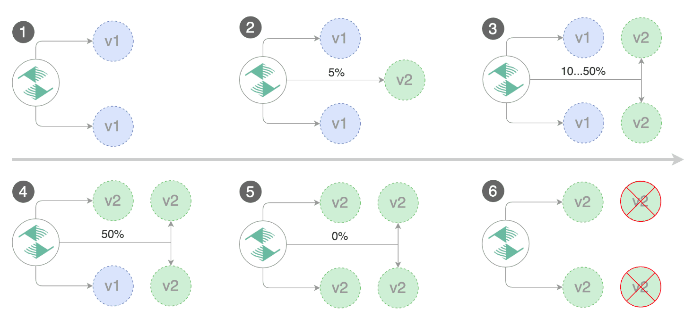

# ACP Deployment Strategies

## Overview

Updating applications in Kubernetes clusters using standard rolling updates can sometimes introduce risks. To mitigate this, advanced deployment strategies like blue/green and canary are widely adopted. Alauda Container Platform is fully compatible with Kubernetes APIs and supports these methods.

Let's look at the principles and how traffic is managed for these strategies:

### Understanding deployment strategies

#### Blue/green deployment

In a blue/green deployment, the new version is deployed to the inactive Green environment. Once ready, all user traffic is switched instantly from the Blue environment to the Green environment.

#### Canary deployment

Canary deployment introduces the new version gradually to a small subset of users before a full rollout. The new version runs alongside the old. Traffic is slowly shifted to the new version in small increments, allowing monitoring for issues.

### Understanding Implementation Methods

Alauda Container Platform offers four implementation methods for blue/green and canary deployments.

| Chapter | Automation        | Underlying Mechanism | Traffic Type              | Deployment Strategies |
| ------- | ----------------- | --------------------- | ------------------------- | --------------------- |
| 1       | ACP API           | K8S Service           | North-south and east-west | Blue/green only       |
| 2       | ACP API           | ALB/Nginx Ingress     | North-south only          | Blue/green and canary |
| 3       | ACP API           | Istio VirtualService | North-south and east-west | Blue/green and canary |
| 4       | ASM API (Flagger) | Istio VirtualService | North-south and East-west | Blue/green and canary |

**Note**: Alternative methods leveraging Argo Rollouts are covered in ACP Deployment Strategies with Argo Rollouts.


#### Method 1: Using Kubernetes Service to implement blue/green deployment

This method leverages Kubernetes Services for traffic switching between versions:

1. Deploy the new version (green) with a distinct Pod label (e.g., `version: green`) while keeping the existing version (blue) running with its own label (e.g., `version: blue`).
2. Initially, your Kubernetes Service points to the blue pods through its selector configuration (e.g., `app: web, version: blue`).
3. When ready to switch, update the Service's selector to point to the green version by modifying the `version` label in the selector.
4. Traffic instantly shifts from blue to green pods with zero downtime.
5. After confirming the new version works properly, you can safely scale down or remove the blue deployment.

This approach provides a simple way to implement blue/green deployments using native Kubernetes resources without requiring additional tools.

#### Method 2: Using ALB or Nginx Ingress to implement blue/green and canary deployments

This method uses ALB Load Balancer or Nginx Ingress to control traffic between application versions:

1. Deploy both versions of your application:
   - Current version as `app-v1` (Deployment and Service)
   - New version as `app-v2` (Deployment and Service)
2. For blue/green deployment:
   - Initially, configure the Ingress/ALB to direct 100% of traffic to `app-v1`
   - When ready to switch, update the Ingress/ALB configuration to send 100% of traffic to `app-v2`
   - This creates an instant cutover with zero downtime
3. For canary deployment:
   - Start by sending most traffic (e.g., 95%) to `app-v1` and a small portion (e.g., 5%) to `app-v2`
   - Gradually increase traffic to `app-v2` while monitoring for issues
   - Continue until 100% of traffic flows to `app-v2`

This approach provides traffic control at the ingress level for north-south (external) traffic only.

#### Method 3: Using Istio Virtual Service to implement blue/green and canary deployments

This method leverages Istio's powerful traffic management capabilities:

1. Deploy both versions of your application:
   - Current version as `app-v1` (Deployment and Service)
   - New version as `app-v2` (Deployment and Service)
2. Set up Istio resources:
   - Create an Istio Gateway to handle incoming traffic
   - Define a VirtualService to control traffic distribution between versions
3. For blue/green deployment:
   - Initially configure the VirtualService to route 100% of traffic to `app-v1`
   - When ready to switch, update the VirtualService weights to direct 100% of traffic to `app-v2`
   - This creates an instant cutover with minimal risk
4. For canary deployment:
   - Start with minimal traffic (e.g., 5%) to `app-v2` and most traffic (95%) to `app-v1`
   - Gradually update the VirtualService weights to increase traffic to `app-v2` while monitoring for issues
   - Continue until 100% of traffic flows to `app-v2`

This approach provides comprehensive traffic control for both north-south (external) and east-west (service-to-service) traffic patterns.

#### Method 4: Using Istio VirtualService and Flagger to implement blue/green and canary deployments

This method uses Flagger in Alauda Service Mesh to automate advanced deployment strategies:

1. When you update your application, Flagger creates a new temporary deployment (canary)
2. Traffic gradually shifts from the original version to the canary version based on configurable settings
3. Flagger continuously monitors key metrics like error rates and response times
4. If problems occur, Flagger automatically rolls back to the previous stable version
5. For blue-green deployments, Flagger handles instantaneous traffic switching with zero downtime

This approach eliminates manual intervention in the deployment process while ensuring application reliability through automated metric checks and rollback capabilities.

## Chapter 1. Using Kubernetes Service to implement blue/green deployment

In ACP (Alauda Container Platform), users can implement blue/green Deployment strategies using Kubernetes resources managed via `kubectl` commands.

The process involves two identical application environments—`blue` for the current production version, and `green` for the new version to be released. This document will walk through the step-by-step procedure to:

1. Create the green (new) deployment in parallel.
2. Shift traffic from blue to green with zero downtime.
3. Verify traffic routing.

This strategy allows safe rollouts and instant rollback capability using standard Kubernetes primitives.

### Prerequisites

1. Alauda Container Platform installed.
2. Kubernetes Cluster managed by ACP.
3. A project to create a namespace in it.
4. A namespace in the cluster where the application will be deployed.
5. `kubectl` command-line tool installed with `kubectl-acp` plugin for authentication with ACP Platform.
6. Authenticated to the cluster using `kubectl acp login` command.


### Initial application deployment

Start by defining the "blue" version of your application. This is the current version that users will access. Here is an example of the blue deployment. The container image version is `hello:1.23.1`, and proper labels are `app=web` and `version=blue`.

An example deployment YAML file for the blue version is as follows:

```yaml
apiVersion: apps/v1
kind: Deployment
metadata:
  name: blue
spec:
  replicas: 3
  selector:
    matchLabels:
      app: web
      version: blue
  template:
    metadata:
      labels:
        app: web
        version: blue
    spec:
      containers:
        - name: web
          image: hello:1.23.1
          ports:
            - containerPort: 80
```

Save into a yaml file named `blue-deployment.yaml` and apply it with:

```shell
kubectl apply -f blue-deployment.yaml
```

The deployment needs a `Service` that exposes the blue deployment. This service will forward traffic to the blue pods based on matching labels. Initially, the service selector targets pods labeled with `version=blue`.

```yaml
apiVersion: v1
kind: Service
metadata:
  name: web
spec:
  selector:
    app: web
    version: blue
  ports:
  - protocol: TCP
    port: 80
    targetPort: 80
```

Confirm that the `blue` deployment is running correctly by listing the pods:

```shell
kubectl get pods -l app=web,version=blue
```

Check that all expected replicas (3) are in the `Running` state. This ensures the application is ready to serve traffic.

Ensure that the `web` service is correctly forwarding traffic to the blue deployment. Use this command:

```shell
kubectl describe service web | grep Endpoints
```

The output should list the IP addresses of the blue pods. These are the endpoints receiving traffic.

### Blue/green deployment procedure

#### Step 1: Create the green deployment

Next, prepare the new version of the application as the green deployment. This mirrors the blue deployment but uses a different image version (e.g., `hello:1.23.2`) and label (`version=green`).

```yaml
apiVersion: apps/v1
kind: Deployment
metadata:
  name: green
spec:
  replicas: 3
  selector:
    matchLabels:
      app: web
      version: green
  template:
    metadata:
      labels:
        app: web
        version: green
    spec:
      containers:
        - name: web
          image: hello:1.23.2
          ports:
            - containerPort: 80
```

**Explanation of YAML fields:**

- Identical to the blue deployment, with the exception of:
  - `metadata.name`: Now set to `green`.
  - `spec.selector.matchLabels.version`: Set to `green`.
  - `spec.template.metadata.labels.version`: Set to `green`.
  - `containers.image`: Updated to new image version.

Save as `green-deployment.yaml` and apply it with:

```shell
kubectl apply -f green-deployment.yaml
```

This sets up the new application version for testing.

#### Step 2: Verify the green deployment

Use the following command to ensure the green pods are running properly:

```shell
kubectl get pods -l app=web,version=green
```

Check for 3 running pods. This confirms that the new version is deployed and operational.

#### Step 3: Switch traffic to green

To promote the green deployment to production, update the `web` service selector to point to the green version:

```shell
kubectl patch service web -p '{"spec":{"selector":{"version":"green"}}}'
```

This change is instant and switches all incoming traffic to the green pods.

#### Step 4: Verify traffic routing to green

Confirm the service is now pointing to the green deployment:

```shell
kubectl describe service web | grep Endpoints
```

The output should now show the IPs of the green pods, indicating successful traffic switching.

This completes a zero-downtime blue-green deployment using ACP and Kubernetes.

## Chapter 2. Using ALB or Nginx Ingress to implement blue/green and canary deployments

In ACP, you can use ALB to act as a Gateway API Provider to implement traffic control for deployments.


### Concepts

- **ALB**: ACP Load Balancer, a customized Nginx ingress controller that provides advanced traffic management features.
- **Gateway**: A resource that defines how traffic is routed to services within the cluster.
- **HTTPRoute**: A resource that specifies how HTTP traffic is routed to services based on rules and conditions.


### Prerequisites

1. Alauda Container Platform installed with a working Kubernetes cluster available.
2. A project to create a namespace in it.
3. ALB deployed in the cluster and allocated to the project.
4. A namespace in the cluster where the application will be deployed.
5. `kubectl` command-line tool installed with `kubectl-acp` plugin for authentication with ACP Platform.
6. Authenticated to the cluster using `kubectl acp login` command.


### Initial application deployment

Start by creating the stable version of your application. This is the initial version that users will access. Here is the deployment with the appropriate number of replicas, container image version (e.g., `hello:1.23.1`), and proper labels such as `app=web-stable`.

You can find a YAML example below:

```yaml
apiVersion: apps/v1
kind: Deployment
metadata:
  name: web-stable
spec:
  replicas: 2
  selector:
    matchLabels:
      app: web-stable
  template:
    metadata:
      labels:
        app: web-stable
    spec:
      containers:
        - name: web
          image: hello:1.23.1
          ports:
            - containerPort: 80
```

Save into a yaml file and apply it with:

```shell
kubectl apply -f web-stable-deployment.yaml
```

The `Service` will forward traffic to the pods of stable version based on matching labels. Initially, the service selector targets pods labeled with `app=web-stable`.

```yaml
apiVersion: v1
kind: Service
metadata:
  name: web-stable
spec:
  selector:
    app: web-stable
  ports:
  - protocol: TCP
    port: 80
    targetPort: 80
```

Using `example.com` as an example domain to access the service, create a `Gateway` to expose the service with the domain:

```yaml
apiVersion: gateway.networking.k8s.io/v1
kind: Gateway
metadata:
  name: default
spec:
  gatewayClassName: exclusive-gateway
  listeners:
  - allowedRoutes:
      namespaces:
        from: All
    name: gateway-metric
    port: 11782
    protocol: TCP
  ## This is the route pointing
  ## to the service
  - allowedRoutes:
      namespaces:
        from: All
    hostname: example.com
    name: web
    port: 80
    protocol: HTTP
```

The `Gateway` will be allocated an external IP address, get the IP address from the `status.addresses` of type `IPAddress` in the gateway resource.

```yaml
apiVersion: gateway.networking.k8s.io/v1
kind: Gateway
metadata:
  name: default
...
status:
  addresses:
  - type: IPAddress
    value: 192.168.134.30
```

Configure the domain in your DNS server to resolve the domain to the IP address of the gateway. Verify the DNS resolution with the command:

```shell
nslookup example.com
Server:         192.168.16.19
Address:        192.168.16.19#53

Non-authoritative answer:
Name:   example.com
Address: 192.168.134.30
```

It should return the address of the gateway.

Now create an `HTTPRoute` to route the traffic to the service. This will connect the `Gateway` to the `Service` and route the traffic to the pods of stable version.

```yaml
apiVersion: gateway.networking.k8s.io/v1
kind: HTTPRoute
metadata:
  name: web
spec:
  hostnames:
  ## Make sure the hostname is
  ## the same as the domain
  - example.com
  parentRefs:
  ## Gateway resource reference matching
  - group: gateway.networking.k8s.io
    kind: Gateway
    name: default
    namespace: default # change the namespace accordingly
    sectionName: web
  rules:
  ## Adds the service to the route
  - backendRefs:
    - group: ""
      kind: Service
      name: web-stable
      namespace: default # change the namespace accordingly
      port: 80
      weight: 100
    matches:
    - path:
        type: PathPrefix
        value: /
```

Save as a yaml file and apply using:

```shell
kubectl apply -f httproute.yaml
```

### Blue/green and canary deployment procedures

After initial deployment, you can create a new version of the application (canary) and route traffic to it. This allows you to test the new version before fully switching over.

#### Step 1: Create the canary deployment and service

Create a Kubernetes `Service` that exposes the canary deployment. This service will forward traffic to the pods of canary version based on matching labels. Initially, the service selector targets pods labeled with `app=web-canary`.

```yaml
# web-canary-deployment.yaml
apiVersion: apps/v1
kind: Deployment
metadata:
  name: web-canary
spec:
  replicas: 2
  selector:
    matchLabels:
      app: web-canary
  template:
    metadata:
      labels:
        app: web-canary
    spec:
      containers:
        - name: web
          # new version of the application
          image: hello:1.23.2
          ports:
            - containerPort: 80
---
# web-canary-service.yaml
apiVersion: v1
kind: Service
metadata:
  name: web-canary
spec:
  selector:
    app: web-canary
  ports:
  - protocol: TCP
    port: 80
    targetPort: 80
```

Apply it using:

```shell
kubectl apply -f web-canary-deployment.yaml
kubectl apply -f web-canary-service.yaml
```

This allows external access to the canary deployment.

#### Step 2: Update HTTPRoute to add canary and switch traffic

Update the `HTTPRoute` to add the canary version:

```yaml
apiVersion: gateway.networking.k8s.io/v1
kind: HTTPRoute
metadata:
  name: web
spec:
  [...]
  rules:
  - backendRefs:
    ## Adds the canary service to the route
    ## with weight 0
    - group: ""
      kind: Service
      name: web-canary
      namespace: default
      port: 80
      weight: 0
    ## Unchanged stable route
    - group: ""
      kind: Service
      name: web-stable
      namespace: default
      port: 80
      weight: 100
    matches:
    - path:
        type: PathPrefix
        value: /
```

Apply it using:

```shell
kubectl apply -f httproute.yaml
```

#### Step 3: Switch traffic to canary
Update the `HTTPRoute` to switch traffic to the canary version:

```yaml
apiVersion: gateway.networking.k8s.io/v1
kind: HTTPRoute
metadata:
  name: web
spec:
  [...]
  rules:
  - backendRefs:
    - group: ""
      kind: Service
      name: web-canary
      namespace: default
      port: 80
      ## Switch the traffic to canary
      weight: 100
    - group: ""
      kind: Service
      name: web-stable
      namespace: default
      port: 80
      ## Remove traffic from stable
      weight: 0
    matches:
    - path:
        type: PathPrefix
        value: /
```

Apply it using:

```shell
kubectl apply -f httproute.yaml
```

For blue/green deployment, set the weight to 0% for 'web-stable' and 100% for 'web-canary' to instantly switch all traffic from the old to new version. For canary deployment, set weights between 0% and 100% for both versions to gradually shift traffic between them.

After successfully verifying the new version, you can remove or scale down the old version.

## Chapter 3. Using Istio VirtualService to implement blue/green and canary deployments

Leveraging Istio Gateway and VirtualService capabilities, ACP enables sophisticated traffic management features that efficiently implement blue/green and canary deployment strategies for Kubernetes services.

### Concepts

- **Gateway**: Defines how incoming traffic from outside the mesh is handled, including ports, protocols, and hostnames. Used together with VirtualService to control ingress traffic.
- **Virtual Service**: An Istio resource used to define how requests are routed to services.

### Prerequisites

1. Alauda Container Platform installed with a working Kubernetes cluster available.
2. Alauda Service Mesh 4.0 with Istio 1.22 installed.
3. `kubectl` command-line tool installed with `kubectl-acp` plugin for authentication with ACP Platform.
4. Authenticated to the cluster using `kubectl acp login` command.


### Initial application deployment

Start by defining the stable version of your application. This is the current version that users will access. We use the same stable deployment. The container image version is `hello:1.23.1`, and proper labels are `app=web` and `version=stable`.

```yaml
apiVersion: apps/v1
kind: Deployment
metadata:
  name: web-stable
spec:
  replicas: 2
  selector:
    matchLabels:
      app: web
      version: stable
  template:
    metadata:
      labels:
        app: web
        version: stable
    spec:
      containers:
        - name: web
          image: hello:1.23.1
          ports:
            - containerPort: 80
```


Initially, the service selector targets pods labeled with `app=web` and `version=stable`.

```yaml
apiVersion: v1
kind: Service
metadata:
  name: web-stable
spec:
  selector:
    app: web
    version: stable
  ports:
  - protocol: TCP
    port: 80
    targetPort: 80
```

The `Gateway` resource will expose the `VirtualService` in the namespace:

```yaml
apiVersion: networking.istio.io/v1alpha3
kind: Gateway
metadata:
  name: istio-rollout-gateway
spec:
  selector:
    istio: ingressgateway
  servers:
  - port:
      number: 80
      name: http
      protocol: HTTP
    hosts:
    - "*"
```

To allocate an external IP address to the gateway, there should be a LoadBalancer service in `istio-system` namespace.

```yaml
apiVersion: v1
kind: Service
metadata:
  labels:
    app: istio-ingressgateway
    istio: ingressgateway
    istio.io/rev: 1-22
  name: rollout-ingressgateway
  namespace: istio-system
spec:
  ports:
  - name: http2
    port: 80
    protocol: TCP
    targetPort: 8080
  - name: https
    port: 443
    protocol: TCP
    targetPort: 8443
  selector:
    app: istio-ingressgateway
    istio: ingressgateway
  sessionAffinity: None
  type: LoadBalancer
```

The `VirtualService` defines how traffic is routed to different versions (subsets) of a service. In this context, it enables fine-grained control to implement blue/green or canary deployment strategies by assigning traffic weights to different service versions. This is done by specifying routing rules under HTTP and/or TCP protocols that split traffic based on the assigned weight.

```yaml
apiVersion: networking.istio.io/v1
kind: VirtualService
metadata:
  name: web
spec:
  gateways:
  - istio-rollout-gateway
  hosts:
  - rollout-demo.asm.com
  - asm-demo
  http:
  - route:
    - destination:
        host: web-stable
      weight: 100
  tcp:
  - route:
    - destination:
        host: web-stable
      weight: 100
```

Next, define the "preview" version of your application. This is the new version that will be gradually introduced. Create a Kubernetes deployment with the appropriate number of replicas, container image version (e.g., `hello:1.23.2`), and proper labels such as `app=web` and `version=preview`.

Use the following YAML:

```yaml
apiVersion: apps/v1
kind: Deployment
metadata:
  name: web-preview
spec:
  replicas: 2
  selector:
    matchLabels:
      app: web
      version: preview
  template:
    metadata:
      labels:
        app: web
        version: preview
    spec:
      containers:
        - name: web
          image: hello:1.23.2
          ports:
            - containerPort: 80
```

Apply the configuration using `kubectl`:

```shell
kubectl apply -f preview-deployment.yaml
```

Create a Kubernetes `Service` that exposes the preview deployment. This service will forward traffic to the pods of the preview version based on matching labels. The service selector targets pods labeled with `app=web` and `version=preview`.

```yaml
apiVersion: v1
kind: Service
metadata:
  name: web-preview
spec:
  selector:
    app: web
    version: preview
  ports:
  - protocol: TCP
    port: 80
    targetPort: 80
```

Apply it using:

```shell
kubectl apply -f web-preview-service.yaml
```

This allows external access to the preview deployment.

### Blue/green deployment procedure for VirtualService

To use a VirtualService for blue/green deployment, you modify the weight fields in the HTTP or TCP route section of the YAML definition. Initially, set 100% of traffic to the blue (stable) version and 0% to the green (preview) version.
Once the green version is validated, update the YAML to set the weight to 100 for green and 0 for blue. Update the YAML:

```yaml
apiVersion: networking.istio.io/v1
kind: VirtualService
metadata:
  name: web
spec:
  gateways:
  - istio-rollout-gateway
  hosts:
  - rollout-demo.asm.com
  - asm-demo
  http:
  - route:
    - destination:
        host: web-stable
      weight: 0
    - destination:
        host: web-preview
      weight: 100
  tcp:
  - route:
    - destination:
        host: web-stable
      weight: 0
    - destination:
        host: web-preview
      weight: 100
```

Apply it using:

```shell
kubectl apply -f virtual-service.yaml
```

After applying this change, all traffic will be forwarded to the preview deployment.

### Canary deployment procedure for VirtualService

To use a VirtualService for canary deployment, you modify the weight fields in the HTTP or TCP route section of the YAML definition. Initially, set 100% of traffic to the stable version and 0% to the canary (preview) version.

Update the YAML definition to assign traffic weights between the stable and canary versions. For example, start with a 90/10 split by setting weight: 90 for web-stable and weight: 10 for web-canary.

As the new version proves stable, incrementally shift more traffic to web-canary (e.g., 30%, 50%, then 100%) by updating the weights and reapplying the YAML.

Following this approach, traffic will gradually shift to the canary deployment as you adjust the weights.

## Chapter 4. Using Istio VirtualService and Flagger to implement blue/green and canary deployments

In ACP, Flagger automates progressive delivery strategies like canary releases and blue/green deployments by leveraging Istio's traffic management capabilities. This chapter explains how to implement these strategies using Flagger in Alauda Service Mesh.

### Concepts

- **Flagger**: A progressive delivery operator that automates the release process for applications running on Kubernetes.
- **CanaryDelivery**: A custom resource that defines how Flagger should manage the deployment process.
- **VirtualService**: An Istio resource that Flagger manages to control traffic routing between versions.

### Prerequisites

1. Alauda Container Platform installed with a working Kubernetes cluster available.
2. Alauda Service Mesh 4.0 with Istio 1.22 installed.
3. `kubectl` command-line tool installed with `kubectl-acp` plugin for authentication with ACP Platform.
4. Authenticated to the cluster using `kubectl acp login` command.

### Canary deployment procedure

Canary deployment gradually shifts traffic from the stable version to the new version while monitoring metrics to ensure reliability.

#### Step 1: Create canary Flagger resource

Create a `CanaryDelivery` resource that defines how the canary deployment should be managed:

```yaml
apiVersion: asm.alauda.io/v1alpha1
kind: CanaryDelivery
metadata:
  annotations:
    argocd.argoproj.io/sync-wave: "600"
    argocd.argoproj.io/sync-options: SkipDryRunOnMissingResource=true
  name: canary-demo
  namespace: flagger-demo
spec:
  service:
    gateways:
    - flagger-demo/istio-rollout-gateway
    - mesh
    hosts:
    - canary-demo.asm.com
    - canary-demo.flagger-demo.svc.cluster.local  #you can specify k8s svc name use fqdn assocaite the deployment,support multi svc
  analysis:
    interval: 2m
    maxWeight: 50
    stepWeight: 5
    threshold: 10
  delivertype: canary
  maxResponseTime: 500
  minSuccessRate: 95
  promoteControl: system
  targetRef:
    name: canary-demo
  trafficControl: system
```

Apply it using:

```shell
kubectl apply -f canary-delivery.yaml
```

**Explanation of YAML fields:**

- `spec.service.gateways`: Specifies which gateways should be used for traffic routing.
- `spec.service.hosts`: Defines the hostnames that will be used to access the service.
- `spec.analysis`: Configures the analysis parameters for the canary deployment:
  - `interval`: How often Flagger should check metrics (2 minutes).
  - `maxWeight`: Maximum traffic percentage for the canary (50%).
  - `stepWeight`: Percentage to increase with each interval (5%).
  - `threshold`: Number of checks before promotion.
- `spec.delivertype`: Specifies the deployment strategy (canary).
- `spec.maxResponseTime` and `spec.minSuccessRate`: Define the metrics thresholds.
- `spec.targetRef.name`: References the deployment to be managed.

#### Step 2: Verify primary deployment readiness

After creating the `CanaryDelivery` resource, Flagger automatically sets up the necessary resources:

```shell
kubectl get deployments.apps -n flagger-demo
kubectl get svc -n flagger-demo
kubectl get ep -n flagger-demo
```

Flagger creates:

- A new deployment with "-primary" suffix to serve traffic
- Service endpoints named "-canary" and "-primary"
- Modifies original service to select the primary deployment

The traffic flow is illustrated below:



#### Step 3: Trigger canary deployment

To start the canary deployment process, update the image of the original deployment:

```shell
kubectl set image deploy canary-demo http=quay.io/codefresh/rollouts-demo:red -n flagger-demo
# OR
kubectl set image deploy canary-demo http=quay.io/codefresh/rollouts-demo:green -n flagger-demo
```

This triggers Flagger to start the canary analysis process.

#### Step 4: Monitor deployment progress

You can monitor the progress of the canary deployment through:

1. Alauda Service Mesh UI to monitor metrics
   

2. The demo UI
   

3. Watching VirtualService changes

   ```shell
   kubectl get vs canary-demo -n flagger-demo -o yaml --watch
   ```

**Alauda Service Mesh canary Promotion Stages:**

1. Scan for canary deployments
2. Check deployment status
3. Increase traffic weight incrementally (starting at 5%)
4. Check metrics at each step
5. Abort if metrics are below thresholds
6. Promote canary to primary when reaching target weight (50%)
7. Complete traffic migration
8. Scale down canary deployment



#### Step 5: Promotion and rollback options

**Option 1: Automatic promotion**
Wait for all steps to complete using metrics-based promotion.

**Option 2: Manual rollback**
Use the CLI Method to rollback:
```shell
# Complete one-liner (for quick execution)
kubectl label $(kubectl get canaryevents.asm.alauda.io -n flagger-demo \
  -l asm.cpaas.io/msname=canary-demo \
  --sort-by='{.metadata.creationTimestamp}' \
  -o name | tail -n 1) action=rollback -n flagger-demo
```
Command Breakdown:
```shell
# Step 1: Get Current Canary event
# - Auto-sorts by creation timestamp
# - Filters by label selector
# - Extracts resource name
CANARY_EVENT=$(kubectl get canaryevents.asm.alauda.io -n flagger-demo \
  -l asm.cpaas.io/msname=canary-demo \
  --sort-by='{.metadata.creationTimestamp}' \
  -o name | tail -n 1)

# Step 2: Trigger rollback
# - Applies 'rollback' label to Current event
# - Initiates Flagger's rollback workflow
kubectl label ${CANARY_EVENT} action=rollback -n flagger-demo

```

**Review canary History:**

*UI Method:*

1. View event history
   

2. Review specific events
   

*CLI Method:*

```shell
kubectl get canaryevents.asm.alauda.io -l asm.cpaas.io/msname=canary-demo -n flagger-demo
```

### Blue/green deployment procedure

Blue/green deployment creates a complete new environment and switches traffic all at once after validation.

#### Step 1: Create blue/green Flagger resource

Create a `CanaryDelivery` resource configured for blue/green deployment:

```yaml
apiVersion: asm.alauda.io/v1alpha1
kind: CanaryDelivery
metadata:
  name: bluegreen-demo
  namespace: flagger-demo
spec:
  service:
    gateways:
    - flagger-demo/istio-rollout-gateway
    - mesh
    hosts:
    - bluegreen-demo.flagger-demo.svc.cluster.local  #you can specify k8s svc name use fqdn assocaite the deployment,support multi svc
    - bluegreen-demo.asm.com
  analysis:
    interval: 4m
    maxWeight: 100
    stepWeight: 100
    threshold: 10
  delivertype: canary
  maxResponseTime: 500
  minSuccessRate: 95
  promoteControl: system
  targetRef:
    name: bluegreen-demo
  trafficControl: system
```

Apply it using:

```shell
kubectl apply -f bluegreen-delivery.yaml
```

**Key differences for blue/green configuration:**
- `stepWeight: 100`: Ensures traffic switches all at once
- `maxWeight: 100`: Allows full traffic shift
- `interval: 4m`: Longer interval for validation

#### Step 2: Verify primary deployment readiness

Check that Flagger has created the necessary resources:

```shell
kubectl get deployments.apps -n flagger-demo
kubectl get svc -n flagger-demo
kubectl get ep -n flagger-demo
```

#### Step 3: Trigger blue/green deployment

Update the image to start the blue/green deployment process:

```shell
kubectl set image deploy bluegreen-demo http=quay.io/codefresh/rollouts-demo:red -n flagger-demo
# OR
kubectl set image deploy bluegreen-demo http=quay.io/codefresh/rollouts-demo:green -n flagger-demo
```

#### Step 4: Monitor blue/green deployment progress

**Blue/green rollout steps:**

1. Detect new revision
2. Scale up the canary (green)
3. Route traffic to canary (all traffic at once)
4. Promote canary spec over primary (blue)
5. Wait for primary rollout
6. Route traffic to primary
7. Scale down canary

This ensures smooth transition without dropping in-flight requests.

#### Step 5: Promotion or rollback

The promotion and rollback process follows the same approach as with canary deployment, using either automatic promotion based on metrics or manual intervention through the UI.


## Conclusion

Alauda Container Platform (ACP) provides multiple strategies for implementing blue/green and canary deployments, each with its own advantages and use cases. This document has explored four distinct methods:

1. **Using Kubernetes Service for blue/green deployment**:
   - Leverages native Kubernetes resources
   - Simple implementation with zero downtime
   - Suitable for both north-south and east-west traffic
   - Limited to blue/green deployments only

2. **Using ALB or Nginx Ingress**:
   - Provides traffic control at the ingress level
   - Supports both blue/green and canary deployments
   - Limited to north-south (external) traffic only
   - Offers fine-grained traffic control through weight adjustments

3. **Using Istio VirtualService**:
   - Leverages Istio's powerful traffic management capabilities
   - Supports both blue/green and canary deployments
   - Works for both north-south and east-west traffic
   - Requires manual configuration and monitoring

4. **Using Istio VirtualService with Flagger**:
   - Automates the deployment process with progressive traffic shifting
   - Provides automated metric-based promotion or rollback
   - Supports both blue/green and canary deployments
   - Offers comprehensive monitoring and visualization
   - Works for both north-south and east-west traffic

When choosing a deployment strategy, consider the following factors:

- **Traffic type**: If you need to manage both external and service-to-service traffic, consider methods 1, 3, or 4.
- **Automation requirements**: For fully automated deployments with metric-based promotion, method 4 is ideal.
- **Complexity**: Method 1 is the simplest to implement but has limited capabilities, while methods 3 and 4 offer more advanced features but require additional components.
- **Monitoring needs**: Method 4 provides the most comprehensive monitoring and automatic rollback capabilities.

Alauda Container Platform's flexibility allows you to choose the most appropriate deployment strategy based on your specific requirements, ensuring reliable and efficient application updates with minimal risk and downtime.

