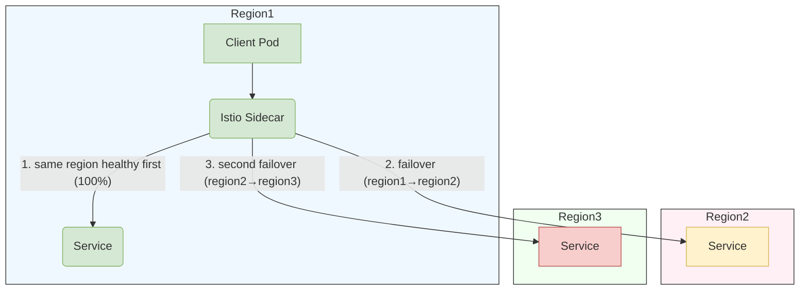
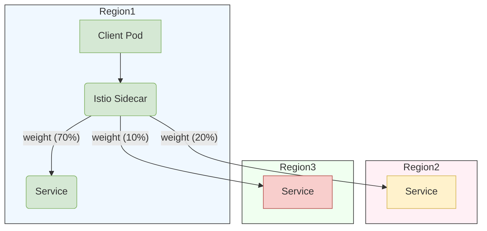

# Installation Guide for Multi-Primary different network Service Mesh Architecture

## Overview

This guide walks you through deploying the Istio control plane on two business clusters and configuring both clusters as primary clusters. This solution employs a multi-network model where workloads across different clusters cannot communicate directly and must route traffic through the Istio east-west gateway.

This architecture offers enhanced isolation and high availability for business operations.

## Prerequisites

- Prepare two business clusters.
- Prepare the following unified storage components:
  - ACP Elasticsearch (for centralized storage of trace data).
  - ACP VictoriaMetrics (for centralized storage of monitoring metrics).
  - Deploy an ACP Redis Sentinel instance separately for each cluster (for service rate limiting).
- Networking:
  - The K8S API server in each cluster must be accessible by other clusters in the service mesh.
  - The IP:15443 assigned to the east-west gateway by the LoadBalancer service in each cluster must be accessible by other clusters.

## Installation Steps

Follow the steps to install the service mesh on both clusters in sequence. The installation involves two types of parameters:

**Global parameters** (remain the same for both clusters):

| Parameter             | Example                               | Description                                  |
| --------------------- | ------------------------------------- | -------------------------------------------- |
| MESH_NAME             | multi-cluster-mesh                    | Service mesh name                            |
| GLOBAL_INGRESS_HOST   | https://1.2.3.4/                      | ACP access address                           |
| REGISTRY_ADDRESS      | 1.2.3.4:4567                          | Image registry address                       |
| ELASTICSEARCH_CLUSTER | global                                | Cluster name where Elasticsearch is deployed |
| ELASTICSEARCH_URL     | https://1.2.3.4/es_proxy              | Elasticsearch access URL                     |
| VICTORIAMETRICS_URL   | https://1.2.3.4/clusters/xxx/vmselect | VictoriaMetrics access URL                   |

**Business cluster parameters** (configure according to the actual cluster information):

| Parameter     | Example      | Description                                                                 |
| ------------- | ------------ | --------------------------------------------------------------------------- |
| CLUSTER_NAME  | cluster1     | Business cluster name                                                       |
| REDIS_ADDRESS | 1.2.3.4:4567 | Redis access address                                                        |
| REDIS_PASSWD  | passwd       | Redis access password (automatically stored as a Secret after installation) |


### Configure Kubernetes Cluster Topology for Alauda Service Mesh

#### Node Labeling Configuration

1. Apply Region Labels (Cluster Level)
```bash
# For all nodes in US-West region cluster
kubectl label nodes topology.kubernetes.io/region=us-west-1 --all
```

2. Apply Zone Labels (Availability Zone Level)
```bash
# For all nodes in Zone 1A
kubectl label nodes topology.kubernetes.io/zone=us-west-1a --all
```

3. Verification Commands
```bash
# Check labels for all nodes
kubectl get nodes -L topology.kubernetes.io/region,topology.kubernetes.io/zone

# Detailed label inspection
kubectl describe nodes | grep "Labels" -A 5
```

#### Multi-Cluster Configuration Example

| Cluster Role      | Region Label       | Zone Label         | Command Template                          |
|--------------------|--------------------|--------------------|-------------------------------------------|
| Primary Cluster   | `us-east-1`        | `us-east-1a`       | `kubectl label nodes topology.kubernetes.io/region=us-east-1 --all` |
| Secondary Cluster | `us-east-1`        | `us-east-1b`       | `kubectl label nodes topology.kubernetes.io/zone=us-east-1b --all` |
| DR Cluster        | `eu-west-1`        | `eu-west-1a`       | `kubectl label nodes topology.kubernetes.io/region=eu-west-1 --all` |


#### Configuration Notes
**Label Standards**
```yaml
# Official Kubernetes labels (do NOT modify key names)
topology.kubernetes.io/region: "<cloud-region-id>"  # e.g. us-east1
topology.kubernetes.io/zone: "<region-id>-<zone-id>" # e.g. us-east1-a
```


### Installing the First Service Mesh

#### Execute Mesh Deployment

After setting the installation parameters, execute the following command on the `global` cluster:

```bash
# please set global arguments
MESH_NAME=""
REGISTRY_ADDRESS=""
GLOBAL_INGRESS_HOST=""
ELASTICSEARCH_CLUSTER=""
ELASTICSEARCH_URL=""
VICTORIAMETRICS_URL=""
# please set business cluster arguments
CLUSTER_NAME=""
REDIS_ADDRESS=""
REDIS_PASSWD=""

# create service mesh
kubectl apply -f - <<EOF
apiVersion: asm.alauda.io/v1alpha1
kind: ServiceMesh
metadata:
  labels:
    servicemesh.cpaas.io/managedBy: operator
    asm.cpaas.io/meshgroup: "${MESH_NAME}"
    asm.cpaas.io/cluster: "${CLUSTER_NAME}"
  name: "${CLUSTER_NAME}"
  namespace: cpaas-system
  annotations:
    asm.cpaas.io/display-name: ''
spec:
  withoutIstio: false
  istioVersion: "1.22.4+202408291030"
  cluster: "${CLUSTER_NAME}"
  registryAddress: ${REGISTRY_ADDRESS}
  multiCluster:
    enabled: true
    isMultiNetwork: true
    istioNetwork: ""
  istioSidecarInjectorPolicy: false
  ipranges:
    ranges:
      - '*'
  ingressH2Enabled: false
  ingressScheme: https
  caConfig:
    certmanager: {}
  componentConfig:
    - name: istioCni
      group: istio
      replicaCount: 0
      resources: {}
      hpaSpec:
        enabled: false
      cni:
        namespace: kube-system
    - name: istiod
      group: istio
      replicaCount: 1
      hpaSpec:
        enabled: false
      resources:
        requests:
          cpu: '0.5'
          memory: 512Mi
        limits:
          cpu: '2'
          memory: 2048Mi
    - name: asmController
      group: controller
      replicaCount: 1
      hpaSpec:
        enabled: false
      resources:
        requests:
          cpu: '0.25'
          memory: 512Mi
        limits:
          cpu: '1'
          memory: 1Gi
    - name: eastwestGateways
      group: istio
      replicaCount: 1
      hpaSpec:
        enabled: false
      resources:
        requests:
          cpu: '0.25'
          memory: 128Mi
        limits:
          cpu: '2'
          memory: 1024Mi
      deployMode: FixedRequired
      parameters: null
      affinity:
        nodeAffinity:
          requiredDuringSchedulingIgnoredDuringExecution:
            nodeSelectorTerms:
              - matchExpressions:
                  - key: "kubernetes.io/os"
                    operator: In
                    values:
                      - "linux"
    - name: flagger
      group: controller
      replicaCount: 1
      hpaSpec:
        enabled: false
      resources:
        requests:
          cpu: '0.25'
          memory: 128Mi
        limits:
          cpu: '1'
          memory: 512Mi
    - name: jaegerCollector
      group: tracer
      replicaCount: 1
      hpaSpec:
        enabled: false
      resources:
        requests:
          cpu: '0.25'
          memory: 512Mi
        limits:
          cpu: '3'
          memory: 512Mi
    - name: jaegerQuery
      group: tracer
      replicaCount: 1
      hpaSpec:
        enabled: false
      resources:
        requests:
          cpu: '0.25'
          memory: 512Mi
        limits:
          cpu: '1'
          memory: 512Mi
    - name: asmCore
      group: controller
      replicaCount: 1
      hpaSpec:
        enabled: false
      resources:
        requests:
          cpu: '0.25'
          memory: 128Mi
        limits:
          cpu: '1'
          memory: 512Mi
    - name: asmOtelCollector
      group: tracer
      replicaCount: 1
      hpaSpec:
        enabled: false
      resources:
        requests:
          cpu: '0.25'
          memory: 512Mi
        limits:
          cpu: '2'
          memory: 1Gi
    - name: asmOtelCollectorLB
      group: tracer
      replicaCount: 1
      hpaSpec:
        enabled: false
      resources:
        requests:
          cpu: '0.25'
          memory: 512Mi
        limits:
          cpu: '1'
          memory: 1Gi
    - name: tier2ingressGateways
      group: istio
      replicaCount: 1
      hpaSpec:
        enabled: false
      resources:
        requests:
          cpu: '0.25'
          memory: 128Mi
        limits:
          cpu: '2'
          memory: 1024Mi
  requiredAntiAffinity: true
  elasticsearch:
    url: "${ELASTICSEARCH_URL}"
    isDefault: true
    cluster: "${ELASTICSEARCH_CLUSTER}"
  redis:
    address: "${REDIS_ADDRESS}"
    authType: basic
    enabled: true
    # kind support: single, sentinel, cluster
    kind: sentinel
    # only sentinel kind need masterName
    masterName: mymaster
    password: "${REDIS_PASSWD}"
  istioSidecar:
    resources:
      requests:
        cpu: 100m
        memory: 128Mi
      limits:
        cpu: 500m
        memory: 512Mi
  istioConfig:
    cni:
      enabled: true
    defaultHttpRetryPolicy:
      attempts: 2
  traceSampling: 100
  globalIngressHost: "${GLOBAL_INGRESS_HOST}"
  monitorType: victoriametrics
  prometheusURL: "${VICTORIAMETRICS_URL}"
  isDefaultMonitor: true
  clusterType: Baremetal
  kafka:
    enabled: false
EOF
```

#### Verify Deployment Status

On the `global` cluster, check the status of the service mesh installation with the following command:

```bash
kubectl -n cpaas-system get servicemesh
```

When the `PHASE` field shows `Deployed`, the installation is successful. Example output:

```bash
NAME        STATE   SYNTHESISPHASE   PHASE      VERSION   DESIREDVERSION
cluster1            Deployed         Deployed   v4.0.20    v4.0.20
```

On the business cluster, check the running status of the service mesh components with the following commands:

```bash
kubectl -n istio-system get pod
kubectl -n kube-system get pod | grep "istio-cni"
kubectl -n cpaas-system get pod | grep "asm-"
```

When all `STATUS` fields show `Running`, the service mesh components have started successfully. Example output:

```bash
# kubectl -n istio-system get pod
NAME                                                         READY   STATUS      RESTARTS       AGE
asm-operator-65f89b7c55-x4n7d                                1/1     Running     0              27h
flagger-7966f44f64-dldrl                                     1/1     Running     0              27h
flagger-operator-5fcdf67cd4-txr8m                            1/1     Running     0              27h
istio-eastwestgateway-795d4949ff-z9md8                       1/1     Running     0              27h
istio-ingressgateway-549fb4d56f-xs86q                        1/1     Running     0              27h
istio-operator-122-7bd55874b7-pdhj5                          1/1     Running     0              27h
istiod-1-22-975c6c44-bx7kq                                   1/1     Running     0              27h
jaeger-operator-6dd74f89b4-9kgks                             1/1     Running     0              27h
jaeger-prod-collector-86f5748f8f-g6tg6                       1/1     Running     0              27h
jaeger-prod-query-df8c457dd-dh7gc                            2/2     Running     0              27h
opentelemetry-operator-controller-manager-5dbd9c5bb7-hzdmc   1/1     Running     0              27h
# kubectl -n cpaas-system get pod | grep "asm-"
asm-controller-8bbc86c69-l5zdf                               1/1     Running     0              27h
asm-core-67c7c66cb-spscl                                     1/1     Running     0              22h
asm-otel-backend-collector-7dbfd9d877-m2scw                  1/1     Running     0              27h
asm-otel-collector-7d54bddccd-2sxhm                          1/1     Running     0              27h
# kubectl -n kube-system get pod | grep "istio-cni"
istio-cni-node-5cn5n                                         1/1     Running     0              27h
istio-cni-node-b55xg                                         1/1     Running     0              27h
istio-cni-node-jf584                                         1/1     Running     0              27h
```

### Installing the Second Service Mesh

After the first service mesh is deployed, update the business cluster parameters and follow the same process to deploy the second service mesh.

## Service Mesh Mutual TLS Security

### Istio Authentication and mTLS

Istio uses the **PeerAuthentication** resource to control workload-to-workload security via mutual TLS (mTLS). With mTLS, Envoy sidecars automatically obtain certificates from Istio’s CA so that each service connection is encrypted and identities are verified without additional configuration.


### Default PERMISSIVE Mode

* Workloads accept both plaintext and mTLS-encrypted traffic.
* Sidecars advertise mTLS capabilities but do not reject plain HTTP.

This ensures existing (non-sidecar) services continue working until you’re ready to “lock down” traffic to mTLS-only.

### Namespace-Level PeerAuthentication

To require strict mTLS for all workloads in a specific namespace, apply:

```yaml
apiVersion: security.istio.io/v1
kind: PeerAuthentication
metadata:
  name: default
  namespace: <namespace>
spec:
  mtls:
    mode: STRICT
```

* **Scope:** Only affects workloads in `<namespace>`.
* **Effect:** Envoy sidecars in `<namespace>` reject any inbound plaintext. Clients outside `<namespace>` without mTLS will fail until they move behind a sidecar.

### Mesh-Level PeerAuthentication

To enforce mTLS everywhere, create a mesh-wide policy in `istio-system`:

```yaml
apiVersion: security.istio.io/v1
kind: PeerAuthentication
metadata:
  name: default
  namespace: istio-system
spec:
  mtls:
    mode: STRICT
```

* **Scope:** Applies to all namespaces (unless overridden by a namespace-level or workload-level policy).
* **Effect:** All services must speak mTLS; any plaintext or non-sidecar workload is blocked mesh-wide.

## Manage Cross-Cluster Traffic with Alauda ServiceMesh

### Core Requirements for Multi-Cluster Traffic Management

**Service Identity**
Services across clusters must align in key attributes:

| Attribute             | Requirement                           | Example                    |
|-----------------------|---------------------------------------|----------------------------|
| `metadata.name`       | Identical across clusters            | `product-service`          |
| `metadata.namespace`  | Identical across clusters            | `global-svc`               |
| `spec.ports`          | Port numbers, names, and protocols   | `port: 80`, `name: http`   |
| `spec.selector`           | Service selector consistency          | `app: product`             |


### Cluster-Wide Failover Configuration 

#### Full Configuration (Applies to ALL services)
```bash
kubectl apply -f - <<EOF
apiVersion: networking.istio.io/v1alpha3
kind: DestinationRule
metadata:
  name: global 
  namespace: istio-system #required in this namespace
spec:
  host: "*.cluster.local"
  trafficPolicy:
    loadBalancer:
      localityLbSetting:
        enabled: true
        failover:
          - from: region1 #be your current cluster region 
            to: region2
    outlierDetection:
      baseEjectionTime: 600s
      consecutive5xxErrors: 1
      interval: 10s
      maxEjectionPercent: 100
EOF
```
Key Parameters Explained:

| Parameter                  | Value               | Description                                  |
|----------------------------|---------------------|----------------------------------------------|
| `host`                     | `*.cluster.local`   | Applies to all cluster-local services        |
| `failover.from/to`         | region pairs        | Defines failover chain sequence              |
| `consecutive5xxErrors`     | 1                   | Higher threshold to prevent over-sensitive triggers |
| `maxEjectionPercent`       | 100                  | Limits ejection scope to maintain service capacity |

More Parameters refrence to this
- [Outlier detection](https://istio.io/latest/docs/reference/config/networking/destination-rule/#OutlierDetection)
  for the `server` service. This is required in order for failover to
  function properly. In particular, it configures the sidecar proxies to know
  when endpoints for a service are unhealthy, eventually triggering a failover
  to the next locality.

- [Failover](https://istio.io/latest/docs/reference/config/networking/destination-rule/#LocalityLoadBalancerSetting-Failover)
  policy between regions. This ensures that failover beyond a region boundary
  will behave predictably.


Example you have three cluster,each Region is blow

Priority | Locality | Details
-------- | -------- | -------
0 | `region1` | Current Cluster, client and server Region match.
1 | `region2` | No match, however failover is defined for `region1`->`region2`.
2 | `region3` | No match and no failover defined for `region1`->`region3`.

After Apply the  DestinationRule below,the traffic like



Internally, [Envoy priorities](https://www.envoyproxy.io/docs/envoy/latest/intro/arch_overview/upstream/load_balancing/priority.html)
are used to control failover. 


### Cluster-Wide Weighted Distribution Configuration

#### Full Configuration (Applies to ALL services)
```bash
kubectl apply -f - <<EOF
apiVersion: networking.istio.io/v1alpha3
kind: DestinationRule
metadata:
  name: global 
  namespace: istio-system #required in this namespace
spec:
  host: "*.cluster.local"
  trafficPolicy:
    loadBalancer:
      localityLbSetting:
        enabled: true
		distribute:
        - from: region1/*  #shoule be your current cluster region,format like ${region}/*
          to:
            "region1/*": 70
            "region2/*": 20
            "region3/*": 10
    outlierDetection:
      baseEjectionTime: 600s
      consecutive5xxErrors: 1
      interval: 10s
      maxEjectionPercent: 100
EOF
```
Key Parameters Explained:

| Parameter                  | Value               | Description                                  |
|----------------------------|---------------------|----------------------------------------------|
| `distribute.from/to`         | region pairs        | Defines from region distribute to which regions              |

- [Distribute](https://istio.io/latest/docs/reference/config/networking/destination-rule/#LocalityLoadBalancerSetting-Distribute)
  policy between regions. This ensures originating in the ‘from’ region or zone is distributed over a set of ’to’ regions
  behave predictably.

- [Envoy Weighted Distribution](https://www.envoyproxy.io/docs/envoy/latest/intro/arch_overview/upstream/load_balancing/locality_weight.html?highlight=weight)
  for the `server` service as described in the table below.

Example you have three cluster,each Region is blow

Region |  % of traffic
------ |  ------------
`region1` | 70
`region2` | 20
`region3` | 10

then the traffic is like



### Adding Namespace to Service Mesh

Adding namespaces to service mesh is required before use.

```shell
kubectl label namespace my-namespace cpaas.io/serviceMesh=enabled istio.io/rev=1-22
```

Verify the namespace labels:

```shell
kubectl get ns my-namespace -o yaml
```

The output should contain:

```yaml
apiVersion: v1
kind: Namespace
metadata:
  name: my-namespace
  labels:
    # existing labels
    cpaas.io/serviceMesh: enabled
    istio.io/rev: 1-22
```

**Explanation of labels:**

- `cpaas.io/serviceMesh: enabled`: Indicates that this namespace should be managed by Alauda Service Mesh
- `istio.io/rev: 1-22`: Specifies the Istio control plane revision to use (1.22 in this example)


## Uninstallation Process

**Important Reminder:** Ensure all microservices are deleted from the service mesh before uninstallation.

Uninstall the service mesh from each cluster in the reverse order of installation.

### Uninstalling the Second Service Mesh

On the `global` cluster, uninstall the second service mesh with the following command:

```bash
# Replace {cluster-name} with the cluster name of the second service mesh
kubectl -n cpaas-system delete servicemesh {cluster-name} --wait
```

### Uninstalling the First Service Mesh

On the `global` cluster, uninstall the first service mesh with the following command:

```bash
# Replace {cluster-name} with the cluster name of the first service mesh
kubectl -n cpaas-system delete servicemesh {cluster-name} --wait
```
