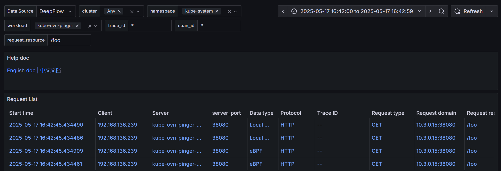

# Alauda 通过 DeepFlow 实现可观测性

## 概述

本指南提供了在 Alauda 容器平台（ACP）上安装和部署 DeepFlow 的过程，并详细解释了如何利用 DeepFlow 强大的追踪、指标和日志功能，实现对 ACP 平台及其运行应用的全面可观测性。通过遵循本指南，读者将掌握在 ACP 环境中使用 DeepFlow 的最佳实践，从而显著提高运营效率，确保业务连续性。

> 注意：本文档中提到的所有命令必须在您希望安装 DeepFlow 的集群的主节点上执行。

## 先决条件

1. 已安装 Alauda 容器平台。
2. 由 ACP 管理的 Kubernetes 集群。
3. 为 ACP 配置了网络文件系统（NFS）。

## 第 1 章. 安装 DeepFlow

### 步骤 1：下载打包工具

名为 `violet` 的打包和列出工具用于将工件上传到 Alauda 容器平台。

Alauda 容器平台提供的下载链接格式为 *\<PLATFORM\_URL>/platform/tools/download/violet/violet\_linux\_amd64*。

假设 ACP 平台的 URL 为 *<https://43.138.134.22>*，则下载链接为 *<https://43.138.134.22/platform/tools/download/violet/violet_linux_amd64>*。您可以执行以下命令下载该工具：

```shell
curl -k -O https://43.138.134.22/platform/tools/download/violet/violet_linux_amd64
```

然后，您需要执行以下命令使二进制文件可执行：

```shell
mv violet_linux_amd64 /usr/local/bin/violet
chmod +x /usr/local/bin/violet
```

执行命令 `violet version` 检查工具是否按预期工作。以下是一个示例：

```shell
[root@master01 ~]# violet version
violet v3.0.0
```

### 步骤 2：上传工件

需要两个工件。一个是 DeepFlow，另一个是 NFS CSI 插件。在本示例中，它们的文件名分别为 `deepflow-v3.19.0-fix.49.27.gb547cdc5-dbs.tgz` 和 `nfs.amd64.v4.0.2.tgz`。

将文件上传到您正在工作的节点，然后执行以下命令上传工件：

```shell
# 以下变量值必须根据您的实际环境设置
PLATFORM_URL="https://43.138.134.22"
USERNAME="admin@cpaas.io"
PASSWORD="07Apples@"

violet push --platform-address $PLATFORM_URL --platform-username $USERNAME --platform-password $PASSWORD nfs.amd64.v4.0.2.tgz
violet push --platform-address $PLATFORM_URL --platform-username $USERNAME --platform-password $PASSWORD deepflow-v3.19.0-fix.49.27.gb547cdc5-dbs.tgz
```

### 步骤 3：安装 NFS CSI 插件

执行以下命令安装 NFS CSI 插件：

```shell
# 可选环境变量
export KUBECONFIG="/etc/kubernetes/admin.conf"

# 安装 NFS CSI 插件
cat <<EOF | kubectl apply -f -
apiVersion: cluster.alauda.io/v1alpha1
kind: ClusterPluginInstance
metadata:
  annotations:
    cpaas.io/display-name: nfs
  labels:
    create-by: cluster-transformer
    manage-delete-by: cluster-transformer
    manage-update-by: cluster-transformer
  name: nfs
spec:
  pluginName: nfs
EOF

# 等待 ars 被创建
while true; do
  if kubectl -n cpaas-system get ars -o name | grep -w nfs >/dev/null; then
    break
  fi
  echo "等待 ars/nfs 被创建..."
  sleep 3
done

# 等待 NFS CSI 插件准备就绪
kubectl -n cpaas-system wait --for=condition=Health=true ars/nfs
```

### 步骤 4：创建 NFS 存储类

创建名为 `nfs` 的存储类：

```shell
# 可选环境变量
export KUBECONFIG="/etc/kubernetes/admin.conf"

# 以下变量值必须根据您的实际外部 NFS 服务器设置
NFS_SERVER="10.100.0.4" # NFS 服务器地址
NFS_PATH="/nfs"         # NFS 共享路径

# 创建存储类
cat <<EOF | kubectl apply -f -
apiVersion: storage.k8s.io/v1
kind: StorageClass
metadata:
  labels:
    project.cpaas.io/ALL_ALL: "true"
    project.cpaas.io/name: ""
  name: "nfs"
mountOptions:
  - hard
  - nfsvers=4.1
parameters:
  server: "${NFS_SERVER}"
  share: "${NFS_PATH}"
provisioner: nfs.csi.k8s.io
reclaimPolicy: Delete
volumeBindingMode: Immediate
EOF
```

### 步骤 5：安装 DeepFlow

执行以下命令安装 DeepFlow：

```shell
# 可选环境变量
export KUBECONFIG="/etc/kubernetes/admin.conf"

# DeepFlow chart 版本
VERSION="v3.19.0-fix.49.27.gb547cdc5-dbs"
# 安装 DeepFlow 的集群名称
CLUSTER_NAME="clsuter1"
# DeepFlow Grafana Web UI 的初始用户名/密码
USERNAME="admin"
PASSWORD="deepflow"
# 存储类名称
SC_NAME="nfs"
# MySQL 使用的存储大小
MYSQL_PVC_SIZE="50Gi"
# ClickHouse 使用的存储大小
CK_PATH_PVC_SIZE="100Gi"
CK_STORAGE_PATH_PVC_SIZE="200Gi"

cat <<EOF | kubectl apply -f -
apiVersion: app.k8s.io/v1beta1
kind: Application
metadata:
  name: deepflow
  namespace: cpaas-system
  annotations:
    app.cpaas.io/chart.source: public-charts/deepflow-plugin
    app.cpaas.io/chart.version: ${VERSION}
    app.cpaas.io/chart.values: |
      {
        "global": {
          "storageClass": "${SC_NAME}"
        },
        "server": {
          "service": {
            "type": "ClusterIP"
          }
        },
        "deepflow-agent": {
          "clusterNAME": "${CLUSTER_NAME}"
        },
        "grafana": {
          "adminUser": "${USERNAME}",
          "adminPassword": "${PASSWORD}",
          "service": {
            "type": "ClusterIP"
          },
          "grafana.ini": {
            "server": {
              "root_url": "%(protocol)s://%(domain)s/clusters/${CLUSTER_NAME}/deepflow",
              "serve_from_sub_path": true
            }
          }
        },
        "mysql": {
          "storageConfig": {
            "persistence": {
              "size": "${MYSQL_STORAGE_SIZE}"
            }
          }
        },
        "clickhouse": {
          "storageConfig": {
            "persistence": [
              {
                "accessModes": [
                  "ReadWriteOnce"
                ],
                "name": "clickhouse-path",
                "size": "${CK_PATH_PVC_SIZE}",
                "storageClass": "{{ .Values.global.storageClass }}"
              },
              {
                "accessModes": [
                  "ReadWriteOnce"
                ],
                "name": "clickhouse-storage-path",
                "size": "${CK_STORAGE_PATH_PVC_SIZE}",
                "storageClass": "{{ .Values.global.storageClass }}"
              }
            ]
          }
        }
      }
    cpaas.io/display-name: 'DeepFlow'
  labels:
    sync-from-helmrequest: 'true'
EOF

# 等待 DeepFlow 准备就绪
# 此步骤可能需要几分钟
kubectl -n cpaas-system wait --for=jsonpath='{.spec.assemblyPhase}'=Succeeded application deepflow
kubectl -n cpaas-system rollout status statefulset deepflow-clickhouse
kubectl -n cpaas-system rollout status deployment deepflow-mysql
kubectl -n cpaas-system rollout status deployment deepflow-server
kubectl -n cpaas-system rollout status deployment deepflow-app
kubectl -n cpaas-system rollout status deployment deepflow-grafana
kubectl -n cpaas-system rollout status daemonset deepflow-agent

# 配置 DeepFlow Grafana Web UI 的 ingress
cat <<EOF | kubectl apply -f -
apiVersion: networking.k8s.io/v1
kind: Ingress
metadata:
  annotations:
    nginx.ingress.kubernetes.io/backend-protocol: http
    nginx.ingress.kubernetes.io/enable-cors: "true"
  name: deepflow-grafana
  namespace: cpaas-system
spec:
  ingressClassName: cpaas-system
  rules:
  - http:
      paths:
      - backend:
          service:
            name: deepflow-grafana
            port:
              number: 80
        path: /clusters/${CLUSTER_NAME}/deepflow($|/)(.*)
        pathType: ImplementationSpecific
EOF
```

> 在上述示例中，DeepFlow 需要总共 350Gi 的存储空间。您必须确保存储类具有足够的存储容量。

## 第 2 章. DeepFlow 使用

### 登录 Grafana

DeepFlow 仪表板安装在 Grafana 部署中。Grafana Web UI 的 URL 格式为 *\<PLATFORM\_URL>/clusters/\<CLUSTER\_NAME>/deepflow*。

假设 ACP 平台的 URL 为 *<https://43.138.134.22>*，并且 DeepFlow 安装在集群 *cluster1* 中，则 URL 为 *<https://43.138.134.22/clusters/cluster1/deepflow>*。

在浏览器中访问 Grafana URL，您将看到登录页面：


您可以使用第 5 步中指定的用户名和密码登录 Grafana。**我们强烈建议您更改 Grafana 的默认密码。**

### DeepFlow 仪表板

在 Grafana Web UI 中，进入 **仪表板** 菜单：


进入 DeepFlow 模板文件夹，您将看到可用的仪表板：


### 使用 DeepFlow 进行故障排除

以下是两个关于如何排除 DNS 故障和链式 HTTP 请求的示例。

#### DNS 故障

如果您的应用面临 DNS 故障，您可以打开 **分布式追踪** 仪表板：


在变量选择中，选择您应用的命名空间和工作负载，然后输入域名；在时间设置中，选择您需要的时间范围。

以下是一个示例：


点击 **刷新** 按钮，您可以在 **请求列表** 面板中查看 DNS 请求：


DNS 请求的域名和状态也可用：


> *客户端错误* 表示请求的域名不存在。

#### 链式 HTTP 请求

假设有两个 HTTP GET 请求通过 HTTP 头 *X-Request-ID* 链接：节点 -> Pod (/foo) -> 外部 (/bar)。

在 **分布式追踪** 仪表板中，您可以看到请求日志：



点击请求日志，您可以在 **DeepFlow Flame Graph** 面板中看到火焰图：


> "S" 表示请求在系统进程侧被捕获，"N" 表示在网络 NIC 侧被捕获。

火焰图显示：

1. 节点 *192.168.136.239* 上的一个进程发送了一个 URL 为 */foo* 的 HTTP GET 请求到 Pod *kube-ovn-pinger-nnsrc*；
2. 在接收到请求后，Pod *kube-ovn-pinger-nnsrc* 向外部服务器 *192.168.152.146* 发送了一个 HTTP GET 请求；

点击火焰图中的一个跨度，您可以看到更多详细信息，包括开始时间、结束时间和状态码：


