# 原生应用高可用性测试解决方案

# 1. 测试环境准备

## 1.1 部署架构

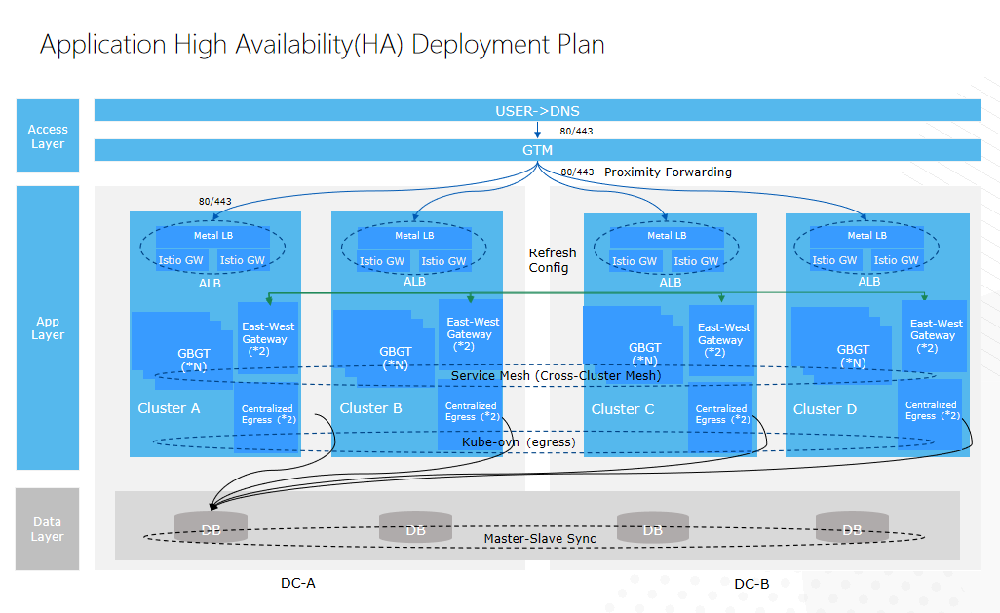

## **1.2 资源准备**

| 资源                          | **DC-A**                                                                                         | **DC-B**                                                                                           |
| ---------------------------- | ------------------------------------------------------------------------------------------------ | -------------------------------------------------------------------------------------------------- |
| 工作负载集群数量            | 2                                                                                                | 2                                                                                                  |
| 节点数量                     | 3 主节点 + 3 工作节点                                                                            | 3 主节点 + 3 工作节点                                                                               |
| 节点角色规划                 | - Kubernetes 角色（主节点/工作节点） <br>- 基础设施角色（ALB/Istio 网关/出口）                 | - Kubernetes 角色（主节点/工作节点） <br/>- 基础设施角色（ALB/Istio 网关/出口）                   |
| CPU 规格                     | 16C                                                                                              | 16C                                                                                                |
| 内存规格                    | 32GB                                                                                             | 32GB                                                                                               |
| NIC 规格                     | 10Gbps                                                                                           | 10Gbps                                                                                             |
| 操作系统                     | redhat810-enable_security-boot_disable-nopasswd-20250509-v2                                    | redhat810-enable_security-boot_disable-nopasswd-20250509-v2                                      |
| 命名空间                     | 应用命名空间：ha-cluster-ns                                                                     | 应用命名空间：cluster-ns                                                                           |
| Metal LB                     | Matelb 协议：ARP（L2）<br>IP 地址范围：192.168.170.0/24<br>部署规格：deafult                  | Matelb 协议：ARP（L2）<br/>IP 地址范围：192.168.170.0/24<br/>部署规格：deafult                   |
| Istio 网关                   | 容器网络模式：2 副本<br>部署规格：1C/1G                                                         | 容器网络模式：2 副本<br/>部署规格：1C/1G                                                          |
| Sidecar 代理                 | 部署规格：deafult                                                                                 | 部署规格：deafult                                                                                   |
| 东西向网关                   | 容器网络模式：2+ 副本<br>部署规格：2c/2G                                                        | 容器网络模式：2+ 副本<br/>部署规格：2c/2G                                                         |
| 出口网关                     | 近源出口（本地出口）                                                                               | 近源出口（本地出口）                                                                                 |
| 数据中心网络延迟            | <50 ms                                                                                           | <50 ms                                                                                             |
| 网络白名单激活              | 确保集中网关节点可以访问数据库                                                                    | 确保集中网关节点可以访问数据库                                                                      |
| 负载均衡器                   | HAproxy                                                                                          | HAproxy                                                                                            |

## 1.3 配置说明

| 资源                                          | 配置信息                                                                                                           |
| :-------------------------------------------- | :---------------------------------------------------------------------------------------------------------------- |
| DNS                                          | TTL < 5m                                                                                                        |
| GSLB(HAProxy)                                | 具有 4 个后端服务器的轮询负载均衡；<br>如果连续 5 次健康检查失败，则标记为不可用。                               |
| Istio Mesh 断路器策略                       | 每 10 秒检测一次。如果出现 5 次连续的 5XX 错误，则 100% 的实例将在 300 秒内断路。                             |
| 地域标签配置                                 | 创建 DC-A 和 DC-B 地域标签；<br>业务集群 c1 和 c2 绑定到 DC-A，c3 和 c4 绑定到 DC-B。                          |
| 基于 Mesh 创建微服务应用                     | 按顺序创建应用的 Deployment、Service 和 MicroService 资源。                                                     |
| ovn 出口                                     | 配置近源出口。                                                                                                   |
| 配置监控仪表板                               | 创建 ASM 性能监控仪表板；<br>创建流量指标图表。                                                                |

# 2. 测试数据准备

## 2.1 创建地域 & 配置地域

**创建地域**：

- 在管理员页面的“系统设置”下，点击左侧导航中的“地域”。
- 在列表页面，点击“创建”按钮。在创建弹出页面中，在名称输入框中输入“dc-a”，然后点击“创建”按钮。
- 继续点击“创建”按钮。通过相同步骤创建名称为“dc-b”的地域。

**集群地域配置**：

- 在管理员页面的“集群”下，点击左侧导航中的“集群”。
- 点击第一个集群“dbs-dca-c1”以访问其详细页面。点击“设置地域”按钮，选择“dc-a”，然后点击“设置”按钮。
- 点击第二个集群“dbs-dca-c2”以访问其详细页面。点击“设置地域”按钮，选择“dc-a”，然后点击“设置”按钮。
- 点击第三个集群“dbs-dca-c3”以访问其详细页面。点击“设置地域”按钮，选择“dc-b”，然后点击“设置”按钮。
- 点击第四个集群“dbs-dca-c4”以访问其详细页面。点击“设置地域”按钮，选择“dc-b”，然后点击“设置”按钮。

## 2.2 创建测试服务

### 步骤 1. 创建 Deployment

```bash
#!/bin/bash
 
set -euo pipefail  # 更安全的脚本执行模式
 
# 定义变量
project="ha-cluster"                            # 项目名称（一般不需要更改）。
namespace="ha-cluster-ns"                       # 命名空间名称（一般不需要更改）。
registry="152-231-registry.alauda.cn:60070"     # 需要与环境一致。
services=("service-a" "service-b" "service-c")  # 定义服务列表（一般不需要更改）
 
# 通用部署模板函数
generate_deployment() {
  local service_name=$1
  cat <<EOF
apiVersion: apps/v1
kind: Deployment
metadata:
  annotations:
    cpaas.io/creator: admin@cpaas.io
    cpaas.io/display-name: ""
    cpaas.io/operator: admin@cpaas.io
  labels:
    asm.cpaas.io/msname: ${service_name}
  name: ${service_name}
  namespace: ${namespace}
spec:
  progressDeadlineSeconds: 600
  replicas: 2
  revisionHistoryLimit: 10
  selector:
    matchLabels:
      project.cpaas.io/name: ${project}
      service.cpaas.io/name: deployment-${service_name}
  strategy:
    rollingUpdate:
      maxSurge: 1
      maxUnavailable: 1
    type: RollingUpdate
  template:
    metadata:
      labels:
        project.cpaas.io/name: ${project}
        service.cpaas.io/name: deployment-${service_name}
    spec:
      affinity:
        podAntiAffinity:
          requiredDuringSchedulingIgnoredDuringExecution:
          - labelSelector:
              matchExpressions:
              - key: service.cpaas.io/name
                operator: In
                values:
                - deployment-${service_name}
            topologyKey: "kubernetes.io/hostname"
      containers:
        - command:
            - http-server
          image: ${registry}/asm/asm-test-image:latest
          imagePullPolicy: Always
          name: ${service_name}
          resources:
            limits:
              cpu: "1"
              memory: 1Gi
            requests:
              cpu: 500m
              memory: 512Mi
          terminationMessagePath: /dev/termination-log
          terminationMessagePolicy: File
      dnsPolicy: ClusterFirst
      restartPolicy: Always
      schedulerName: default-scheduler
      securityContext: {}
      terminationGracePeriodSeconds: 30
EOF
}
 
# 生成并应用所有部署配置
for service in "${services[@]}"; do
  echo "正在应用 ${service} 的部署..."
  generate_deployment "${service}" | kubectl apply -f -
   
  # 检查 kubectl 命令是否成功执行
  if [ $? -ne 0 ]; then
    echo "错误：应用 ${service} 的 Deployment 配置失败。"
    exit 1
  fi
done
 
echo "所有部署配置成功应用。"
```

执行上述脚本，

```bash
bash deployment.sh
```

### 步骤 2. 创建 Service

```bash
#!/bin/bash
set -euo pipefail
 
# 配置常量
readonly PROJECT="ha-cluster"
readonly NAMESPACE="ha-cluster-ns"
readonly SERVICES=("service-a" "service-b" "service-c")
 
 
# 生成通用服务配置
generate_service() {
  local service_name=$1
  local port_config=""
  local selector_name="deployment-${service_name}"
 
  # Fortio 服务端口配置的特殊处理
  if [[ "${service_name}" == "fortio" ]]; then
    port_config=$(cat <<EOS
    - appProtocol: http
      name: http-80-8080
      port: 80
      protocol: TCP
      targetPort: 8080
EOS
    )
  else
    port_config=$(cat <<EOS
    - appProtocol: http
      name: http-80-80
      port: 80
      protocol: TCP
      targetPort: 80
EOS
    )
  fi
 
  cat <<EOF
apiVersion: v1
kind: Service
metadata:
  annotations:
    cpaas.io/display-name: ""
    resource.cpaas.io/reference: '["Deployment.${service_name}"]'
  name: ${service_name}
  namespace: ${NAMESPACE}
spec:
  ports:
${port_config}
  selector:
    project.cpaas.io/name: ${PROJECT}
    service.cpaas.io/name: ${selector_name}
  sessionAffinity: None
  type: ClusterIP
EOF
}
 
# 应用服务配置
apply_service() {
  local service_name=$1
  echo "正在应用 ${service_name} 的服务配置..."
   
  if ! generate_service "${service_name}" | kubectl apply -f -; then
    echo "错误：应用 ${service_name} 的服务配置失败" >&2
    return 1
  fi
}
 
# 主执行函数
main() {
  # 检查 kubectl 是否可用
  if ! command -v kubectl &>/dev/null; then
    echo "错误：kubectl 未安装或不在 PATH 中" >&2
    exit 1
  fi
 
  # 应用所有服务配置
  for service in "${SERVICES[@]}"; do
    if ! apply_service "${service}"; then
      exit 1
    fi
  done
 
  echo "所有服务配置成功应用。"
  exit 0
}
 
# 执行主函数
main
```

执行上述脚本，

```bash
bash service.sh
```

### 步骤 3. 创建微服务

```bash
#!/bin/bash
set -euo pipefail
 
# 配置常量
readonly NAMESPACE="ha-cluster-ns"
readonly SERVICES=(
  "service-a"
  "service-b"
  "service-c"
  # 可以继续添加更多服务
)
 
# 生成微服务配置
generate_microservice() {
  local service_name=$1
  cat <<EOF
apiVersion: asm.alauda.io/v1beta3
kind: MicroService
metadata:
  labels:
    app.cpaas.io/microservice-type: service-mesh
    asm.cpaas.io/isolatepod: enabled
    asm.cpaas.io/mesh-discovery: disabled
  name: ${service_name}
  namespace: ${NAMESPACE}
spec:
  accessLogging:
    enabled: false
  auth: {}
  deployments:
    - name: ${service_name}
  otelJavaAgent:
    enabled: false
  services:
    - iscreatebysystem: true
      name: ${service_name}
  sidecar:
    enabled: true
    envoyLogLevel: warning
    resources:
      limits:
        cpu: 500m
        memory: 512Mi
      requests:
        cpu: 100m
        memory: 128Mi
  swagger: {}
EOF
}
 
# 应用微服务配置
apply_microservice() {
  local service_name=$1
  echo "正在应用 ${service_name} 的微服务配置..."
   
  if ! generate_microservice "${service_name}" | kubectl apply -f -; then
    echo "错误：应用 ${service_name} 的微服务配置失败" >&2
    return 1
  fi
}
 
# 主执行函数
main() {
  # 预检查
  if ! command -v kubectl &>/dev/null; then
    echo "错误：kubectl 未安装或不在 PATH 中" >&2
    exit 1
  fi
 
  # 批量创建微服务
  for svc in "${SERVICES[@]}"; do
    if ! apply_microservice "${svc}"; then
      exit 1
    fi
  done
 
  echo "成功应用了 ${#SERVICES[@]} 个微服务："
  printf " - %s\n" "${SERVICES[@]}"
  exit 0
}
 
# 执行入口
main
```

执行上述脚本，

```bash
bash microservice.sh
```

### 步骤 4. 创建 Ingress 网关

在所有四个集群上执行相同步骤以创建每个集群的网关路由。

1. 转到 **Service Mesh** 管理视图，点击左侧导航中的 Gateways。

2. 点击“**部署网关**”，填写：

```
- 名称: test-lb-gateway
- 命名空间: ha-cluster-ns   
- 部署节点: 选择 "node-role.kubernetes.io/master"
```

​	点击“**创建**”按钮。

3. 转到“test-lb-gateway”详细页面，点击“**网关配置**”选项卡，然后点击“**创建网关配置**”按钮。填写：

```
- 名称: test
- 端口 HTTP: 80
- 主机: *
```

​	点击“**创建**”按钮。

4. 再次转到“test-lb-gateway”详细页面，点击“**虚拟服务**”选项卡，然后点击“**创建路由配置**”。填写：

```
- 名称: test
- 命名空间: ha-cluster-ns
- 目标: ha-cluster-ns service-a 80
```

​	点击“**创建**”按钮。

### 步骤 5. 配置 haproxy

在部署 HAProxy 后，我们需要为 4 个集群配置入口网关地址。访问地址可以在“步骤 4：创建 Ingress 网关”中找到。

例如：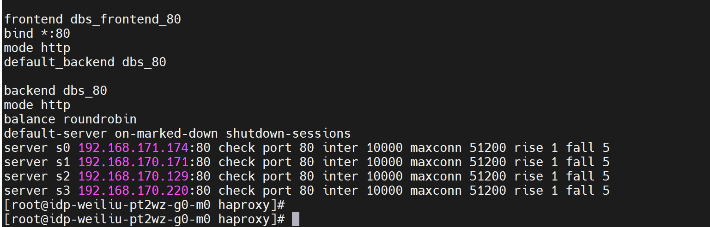

### 步骤 6. 部署 fortio

```bash
#!/bin/bash
 
set -euo pipefail  # 更安全的脚本执行模式
 
# 定义变量
project="ha-cluster"
namespace="ha-cluster-ns"
registry="global-g1-z9e4vi--idp.alaudatech.net:11443" # 环境镜像仓库地址
haproxyip="192.168.141.58"   # 需要替换为 [haproxyio]
 
cat << EOF |kubectl apply -f -
apiVersion: apps/v1
kind: Deployment
metadata:
  annotations:
    cpaas.io/creator: admin@cpaas.io
    cpaas.io/display-name: ""
  labels:
    asm.cpaas.io/msname: fortio
  name: fortio
  namespace: ${namespace}
spec:
  progressDeadlineSeconds: 600
  replicas: 1
  revisionHistoryLimit: 10
  selector:
    matchLabels:
      project.cpaas.io/name: ${project}
      service.cpaas.io/name: deployment-fortio
  strategy:
    rollingUpdate:
      maxSurge: 1
      maxUnavailable: 1
    type: RollingUpdate
  template:
    metadata:
      annotations:
        cpaas.io/creator: admin@cpaas.io
      labels:
        project.cpaas.io/name:  ${project}
        service.cpaas.io/name: deployment-fortio
    spec:
      affinity: {}
      containers:
        - args:
            - load
            - -qps
            - "40"
            - -c
            - "5"
            - -t
            - "0"
            - -H
            - "Connection: close"
            - http://${haproxyip}/call?url=http://service-b/call?url=http://service-c/call
          image: ${registry}/asm/test/fortio:istio
          imagePullPolicy: IfNotPresent
          name: fortio
          ports:
            - containerPort: 8080
              protocol: TCP
            - containerPort: 8079
              protocol: TCP
          resources:
            limits:
              cpu: 200m
              memory: 200Mi
            requests:
              cpu: 100m
              memory: 100Mi
          terminationMessagePath: /dev/termination-log
          terminationMessagePolicy: File
      dnsPolicy: ClusterFirst
      restartPolicy: Always
      schedulerName: default-scheduler
      securityContext: {}
      terminationGracePeriodSeconds: 30
EOF
 
 
echo "所有部署配置成功应用。"
```

执行上述脚本，

```
bash fortio.sh
```

## 2.3 可观察性指标配置

### 步骤 1. 创建 ASM 性能监控面板

导航到 **管理员**，点击左侧导航中的 **操作中心** → **监控** → **监控仪表板**。点击右上角的 **"创建"** 按钮，填写以下表单，然后点击底部的 **"创建"** 按钮：

```
- 名称: asm
- 仪表板名称: ASM 性能监控仪表板
- 文件夹: monitor
- 主仪表板: 开
```

### 步骤 2. 创建东西向流量指标

#### 步骤 2-1. 创建 "服务请求 TPS" 图表

在 *ASM 性能监控* 仪表板中，点击 **"添加图表"** 按钮，填写以下表单，然后点击 **"保存"** 按钮：

```
面板设置：
- 图表类型： 趋势
- 名称：东西向流量 TPS (集群分组)
- 标准设置： 自定义   qps
- 图例参数: 图例位置 右
```

```
指标：
- 添加方法：原生
- PromQL: sum by (source_app,destination_app) (rate(istio_requests_total{reporter="destination", source_app!="unknown", source_app!="fortio",source_app!="fortio-lb",destination_app=~"service-.*"}[5m]))
- 图例参数：{{.source_app}}->{{.destination_app}}
```

#### 步骤 2-2. 创建 "服务请求成功率" 图表

在 *ASM 性能监控* 仪表板中，点击 **"添加图表"** 按钮，填写以下表单，然后点击 **"保存"** 按钮：

```
面板设置：
- 图表类型： 趋势
- 名称：东西向流量成功率 (2xx/3xx 比率)
- 标准设置： 其他 %
- 图例参数: 图例位置 右
```

```
指标：
- 添加方法：原生
- PromQL: sum by (source_app,destination_app) (rate(istio_requests_total{reporter="destination",response_code=~"2..|3.."}[5m]) )  /  sum by (source_app,destination_app) (rate(istio_requests_total{reporter="destination"}[5m]))
- 图例参数：{{.source_app}}->{{.destination_app}}
```

#### 步骤 2-3. 创建 "服务延迟" 图表

在 *ASM 性能监控* 仪表板中，点击 **"添加图表"** 按钮，填写以下表单，然后点击 **"保存"** 按钮：

```
面板设置：
- 图表类型： 趋势
- 名称：东西向流量 P99 服务延迟 (集群分组)
- 标准设置： 时间   毫秒
- 图例参数: 图例位置 右
```

```
指标：
- 添加方法：原生
- PromQL: histogram_quantile(0.99, sum by (le, source_app,destination_app) (rate(istio_request_duration_milliseconds_bucket{reporter="destination", source_app!="unknown"}[5m])))
- 图例参数：{{.source_app}}->{{.destination_app}}
```

### 步骤 3. 南北向流量指标

#### 步骤 3-1. 创建 "服务请求 TPS" 图表

在 *ASM 性能监控* 仪表板中，点击 **"添加图表"** 按钮，填写以下表单，然后点击 **"保存"** 按钮：

```
面板设置：
- 图表类型： 趋势
- 名称：南北向流量 TPS (集群分组)
- 标准设置： 自定义    qps
- 图例参数: 图例位置 右
```

```
指标：
- 添加方法：原生
- PromQL:  sum by (source_app,destination_app) (rate(istio_requests_total{reporter="destination",source_app="test-lb-gateway"}[5m]))
- 图例参数：{{.source_app}}->{{.destination_app}}
```

#### 步骤 3-2. 创建 "服务请求成功率" 图表

在 *ASM 性能监控* 仪表板中，点击 **"添加图表"** 按钮，填写以下表单，然后点击 **"保存"** 按钮：

```
面板设置：
- 图表类型： 趋势
- 名称：南北向流量成功率 (2xx/3xx)
- 标准设置： 其他 %
- 图例参数: 图例位置 右
```

```
指标：
- 添加方法：原生
- PromQL: sum by (source_app,destination_app) (rate(istio_requests_total{source_app="test-lb-gateway",reporter="destination",response_code=~"2..|3.."}[5m]))  /  sum by (source_app,destination_app) (rate(istio_requests_total{source_app="test-lb-gateway",reporter="destination"}[5m]))
- 图例参数：{{.source_app}}→{{.destination_app}}
```

#### 步骤 3-3. 创建 "服务延迟" 图表

在 *ASM 性能监控* 仪表板中，点击 **"添加图表"** 按钮，填写以下表单，然后点击 **"保存"** 按钮：

```
面板设置：
- 图表类型： 趋势
- 名称：南北向流量 P99 服务延迟 (集群分组)
- 标准设置： 时间   毫秒
- 图例参数: 图例位置 右
```

```
指标：
- 添加方法：原生
- PromQL: histogram_quantile(0.99, sum by (le, source_app,destination_app) (rate(istio_request_duration_milliseconds_bucket{source_app="test-lb-gateway", reporter="destination"}[5m])))
- 图例参数：{{.source_app}}->{{.destination_app}}
```

### 步骤 4. 多集群流量分布指标

在 *ASM 性能监控* 仪表板中，点击 **"添加图表"** 按钮，填写以下表单，然后点击 **"保存"** 按钮：

```
面板设置：
- 图表类型： 趋势
- 名称：多集群流量分布
- 标准设置： 自定义 qps
- 图例参数: 图例位置 右
```

```
指标：
- 添加方法：原生
- PromQL: sum by (destination_cluster) (rate(istio_requests_total{reporter="source",destination_cluster!="unknown"}[5m]) )
- 图例参数：{{.destination_cluster}}
```

## 2.4 基准测试

基准测试结果是识别测试环境中后续流量变化期间异常波动的重要指标。

### 案例 1: DC-A ↔ DC-B 流量调度测试

**测试步骤：**

- 打开操作中心→监控→仪表板，在管理员页面中
- 在顶部导航栏中，分别选择四个业务集群并记录 ASM 监控仪表板。

**预期结果：**

- 每个集群以 10 qps 发送请求，这些请求在同一区域的两个集群之间进行负载均衡。
- 服务请求成功率（2xx/3xx 响应的百分比）= 100%。

**实际结果：**

- 区域 DC-A 中核心集群 dbs-dca-c1 的监控。

  核心集群 dbs-dca-c1 以 10 qps 处理请求。


- 这些请求在同一区域的两个集群之间以 10 qps 进行负载均衡。


服务请求成功率：

******

P99 服务延迟：

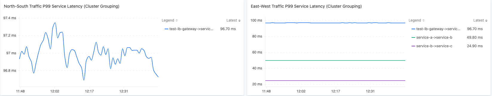

# 3. 测试场景 1: 数据中心级切换

## 3.1 测试目标


验证跨区域数据中心级故障转移能力，RTO ≤ 90s 和 RPO = 0。

| 指标   | 描述                                                                                                  | 标准     |
| ------ | ----------------------------------------------------------------------------------------------------- | -------- |
| RTO    | 从故障发生时起，系统完全恢复业务功能的最大可接受时间。                                               | RTO≤90s  |
| RPO    | 故障期间最大可容忍的数据丢失，通常以时间来衡量。                                                    | RPO=0    |

## 3.2 测试前提

- Fortio 性能测试工具以 40 qps 访问 haproxy，haproxy 将流量以 10 qps 分配到 4 个业务集群。
- 服务访问链如下：haproxy → metalab → ingress 网关 → service-a → service-b → service-c。

## 3.3 可观察性指标准备

| 指标                                                        | 描述                                                                                          | 标准                               |
| ----------------------------------------------------------- | --------------------------------------------------------------------------------------------- | ---------------------------------- |
| 服务请求 TPS (集群分组)                                    | 使用 Fortio 性能测试工具对服务 a (a→b-c) 每秒的调用次数。                                   | 流量波动在 10 qps 左右。          |
| P99 服务延迟 (集群分组)                                    | P99 服务延迟                                                                                  | 抖动 < 5%                          |
| 服务请求成功率 (2xx/3xx 响应的比例)                        | 服务请求成功率                                                                                | 100%                               |

## 3.4 测试用例

### 案例 1: DC-A 故障转移测试

**测试步骤：**

- 关闭 DC-A 中所有集群的所有节点，等待 10 分钟。
- 打开操作中心→监控→仪表板，在管理员页面中。
- 在顶部导航栏中，选择 DC-B 区域的第一个业务集群并记录 ASM 监控仪表板。

**预期结果：**

- 当主中心 DC-A 发生停电并启动灾难恢复时，备份中心 DC-B 接管流量。
- 服务请求成功率（2xx/3xx 响应的百分比）抖动 < 5%

**实际结果：**

- 在 DC-A 中所有集群停电后，haproxy 将请求引导到 DC-B 区域的两个集群，每个集群的流量将增加 10 QPS。

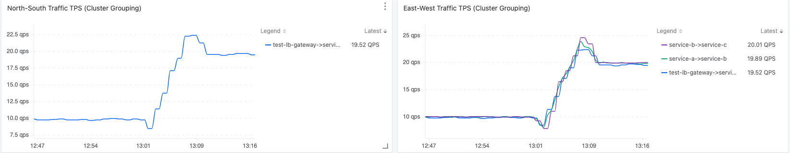

- 每个集群的 20 qps 流量将在同一区域的两个集群之间进行负载均衡。


- 服务请求成功率

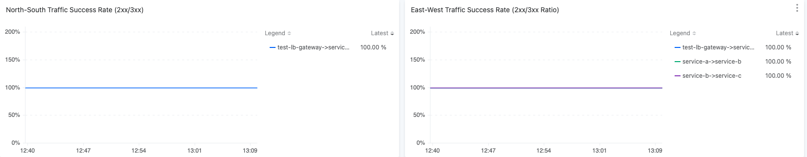

- P99 服务延迟


- 结果总结

| 期望                                      | 实际测试结果                                             | 满足期望 |
| ----------------------------------------- | -------------------------------------------------------- | -------- |
| 备份中心 DC-B 接管流量                   | 20 qps 流量在 DC-B 的 2 个集群之间进行负载均衡        | ✅       |
| 2xx/3xx 响应的百分比保持 100%            | 成功率 100%                                             | ✅       |
| P99 服务延迟抖动 < 5%                     | 实际抖动 1%                                            | ✅       |

### 案例 2: DC-A 恢复测试

**测试步骤：**

- 开启 DC-A 区域的所有集群并等待 10 分钟。
- 打开操作中心→监控→仪表板，在管理员页面中。
- 在顶部导航栏中，选择 DC-B 区域的第一个业务集群并记录 ASM 监控仪表板。

**预期结果：**

- 在故障恢复过程中，备份中心 DC-B 将释放一部分流量到 DC-A。
- 在故障恢复过程中，主中心 DC-A 将逐渐接管流量。

**实际结果：**

- 备份中心 DC-B 将一部分流量释放到 DC-A。


服务请求成功率

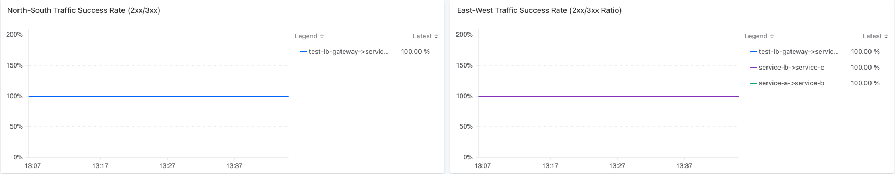

P99 服务延迟


- 主中心 DC-A 将逐渐接管流量。

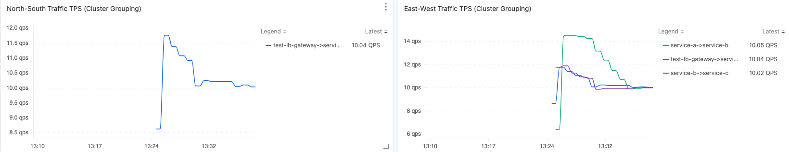

服务请求成功率


P99 服务延迟

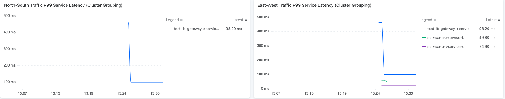

- 结果总结

| 期望                                      | 实际测试结果                               | 满足期望 |
| ----------------------------------------- | ------------------------------------------ | -------- |
| DC-B 释放部分流量                        | 每个网关的流量减少 10 QPS                  | ✅       |
| DC-A 逐渐接管流量                        | 每个网关的流量增加 10 QPS                  | ✅       |

# 4. 测试场景 2: 集群级切换

## 4.1 测试目标

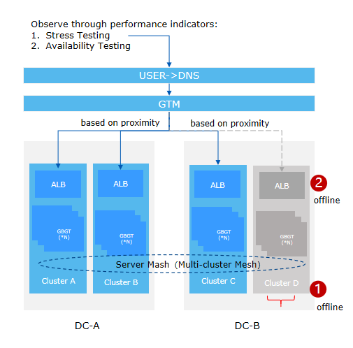

验证双中心核心集群应用单节点故障的数据故障转移能力。

| 指标   | 描述                                                                                                  | 标准     |
| ------ | ----------------------------------------------------------------------------------------------------- | -------- |
| RTO    | 从故障发生时起，系统完全恢复业务功能的最大可接受时间。                                               | RTO≤90s  |
| RPO    | 故障期间最大可容忍的数据丢失，通常以时间来衡量。                                                    | RPO=0    |

## 4.2 测试前提

- Fortio 性能测试工具以 40 qps 访问 haproxy，haproxy 将流量以 10 qps 分配到 4 个业务集群。
- 服务访问链如下：haproxy → metalab → ingress 网关 → service-a → service-b → service-c。

## 4.3 可观察性指标准备

| 指标                                                        | 描述                                                                                          | 标准                               |
| ----------------------------------------------------------- | --------------------------------------------------------------------------------------------- | ---------------------------------- |
| 服务请求 TPS (集群分组)                                    | 使用 Fortio 性能测试工具对服务 a (a→b-c) 每秒的调用次数。                                   | 流量波动在 10 qps 左右。          |
| P99 服务延迟 (集群分组)                                    | P99 服务延迟                                                                                  | 抖动 < 5%                          |
| 服务请求成功率 (2xx/3xx 响应的比例)                        | 服务请求成功率                                                                                | 100%                               |

## 4.4 测试用例

### 案例 1: DC-B c4 集群故障

**测试步骤**：DC-B 区域的集群 dbs-dca-c4 所有节点停电

**预期结果**：集群 dbs-dca-c4 的流量被重定向到同一区域的热备集群。

**实际结果**：

- 在关闭 dbs-dca-c4 集群后，流量切换到同一区域的另一集群。


服务请求成功率


P99 服务延迟


- 结果总结

| 期望                                      | 实际测试结果                                             | 满足期望 |
| ----------------------------------------- | -------------------------------------------------------- | -------- |
| 备份集群 c3 接管来自 c4 的流量          | c4 的流量降至 0<br>c3 的流量增加相同的值                | ✅       |

### 案例 2: DC-B c4 集群恢复

**测试步骤**：开启 DC-B 区域的集群 dbs-dca-c4

**预期结果**：在集群 dbs-dca-c4 完全恢复后，流量继续在同一区域的两个集群之间进行负载均衡。

**实际结果**：

- 流量在同一区域的两个集群（dbs-dca-c3, dbs-dca-c4）之间进行负载均衡。

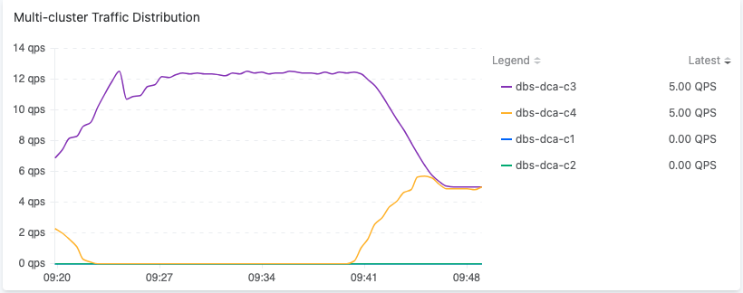

服务请求成功率

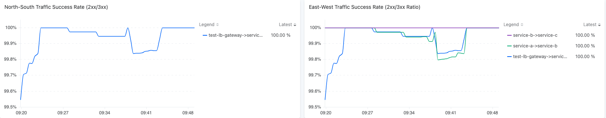

P99 服务延迟


- 结果总结

| 期望                                      | 实际测试结果                                  | 满足期望 |
| ----------------------------------------- | ---------------------------------------------- | -------- |
| 集群 c4 在恢复后接管流量                 | 流量继续在 c3 和 c4 之间进行负载均衡       | ✅       |

### 案例 3: DC-B c4 集群 istio-eastwestgateway 故障

**测试步骤**：在 DC-B 区域的集群 dbs-dca-c4 上模拟 istio-eastwestgateway Pod 故障 10 分钟。

```yaml
apiVersion: chaos-mesh.org/v1alpha1
kind: PodChaos
metadata:
  name: pod-failure-example
  namespace: istio-system
spec:
  action: pod-failure
  mode: one
  duration: '600s'
  selector:
    labelSelectors:
       app: istio-eastwestgateway
```

**预期结果**：集群 dbs-dca-c4 的流量被重定向到同一区域的热备集群。

**实际结果**：

- 核心集群的流量由热备集群接管。

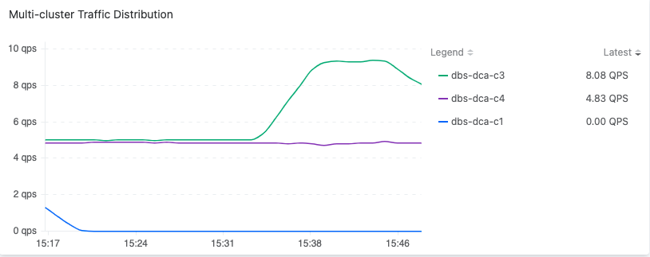

服务请求成功率


P99 服务延迟


- 结果总结

| 期望                                      | 实际测试结果                               | 满足期望 |
| ----------------------------------------- | ------------------------------------------- | -------- |
| 备份集群 c3 接管来自 c4 的流量          | c3 的流量增加了从 c4 重定向的 QPS        | ✅       |

# 5. 测试场景 3: 应用级切换

## 5.1 测试目标


验证双中心核心集群应用单节点故障的数据故障转移能力。

| 指标   | 描述                                                                                                  | 标准     |
| ------ | ----------------------------------------------------------------------------------------------------- | -------- |
| RTO    | 从故障发生时起，系统完全恢复业务功能的最大可接受时间。                                               | RTO≤90s  |
| RPO    | 故障期间最大可容忍的数据丢失，通常以时间来衡量。                                                    | RPO=0    |

## 5.2 测试前提

- Fortio 性能测试工具以 40 qps 访问 haproxy，haproxy 将流量以 10 qps 分配到 4 个业务集群。
- 服务访问链如下：haproxy → metalab → ingress 网关 → service-a → service-b → service-c。

## 5.3 可观察性指标准备

| 指标                                                        | 描述                                                                                          | 标准                               |
| ----------------------------------------------------------- | --------------------------------------------------------------------------------------------- | ---------------------------------- |
| 服务请求 TPS (集群分组)                                    | 使用 Fortio 性能测试工具对服务 a (a→b-c) 每秒的调用次数。                                   | 流量波动在 10 qps 左右。          |
| P99 服务延迟 (集群分组)                                    | P99 服务延迟                                                                                  | 抖动 < 5%                          |
| 服务请求成功率 (2xx/3xx 响应的比例)                        | 服务请求成功率                                                                                | 100%                               |

## 5.4 测试用例

### 案例 1: DC-A c1 和 DC-B c4 双中心应用单节点故障

**测试步骤：**

- 在每个区域的核心集群（dbs-dca-c1, dbs-dca-c4）上，使用 Chaos Mesh 模拟 service-a 实例的 10 分钟故障。

```
apiVersion: chaos-mesh.org/v1alpha1
kind: PodChaos
metadata:
  name: pod-failure-example
  namespace: ha-cluster-ns
spec:
  action: pod-failure
  mode: one
  duration: '600s'
  selector:
    labelSelectors:
       service.cpaas.io/name: deployment-service-a
```

**预期结果：**

- 流量在同一区域的备用集群之间进行负载均衡。

- 服务请求成功率（2xx/3xx 响应的百分比）= 100%

- 应用从故障中恢复后，流量以 10 QPS 在每个集群之间进行负载均衡。

**实际结果：**

- 流量在同一区域的备用集群之间进行负载均衡。
  同一区域备用集群的流量监控。


服务请求成功率


P99 服务延迟


- 结果总结

| 期望                                                                                     | 实际测试结果                              | 满足期望 |
| ---------------------------------------------------------------------------------------- | ------------------------------------------ | -------- |
| 流量在同一区域的备用集群之间进行负载均衡                                               | 入口网关的流量 → service-a 增加         | ✅       |
| 2xx/3xx 响应的百分比保持 100%                                                           | 成功率 100%                                | ✅       |
| 应用从故障中恢复后，流量在每个集群之间进行负载均衡                                     | 每个集群的流量恢复到 10 qps               | ✅       |

# 6. 测试场景 4: 服务级切换

## 6.1 测试目标


验证服务的最小可行生存和同一区域数据故障转移能力，RTO ≤ 90s 和 RPO = 0。

| 指标   | 描述                                                                                                  | 标准     |
| ------ | ----------------------------------------------------------------------------------------------------- | -------- |
| RTO    | 从故障发生时起，系统完全恢复业务功能的最大可接受时间。                                               | RTO≤90s  |
| RPO    | 故障期间最大可容忍的数据丢失，通常以时间来衡量。                                                    | RPO=0    |

## 6.2 测试前提

- Fortio 性能测试工具以 40 qps 访问 haproxy，haproxy 将流量以 10 qps 分配到 4 个业务集群。
- 服务访问链如下：haproxy → metalab → ingress 网关 → service-a → service-b → service-c。

## 6.3 可观察性指标准备

| 指标                                                        | 描述                                                                                          | 标准                               |
| ----------------------------------------------------------- | --------------------------------------------------------------------------------------------- | ---------------------------------- |
| 服务请求 TPS (集群分组)                                    | 使用 Fortio 性能测试工具对服务 a (a→b-c) 每秒的调用次数。                                   | 流量波动在 10 qps 左右。          |
| P99 服务延迟 (集群分组)                                    | P99 服务延迟                                                                                  | 抖动 < 5%                          |
| 服务请求成功率 (2xx/3xx 响应的比例)                        | 服务请求成功率                                                                                | 100%                               |

## 6.4 测试用例

### 案例 1: DC-A 服务最小生存

**测试步骤：**

- 停止 dbs-dca-c1 集群上的 service-a 部署。
- 在 dbs-dca-c2 集群上使用 Chaos Mesh 模拟其中一个 service-a 实例的 10 分钟故障。

```yaml
apiVersion: chaos-mesh.org/v1alpha1
kind: PodChaos
metadata:
  name: pod-failure-example
  namespace: ha-cluster-ns
spec:
  action: pod-failure
  mode: one
  duration: '600s'
  selector:
    labelSelectors:
       service.cpaas.io/name: deployment-service-a
```

- 检查热备（dbs-dca-c1）集群监控。

**预期结果：**

- 当服务故障时，流量由同一区域的热备集群接管。
- 服务请求成功率（2xx/3xx 响应的百分比）= 100%。

**实际结果：**

- 当服务故障时，流量由同一区域的热备集群接管。


服务请求成功率


南北向流量 P99 服务延迟 (集群分组)


- 结果总结

| 期望                                                                 | 实际测试结果                                          | 满足期望 |
| -------------------------------------------------------------------- | ----------------------------------------------------- | -------- |
| 服务流量由同一区域的热备集群接管                                   | 另一个集群的实例流量增加了 10 qps                    | ✅       |
| 2xx/3xx 响应的百分比保持 100%                                     | 成功率 100%                                          | ✅       |
