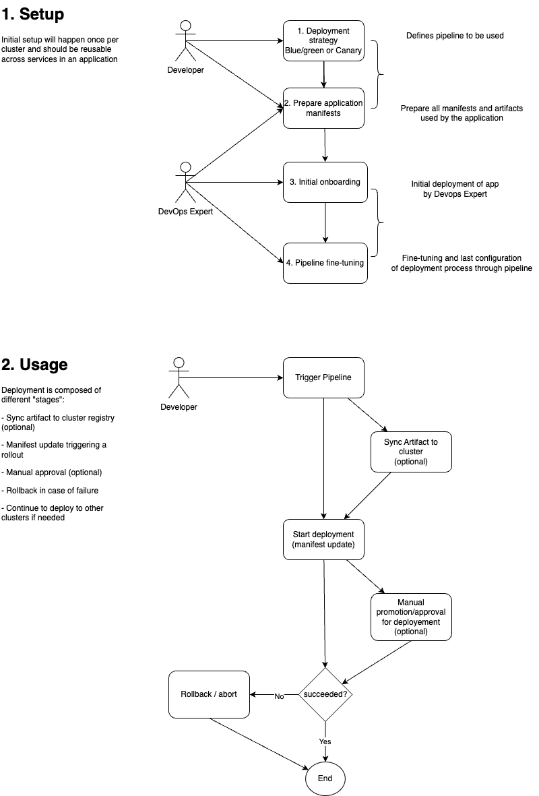

---
products:
  - Alauda Container Platform
  - Alauda Service Mesh
kind:
  - Solution
id: KB250500011
sourceSHA: 72cc5638fa1a7ade8e1bcc7bf2d1bf176970464db6cd2b96a41007082873abbb
---

# 使用 Alauda 容器平台的 CI/CD 集成示例

本文档提供了一个 CI/CD 管道集成示例，用于在 Alauda 容器平台 (ACP) 上部署应用程序，使用的工具包括 Argo Rollouts、Gateway API 和 Skopeo。这是众多可能方法中的一种。鼓励用户根据自己的部署策略和工具调整此示例。

有关其他部署方法，请参阅：

- ACP 部署策略
- 从 Istio 迁移到 Alauda 服务网格

## 先决条件

- Alauda 容器平台环境和账户。
- 在 Alauda 容器平台内已创建项目和命名空间，并具备必要的权限。
- 应用程序清单和镜像仓库。对于本指南，使用公共仓库 (index.docker.io)，并将提供如何集成外部第三方镜像仓库的说明。
- 已安装 [Kubectl CLI](https://kubectl.docs.kubernetes.io/installation/kubectl/)。与集群的所有主要交互将使用 kubectl 完成。
- 已安装 `kubectl acp plugin`。通过 kubectl acp login 命令进行集群身份验证。
- 已安装 [Skopeo](https://github.com/containers/skopeo)。Skopeo 用于在注册表之间同步容器镜像。如果直接使用源镜像进行部署，则此工具变得不必要。
- 可选择安装 [Docker](https://docs.docker.com/get-docker/) 或 [Podman](https://podman.io/docs/installation)，以将镜像从源复制到目标仓库。这些是用于在注册表之间同步容器镜像的替代工具。
- 可选择安装 [Kubectl argo rollouts plugin](https://argoproj.github.io/argo-rollouts/installation/#kubectl-plugin-installation)，用于监视和手动推广基于 Argo Rollouts 的发布。

**注意**：上述某些工具（例如 Skopeo、Argo Rollouts）仅在此示例中使用。如果在您的设置中不必要，可以用其他工具替代或跳过它们。

## 操作步骤

在满足所有先决条件后，使用蓝绿和金丝雀部署策略部署应用程序的过程分为以下几个阶段：

1. 选择部署策略（蓝绿或金丝雀）
2. 准备应用程序清单和容器镜像
3. 将应用程序引入 ACP
4. 配置和微调您的 CI/CD 管道
5. 使用管道部署和管理您的应用程序



## 第一步：选择部署策略

第一步是决定部署策略。您可以选择蓝绿和金丝雀部署策略。策略的选择将取决于您的应用程序需求和对部署过程的控制程度。如果没有特定要求，您可以选择蓝绿部署策略，因为它更易于实施和管理，或者使用常规的滚动更新。

- **蓝绿部署**：该策略涉及将新版本的应用程序与旧版本并行部署，然后将流量切换到新版本。这允许在新版本出现问题时快速回滚。
- **金丝雀部署**：该策略涉及将新版本的应用程序部署到一小部分用户，然后再向整个用户群推出。这允许在生产环境中以最小风险测试新版本。

在选择部署策略后，您还应决定发布策略。发布策略定义了新版本应用程序的部署方式。您可以选择自动和手动发布策略。对于自动策略，您还可以选择使用基于指标的发布。

### 1.1 蓝绿部署

选择蓝绿部署策略时，您需要准备以下内容：

- **服务**：您需要为应用程序创建两个服务。一个服务将用于旧版本的应用程序（蓝色），另一个服务将用于新版本的应用程序（绿色）。对于初始设置，服务清单可以具有相同的规格，Rollout 将负责在服务定义中切换匹配的标签。

- **网关**：您需要为应用程序创建一个网关资源。网关资源定义了应用程序的入口点。

- **HTTPRoute**：为了成功路由流量，您需要创建一个 HTTPRoute 资源。HTTPRoute 资源定义了应用程序的路由规则。

- **Rollout**：您需要为应用程序创建一个 Rollout 资源。Rollout 资源定义了部署策略和要使用的服务。

提供了更高级的教程。

### 1.2 金丝雀部署

在金丝雀部署中，您需要创建应用程序的新版本，并将其与旧版本并行部署。新版本将逐步推出给一小部分用户，然后再推出给整个用户群。这允许在生产环境中以最小风险测试新版本。

选择金丝雀部署策略时，您需要准备以下内容：

- **服务**：您需要为应用程序创建两个服务。一个服务将用于稳定版本的应用程序，另一个服务将用于金丝雀版本的应用程序。对于初始设置，服务清单可以具有相同的规格，Rollout 将负责在服务定义中切换匹配的标签。

- **网关**：您需要为应用程序创建一个网关资源。网关资源定义了应用程序的入口点。

- **HTTPRoute**：为了成功路由流量，您需要创建一个 HTTPRoute 资源。HTTPRoute 资源定义了应用程序的路由规则。

- **Rollout**：您需要为应用程序创建一个 Rollout 资源。Rollout 资源定义了部署策略和要使用的服务。

提供了更高级的教程。

### 1.3 使用 Istio 的金丝雀部署

对于属于服务网格的微服务，您可以使用 Istio 来管理流量路由和部署策略。您需要为应用程序创建一个 VirtualService 资源。VirtualService 资源定义了应用程序的路由规则，并可用于实现金丝雀部署。

- **服务**：您需要为应用程序创建两个服务。一个服务将用于稳定版本的应用程序，另一个服务将用于金丝雀版本的应用程序。对于初始设置，服务清单可以具有相同的规格，Rollout 将负责在服务定义中切换匹配的标签。

- **VirtualService**：您需要为应用程序创建一个 VirtualService 资源。VirtualService 资源定义了应用程序的路由规则，并可用于实现金丝雀部署。

- **Rollout**：您需要为应用程序创建一个 Rollout 资源。Rollout 资源定义了部署策略和要使用的服务。

- **命名空间**：确保命名空间是 Istio 服务网格的一部分。这可以由平台管理员完成。

提供了更高级的教程。

## 第二步：准备应用程序清单和容器镜像

下一步是准备应用程序清单和容器镜像工件。您需要确保应用程序清单已准备好进行部署，并且容器镜像在目标镜像仓库中可用。
对于本教程，使用简单的 `Deployment`、`Service` 和应用程序镜像。

### 示例应用程序

以下步骤将指导您准备应用程序清单和容器镜像工件。如果您的应用程序使用不同的方法定义，请相应调整。

**部署清单**

```yaml
apiVersion: apps/v1
kind: Deployment
metadata:
  name: bluegreen-demo
spec:
  revisionHistoryLimit: 10
  selector:
    matchLabels:
      app: bluegreen
  strategy:
    rollingUpdate:
      maxSurge: 25%
      maxUnavailable: 25%
    type: RollingUpdate
  template:
    metadata:
      labels:
        app: bluegreen
    spec:
      containers:
        # 根据与 quay.io 的连接情况，可能需要更改镜像
        - image: quay.io/codefresh/rollouts-demo:red
          name: rollout
          ports:
            - containerPort: 8080
              protocol: TCP
```

**服务清单**

```yaml
apiVersion: v1
kind: Service
metadata:
  name: bluegreen-active
spec:
  ports:
    - port: 80
      targetPort: 8080
      protocol: TCP
      name: http
  selector:
    app: bluegreen
```

您可以使用 `kubectl apply` 命令应用清单：

```bash
kubectl acp login -u <username> -p <password> <alauda container platform url> [--idp=<idp>]
kubectl acp set-cluster <workcluster-name>
kubectl apply -n <namespace> -f <manifest-file>
```

## 第三步：引入应用程序

一旦应用程序清单和容器镜像准备就绪，您需要将应用程序引入。引入过程包括以下步骤：

1. 为应用程序创建必要的 Kubernetes 资源，例如服务、网关、HTTPRoute 和 Rollout。
2. 使用所需的部署策略和设置配置 Rollout 资源。
3. 测试应用程序，确保其按预期工作。

### 示例应用程序引入

在本示例中，我们选择了使用 Gateway API 进行流量路由的蓝绿部署策略。

**网关清单**

```yaml
apiVersion: gateway.networking.k8s.io/v1
kind: Gateway
metadata:
  # 网关的名称。
  name: default
spec:
  gatewayClassName: exclusive-gateway
  listeners:
    # 此路由仅用于指标
    - allowedRoutes:
        namespaces:
          from: All
      name: gateway-metric
      port: 11782
      protocol: TCP
    # 此监听器用于应用程序流量
    - allowedRoutes:
        namespaces:
          from: All
      # 应用程序使用的域名
      # PS：更改为实际域名
      hostname: bluegreen-demo.com
      # 路由详细信息
      name: bluegreen
      port: 80
      protocol: HTTP
```

**HTTPRoute 清单**

对于蓝绿部署，使用简单的 HTTPRoute 来将流量路由到活动服务。

```yaml
apiVersion: gateway.networking.k8s.io/v1
kind: HTTPRoute
metadata:
  # 用于网关的路由名称
  name: bluegreen
spec:
  hostnames:
    # PS：更改为实际域名
    - bluegreen-demo.com
  parentRefs:
    # 应用程序使用的网关
    - group: gateway.networking.k8s.io
      kind: Gateway
      name: default
  # 流量路由规则
  rules:
    - backendRefs:
        - group: ""
          kind: Service
          name: bluegreen-active
          port: 80
      matches:
        - path:
            type: PathPrefix
            value: /
```

**Rollout 清单**

在本示例中，使用简单的手动推广 Rollout 策略。

```yaml
apiVersion: argoproj.io/v1alpha1
kind: Rollout
metadata:
  name: bluegreen-demo
spec:
  minReadySeconds: 30
  replicas: 4
  revisionHistoryLimit: 3
  selector:
    matchLabels:
      app: bluegreen
  strategy:
    blueGreen:
      activeService: bluegreen-active
      previewService: bluegreen-preview
      autoPromotionEnabled: false
  workloadRef:
    apiVersion: apps/v1
    kind: Deployment
    name: bluegreen-demo
    scaleDown: onsuccess
```

有关如何自定义 Rollout 清单的更多详细信息，请参阅官方规范 [这里](https://argoproj.github.io/argo-rollouts/features/specification/)。

**服务清单**

预览版本需要额外的服务。初始清单与活动服务相同。Rollout 将负责在服务定义中切换匹配的标签。

```yaml
apiVersion: v1
kind: Service
metadata:
  name: bluegreen-preview
spec:
  ports:
    - port: 80
      targetPort: 8080
      protocol: TCP
      name: http
  selector:
    app: bluegreen
```

将所有清单保存在一个文件夹中，并使用 `kubectl apply` 命令应用它们：

```bash
# 将清单应用到集群
kubectl apply -n <namespace> -f <manifest-folder>

# 检查发布状态
kubectl argo rollouts get rollout bluegreen-demo -n <namespace> --watch
```

## 第四步：配置管道

根据您的环境和当前 CI/CD 设置，管道可能涉及不同的步骤：

1. 将容器镜像同步到目标镜像仓库（可选）。
2. 使用引入过程中创建的 Kubernetes 资源部署应用程序。
3. 使用 Rollout 资源管理应用程序发布和流量路由。
4. 监控应用程序并根据需要进行调整。

### 4.1 将容器镜像同步到目标镜像仓库

如果目标镜像仓库与源镜像仓库不同，您需要将容器镜像同步到目标镜像仓库。以下示例将展示如何使用 `skopeo` 工具完成此操作。

```bash
# 使用用户名和密码进行身份验证
## 与源镜像仓库进行身份验证
skopeo login -u <username> -p <password> <source-image-repository>
## 与目标镜像仓库进行身份验证
skopeo login -u <username> -p <password> <target-image-repository>

# 复制
skopeo copy docker://<source-image> docker://<target-image>
```

一个简单的示例是：

```bash
# 使用用户名和密码进行身份验证
skopeo login -u myuser -p <password> index.docker.io
skopeo login -u myuser -p <password> harbor.acp.com
# 复制
skopeo copy docker://index.docker.io/argoproj/rollouts-demo:red docker://harbor.acp.com/argoproj/rollouts-demo:red
```

### 4.2 使用引入过程中创建的 Kubernetes 资源部署应用程序

您需要使用引入过程中创建的 Kubernetes 资源部署应用程序。这可以使用 `kubectl` 命令行工具完成。为了对 Alauda 容器平台进行身份验证，您需要使用 `kubectl acp login` 命令：

```bash
kubectl acp login -u <username> -p <password> <alauda container platform url> [--idp=<idp>] [--kubeconfig=<kubeconfig-file>] [--cluster=<cluster-name>] [--namespace=<namespace>]
```

一个简单的示例是：

```bash
kubectl acp login -u myuser -p <password> https://acp.com --idp=ldap --cluster=cluster1
```

使用 `kubectl acp set-cluster` 命令切换到目标集群：

```bash
kubectl acp set-cluster <workcluster-name>
```

#### 使用 yaml 清单

在对集群进行身份验证后，您可以使用 `kubectl apply` 命令部署应用程序：

```bash
kubectl apply -n <namespace> -f <kubernetes-resource-file/folder>
```

#### 简单的镜像更新

对于简单的镜像更新，您可以使用 `kubectl set image` 命令更新部署的镜像：

```bash
kubectl set image deployment/<deployment-name> <container-name>=<image-name>:<tag> -n <namespace>
```

一个简单的示例是：

```bash
kubectl set image deployment/bluegreen-demo rollout=harbor.acp.com/argoproj/rollouts-demo:red -n argo-demo
```

### 4.3 使用 Rollout 资源管理应用程序发布和流量路由

一旦应用程序部署完成，您可以使用 Rollout 资源管理应用程序发布和流量路由。您可以使用 `kubectl argo rollouts` 命令行工具管理 Rollout 资源。

要监视发布状态，您可以使用以下命令：

```bash
kubectl argo rollouts get rollout <rollout-name> -n <namespace> --watch
```

如果发布涉及多个步骤，包括暂停或手动推广，您可以使用以下命令推广发布：

```bash
kubectl argo rollouts promote <rollout-name> -n <namespace>
```

或者直接推广到最终步骤，跳过所有中间步骤：

```bash
kubectl argo rollouts promote <rollout-name> -n <namespace> --full
```

如果发布不成功，您可以使用以下命令回滚发布：

```bash
kubectl argo rollouts undo <rollout-name> -n <namespace>
```

如果需要暂停发布，您可以使用以下命令：

```bash
kubectl argo rollouts pause <rollout-name> -n <namespace>
```

要恢复发布，您可以使用以下命令：

```bash
kubectl argo rollouts resume <rollout-name> -n <namespace>
```

有关 `kubectl argo rollouts` 命令行工具的更多信息，请参阅 [Argo Rollouts 文档](https://argoproj.github.io/argo-rollouts/features/kubectl-plugin/)。

### 4.4 监控应用程序并根据需要进行调整

一旦应用程序部署完成，管道正常工作，您可以监控应用程序的部署发布并根据需要进行调整。

## 第五步：管道使用和部署

一旦管道配置和微调完成，您可以使用管道部署应用程序。

1. 触发部署管道
2. 监控部署状态和应用程序健康
3. 推广发布（如果使用手动推广）：`kubectl argo rollouts promote <rollout-name> -n <namespace>`
4. 回滚发布（如有需要）：`kubectl argo rollouts undo <rollout-name> -n <namespace>`

## 结论

在本教程中，我们介绍了使用 Argo Rollouts 配置和部署应用程序发布管道的步骤。我们还讨论了如何监控应用程序并根据需要进行调整。通过遵循这些步骤，您可以确保顺利成功地部署您的应用程序。
