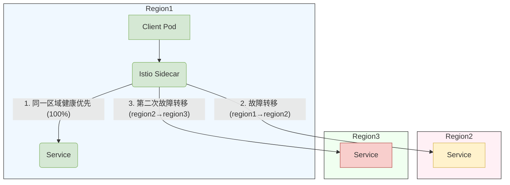
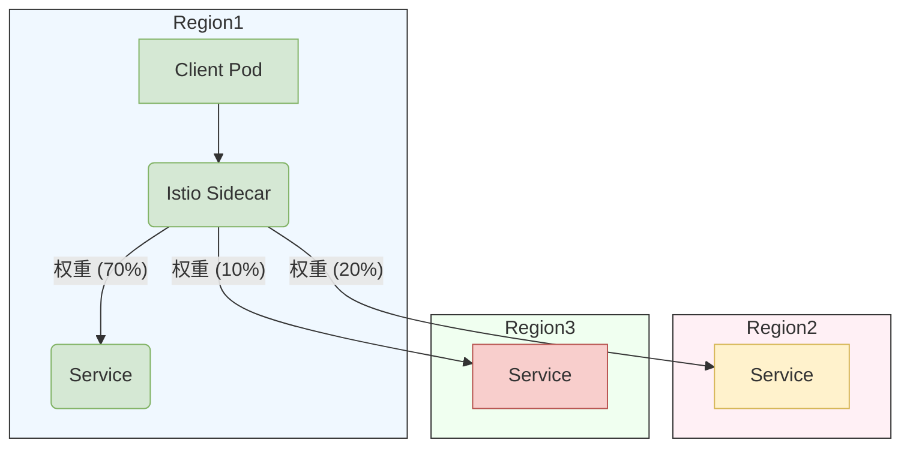

# 多主不同网络服务网格架构的安装指南

## 概述

本指南将引导您在两个业务集群上部署 Istio 控制平面，并将两个集群配置为主集群。该解决方案采用多网络模型，不同集群之间的工作负载无法直接通信，必须通过 Istio 东西向网关路由流量。

该架构为业务操作提供了增强的隔离性和高可用性。

## 先决条件

- 准备两个业务集群。
- 准备以下统一存储组件：
  - ACP Elasticsearch（用于集中存储追踪数据）。
  - ACP VictoriaMetrics（用于集中存储监控指标）。
  - 为每个集群单独部署一个 ACP Redis Sentinel 实例（用于服务速率限制）。
- 网络：
  - 每个集群中的 K8S API 服务器必须可以被服务网格中的其他集群访问。
  - 每个集群中由 LoadBalancer 服务分配给东西向网关的 IP:15443 必须可以被其他集群访问。

## 安装步骤

按照顺序在两个集群上安装服务网格。安装涉及两种类型的参数：

**全局参数**（在两个集群中保持不变）：

| 参数                   | 示例                                   | 描述                                        |
| ---------------------- | -------------------------------------- | ------------------------------------------- |
| MESH\_NAME             | multi-cluster-mesh                     | 服务网格名称                                |
| GLOBAL\_INGRESS\_HOST  | <https://1.2.3.4/>                     | ACP 访问地址                                |
| REGISTRY\_ADDRESS      | 1.2.3.4:4567                           | 镜像注册表地址                              |
| ELASTICSEARCH\_CLUSTER | global                                 | Elasticsearch 部署的集群名称                |
| ELASTICSEARCH\_URL     | <https://1.2.3.4/es_proxy>             | Elasticsearch 访问 URL                      |
| VICTORIAMETRICS\_URL   | <https://1.2.3.4/clusters/xxx/vmselect> | VictoriaMetrics 访问 URL                    |

**业务集群参数**（根据实际集群信息进行配置）：

| 参数           | 示例         | 描述                                                                 |
| --------------- | ------------ | --------------------------------------------------------------------- |
| CLUSTER\_NAME   | cluster1     | 业务集群名称                                                           |
| REDIS\_ADDRESS  | 1.2.3.4:4567 | Redis 访问地址                                                        |
| REDIS\_PASSWD   | passwd       | Redis 访问密码（安装后自动存储为 Secret）                             |

### 配置 Alauda 服务网格的 Kubernetes 集群拓扑

#### 节点标签配置

1. 应用区域标签（集群级别）

```bash
# 对于 US-West 区域集群中的所有节点
kubectl label nodes topology.kubernetes.io/region=us-west-1 --all
```

2. 应用区域标签（可用区级别）

```bash
# 对于区域 1A 中的所有节点
kubectl label nodes topology.kubernetes.io/zone=us-west-1a --all
```

3. 验证命令

```bash
# 检查所有节点的标签
kubectl get nodes -L topology.kubernetes.io/region,topology.kubernetes.io/zone

# 详细标签检查
kubectl describe nodes | grep "Labels" -A 5
```

#### 多集群配置示例

| 集群角色         | 区域标签     | 区域标签     | 命令模板                                                       |
| ---------------- | ------------ | ------------ | -------------------------------------------------------------- |
| 主集群           | `us-east-1`  | `us-east-1a` | `kubectl label nodes topology.kubernetes.io/region=us-east-1 --all` |
| 次集群           | `us-east-1`  | `us-east-1b` | `kubectl label nodes topology.kubernetes.io/zone=us-east-1b --all`  |
| DR 集群          | `eu-west-1`  | `eu-west-1a` | `kubectl label nodes topology.kubernetes.io/region=eu-west-1 --all` |

#### 配置说明

**标签标准**

```yaml
# 官方 Kubernetes 标签（请勿修改键名）
topology.kubernetes.io/region: "<cloud-region-id>"  # 例如 us-east1
topology.kubernetes.io/zone: "<region-id>-<zone-id>" # 例如 us-east1-a
```

### 安装第一个服务网格

#### 执行网格部署

在设置安装参数后，在 `global` 集群上执行以下命令：

```bash
# 请设置全局参数
MESH_NAME=""
REGISTRY_ADDRESS=""
GLOBAL_INGRESS_HOST=""
ELASTICSEARCH_CLUSTER=""
ELASTICSEARCH_URL=""
VICTORIAMETRICS_URL=""
# 请设置业务集群参数
CLUSTER_NAME=""
REDIS_ADDRESS=""
REDIS_PASSWD=""

# 创建服务网格
kubectl apply -f - <<EOF
apiVersion: asm.alauda.io/v1alpha1
kind: ServiceMesh
metadata:
  labels:
    servicemesh.cpaas.io/managedBy: operator
    asm.cpaas.io/meshgroup: "${MESH_NAME}"
    asm.cpaas.io/cluster: "${CLUSTER_NAME}"
  name: "${CLUSTER_NAME}"
  namespace: cpaas-system
  annotations:
    asm.cpaas.io/display-name: ''
spec:
  withoutIstio: false
  istioVersion: "1.22.4+202408291030"
  cluster: "${CLUSTER_NAME}"
  registryAddress: ${REGISTRY_ADDRESS}
  multiCluster:
    enabled: true
    isMultiNetwork: true
    istioNetwork: ""
  istioSidecarInjectorPolicy: false
  ipranges:
    ranges:
      - '*'
  ingressH2Enabled: false
  ingressScheme: https
  caConfig:
    certmanager: {}
  componentConfig:
    - name: istioCni
      group: istio
      replicaCount: 0
      resources: {}
      hpaSpec:
        enabled: false
      cni:
        namespace: kube-system
    - name: istiod
      group: istio
      replicaCount: 1
      hpaSpec:
        enabled: false
      resources:
        requests:
          cpu: '0.5'
          memory: 512Mi
        limits:
          cpu: '2'
          memory: 2048Mi
    - name: asmController
      group: controller
      replicaCount: 1
      hpaSpec:
        enabled: false
      resources:
        requests:
          cpu: '0.25'
          memory: 512Mi
        limits:
          cpu: '1'
          memory: 1Gi
    - name: eastwestGateways
      group: istio
      replicaCount: 1
      hpaSpec:
        enabled: false
      resources:
        requests:
          cpu: '0.25'
          memory: 128Mi
        limits:
          cpu: '2'
          memory: 1024Mi
      deployMode: FixedRequired
      parameters: null
      affinity:
        nodeAffinity:
          requiredDuringSchedulingIgnoredDuringExecution:
            nodeSelectorTerms:
              - matchExpressions:
                  - key: "kubernetes.io/os"
                    operator: In
                    values:
                      - "linux"
    - name: flagger
      group: controller
      replicaCount: 1
      hpaSpec:
        enabled: false
      resources:
        requests:
          cpu: '0.25'
          memory: 128Mi
        limits:
          cpu: '1'
          memory: 512Mi
    - name: jaegerCollector
      group: tracer
      replicaCount: 1
      hpaSpec:
        enabled: false
      resources:
        requests:
          cpu: '0.25'
          memory: 512Mi
        limits:
          cpu: '3'
          memory: 512Mi
    - name: jaegerQuery
      group: tracer
      replicaCount: 1
      hpaSpec:
        enabled: false
      resources:
        requests:
          cpu: '0.25'
          memory: 512Mi
        limits:
          cpu: '1'
          memory: 512Mi
    - name: asmCore
      group: controller
      replicaCount: 1
      hpaSpec:
        enabled: false
      resources:
        requests:
          cpu: '0.25'
          memory: 128Mi
        limits:
          cpu: '1'
          memory: 512Mi
    - name: asmOtelCollector
      group: tracer
      replicaCount: 1
      hpaSpec:
        enabled: false
      resources:
        requests:
          cpu: '0.25'
          memory: 512Mi
        limits:
          cpu: '2'
          memory: 1Gi
    - name: asmOtelCollectorLB
      group: tracer
      replicaCount: 1
      hpaSpec:
        enabled: false
      resources:
        requests:
          cpu: '0.25'
          memory: 512Mi
        limits:
          cpu: '1'
          memory: 1Gi
    - name: tier2ingressGateways
      group: istio
      replicaCount: 1
      hpaSpec:
        enabled: false
      resources:
        requests:
          cpu: '0.25'
          memory: 128Mi
        limits:
          cpu: '2'
          memory: 1024Mi
  requiredAntiAffinity: true
  elasticsearch:
    url: "${ELASTICSEARCH_URL}"
    isDefault: true
    cluster: "${ELASTICSEARCH_CLUSTER}"
  redis:
    address: "${REDIS_ADDRESS}"
    authType: basic
    enabled: true
    # kind 支持: single, sentinel, cluster
    kind: sentinel
    # 仅 sentinel 类型需要 masterName
    masterName: mymaster
    password: "${REDIS_PASSWD}"
  istioSidecar:
    resources:
      requests:
        cpu: 100m
        memory: 128Mi
      limits:
        cpu: 500m
        memory: 512Mi
  istioConfig:
    cni:
      enabled: true
    defaultHttpRetryPolicy:
      attempts: 2
  traceSampling: 100
  globalIngressHost: "${GLOBAL_INGRESS_HOST}"
  monitorType: victoriametrics
  prometheusURL: "${VICTORIAMETRICS_URL}"
  isDefaultMonitor: true
  clusterType: Baremetal
  kafka:
    enabled: false
EOF
```

#### 验证部署状态

在 `global` 集群上，使用以下命令检查服务网格安装的状态：

```bash
kubectl -n cpaas-system get servicemesh
```

当 `PHASE` 字段显示 `Deployed` 时，安装成功。示例输出：

```bash
NAME        STATE   SYNTHESISPHASE   PHASE      VERSION   DESIREDVERSION
cluster1            Deployed         Deployed   v4.0.20    v4.0.20
```

在业务集群上，使用以下命令检查服务网格组件的运行状态：

```bash
kubectl -n istio-system get pod
kubectl -n kube-system get pod | grep "istio-cni"
kubectl -n cpaas-system get pod | grep "asm-"
```

当所有 `STATUS` 字段显示 `Running` 时，服务网格组件已成功启动。示例输出：

```bash
# kubectl -n istio-system get pod
NAME                                                         READY   STATUS      RESTARTS       AGE
asm-operator-65f89b7c55-x4n7d                                1/1     Running     0              27h
flagger-7966f44f64-dldrl                                     1/1     Running     0              27h
flagger-operator-5fcdf67cd4-txr8m                            1/1     Running     0              27h
istio-eastwestgateway-795d4949ff-z9md8                       1/1     Running     0              27h
istio-ingressgateway-549fb4d56f-xs86q                        1/1     Running     0              27h
istio-operator-122-7bd55874b7-pdhj5                          1/1     Running     0              27h
istiod-1-22-975c6c44-bx7kq                                   1/1     Running     0              27h
jaeger-operator-6dd74f89b4-9kgks                             1/1     Running     0              27h
jaeger-prod-collector-86f5748f8f-g6tg6                       1/1     Running     0              27h
jaeger-prod-query-df8c457dd-dh7gc                            2/2     Running     0              27h
opentelemetry-operator-controller-manager-5dbd9c5bb7-hzdmc   1/1     Running     0              27h
# kubectl -n cpaas-system get pod | grep "asm-"
asm-controller-8bbc86c69-l5zdf                               1/1     Running     0              27h
asm-core-67c7c66cb-spscl                                     1/1     Running     0              22h
asm-otel-backend-collector-7dbfd9d877-m2scw                  1/1     Running     0              27h
asm-otel-collector-7d54bddccd-2sxhm                          1/1     Running     0              27h
# kubectl -n kube-system get pod | grep "istio-cni"
istio-cni-node-5cn5n                                         1/1     Running     0              27h
istio-cni-node-b55xg                                         1/1     Running     0              27h
istio-cni-node-jf584                                         1/1     Running     0              27h
```

### 安装第二个服务网格

在第一个服务网格部署后，更新业务集群参数，并按照相同的过程部署第二个服务网格。

## 服务网格互信 TLS 安全

### Istio 身份验证和 mTLS

Istio 使用 **PeerAuthentication** 资源通过互信 TLS（mTLS）控制工作负载之间的安全性。通过 mTLS，Envoy sidecar 自动从 Istio 的 CA 获取证书，从而使每个服务连接加密并验证身份，无需额外配置。

### 默认的 PERMISSIVE 模式

- 工作负载接受明文和 mTLS 加密流量。
- Sidecar 宣布 mTLS 功能，但不拒绝明文 HTTP。

这确保现有（非 sidecar）服务在您准备“锁定”流量为仅 mTLS 之前继续工作。

### 命名空间级别的 PeerAuthentication

要对特定命名空间中的所有工作负载要求严格的 mTLS，请应用：

```yaml
apiVersion: security.istio.io/v1
kind: PeerAuthentication
metadata:
  name: default
  namespace: <namespace>
spec:
  mtls:
    mode: STRICT
```

- **范围：** 仅影响 `<namespace>` 中的工作负载。
- **效果：** `<namespace>` 中的 Envoy sidecar 拒绝任何入站明文。没有 mTLS 的外部客户端将失败，直到它们移到 sidecar 后面。

### 网格级别的 PeerAuthentication

要在所有地方强制执行 mTLS，请在 `istio-system` 中创建一个网格范围的策略：

```yaml
apiVersion: security.istio.io/v1
kind: PeerAuthentication
metadata:
  name: default
  namespace: istio-system
spec:
  mtls:
    mode: STRICT
```

- **范围：** 适用于所有命名空间（除非被命名空间级别或工作负载级别的策略覆盖）。
- **效果：** 所有服务必须使用 mTLS；任何明文或非 sidecar 工作负载在整个网格中被阻止。

## 使用 Alauda ServiceMesh 管理跨集群流量

### 多集群流量管理的核心要求

**服务身份**
跨集群的服务必须在关键属性上保持一致：

| 属性                  | 要求                             | 示例                    |
| --------------------- | -------------------------------- | ----------------------- |
| `metadata.name`       | 在各集群中相同                  | `product-service`       |
| `metadata.namespace`  | 在各集群中相同                  | `global-svc`            |
| `spec.ports`          | 端口号、名称和协议              | `port: 80`, `name: http` |
| `spec.selector`       | 服务选择器一致性                | `app: product`          |

### 集群范围的故障转移配置

#### 完整配置（适用于所有服务）

```bash
kubectl apply -f - <<EOF
apiVersion: networking.istio.io/v1alpha3
kind: DestinationRule
metadata:
  name: global 
  namespace: istio-system # 必须在此命名空间中
spec:
  host: "*.cluster.local"
  trafficPolicy:
    loadBalancer:
      localityLbSetting:
        enabled: true
        failover:
          - from: region1 # 当前集群区域
            to: region2
    outlierDetection:
      baseEjectionTime: 600s
      consecutive5xxErrors: 1
      interval: 10s
      maxEjectionPercent: 100
EOF
```

关键参数说明：

| 参数                   | 值                  | 描述                                           |
| ---------------------- | ------------------- | ---------------------------------------------- |
| `host`                 | `*.cluster.local`    | 适用于所有集群本地服务                        |
| `failover.from/to`     | 区域对              | 定义故障转移链序列                            |
| `consecutive5xxErrors` | 1                   | 较高的阈值以防止过于敏感的触发               |
| `maxEjectionPercent`   | 100                 | 限制驱逐范围以维持服务容量                    |

更多参数参考：

- [异常检测](https://istio.io/latest/docs/reference/config/networking/destination-rule/#OutlierDetection)
  适用于 `server` 服务。这是确保故障转移正常工作的必要条件。特别是，它配置了 sidecar 代理以了解服务的端点何时不健康，最终触发故障转移到下一个区域。

- [故障转移](https://istio.io/latest/docs/reference/config/networking/destination-rule/#LocalityLoadBalancerSetting-Failover)
  策略在区域之间。这确保跨区域边界的故障转移将表现得可预测。

例如，您有三个集群，每个区域如下：

| 优先级 | 区域     | 详细信息                                                       |
| ------ | -------- | ------------------------------------------------------------- |
| 0      | `region1` | 当前集群，客户端和服务器区域匹配。                           |
| 1      | `region2` | 不匹配，但已为 `region1`->`region2` 定义故障转移。           |
| 2      | `region3` | 不匹配且未为 `region1`->`region3` 定义故障转移。             |

应用以下 DestinationRule 后，流量如下：



内部使用 [Envoy 优先级](https://www.envoyproxy.io/docs/envoy/latest/intro/arch_overview/upstream/load_balancing/priority.html)
来控制故障转移。

### 集群范围的加权分配配置

#### 完整配置（适用于所有服务）

```bash
kubectl apply -f - <<EOF
apiVersion: networking.istio.io/v1alpha3
kind: DestinationRule
metadata:
  name: global 
  namespace: istio-system # 必须在此命名空间中
spec:
  host: "*.cluster.local"
  trafficPolicy:
    loadBalancer:
      localityLbSetting:
        enabled: true
        distribute:
        - from: region1/*  # 应为当前集群区域，格式为 ${region}/*
          to:
            "region1/*": 70
            "region2/*": 20
            "region3/*": 10
    outlierDetection:
      baseEjectionTime: 600s
      consecutive5xxErrors: 1
      interval: 10s
      maxEjectionPercent: 100
EOF
```

关键参数说明：

| 参数                   | 值                  | 描述                                           |
| ---------------------- | ------------------- | ---------------------------------------------- |
| `distribute.from/to`   | 区域对              | 定义从区域分配到哪些区域                      |

- [分配](https://istio.io/latest/docs/reference/config/networking/destination-rule/#LocalityLoadBalancerSetting-Distribute)
  策略在区域之间。这确保源自“from”区域或区域的流量在一组“to”区域中分配时表现得可预测。

- [Envoy 加权分配](https://www.envoyproxy.io/docs/envoy/latest/intro/arch_overview/upstream/load_balancing/locality_weight.html?highlight=weight)
  适用于 `server` 服务，如下表所示。

例如，您有三个集群，每个区域如下：

| 区域      | 流量百分比 |
| --------- | ---------- |
| `region1` | 70         |
| `region2` | 20         |
| `region3` | 10         |

则流量如下：



### 向服务网格添加命名空间

在使用之前，需要向服务网格添加命名空间。

```shell
kubectl label namespace my-namespace cpaas.io/serviceMesh=enabled istio.io/rev=1-22
```

验证命名空间标签：

```shell
kubectl get ns my-namespace -o yaml
```

输出应包含：

```yaml
apiVersion: v1
kind: Namespace
metadata:
  name: my-namespace
  labels:
    # 现有标签
    cpaas.io/serviceMesh: enabled
    istio.io/rev: 1-22
```

**标签说明：**

- `cpaas.io/serviceMesh: enabled`：表示该命名空间应由 Alauda 服务网格管理
- `istio.io/rev: 1-22`：指定要使用的 Istio 控制平面版本（在此示例中为 1.22）

## 卸载过程

**重要提醒：** 确保在卸载之前从服务网格中删除所有微服务。

按照安装的反向顺序从每个集群中卸载服务网格。

### 卸载第二个服务网格

在 `global` 集群上，使用以下命令卸载第二个服务网格：

```bash
# 将 {cluster-name} 替换为第二个服务网格的集群名称
kubectl -n cpaas-system delete servicemesh {cluster-name} --wait
```

### 卸载第一个服务网格

在 `global` 集群上，使用以下命令卸载第一个服务网格：

```bash
# 将 {cluster-name} 替换为第一个服务网格的集群名称
kubectl -n cpaas-system delete servicemesh {cluster-name} --wait
```
