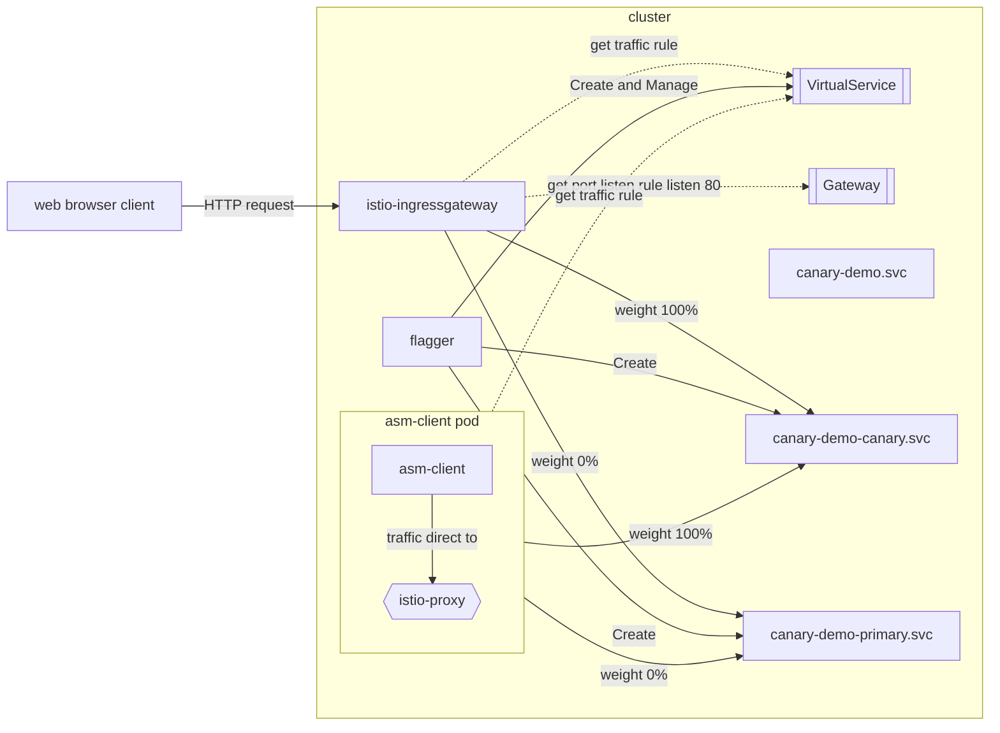
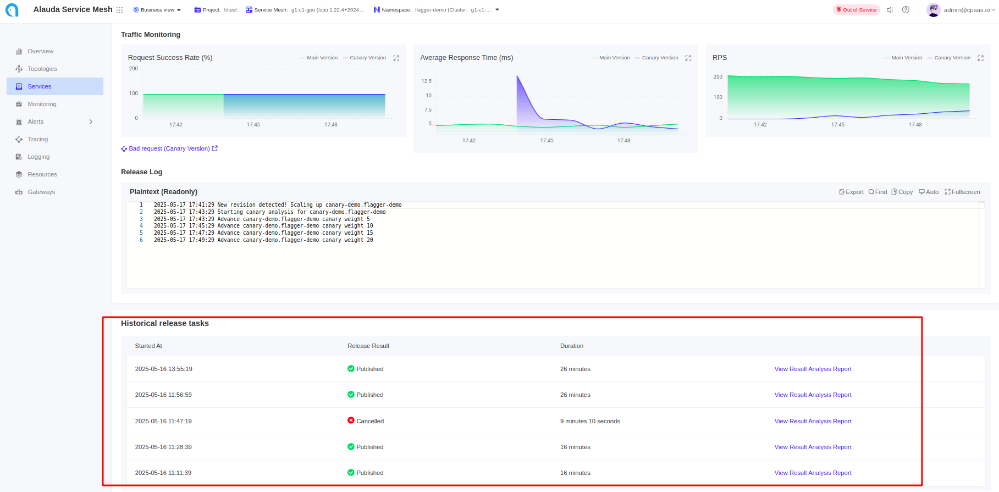
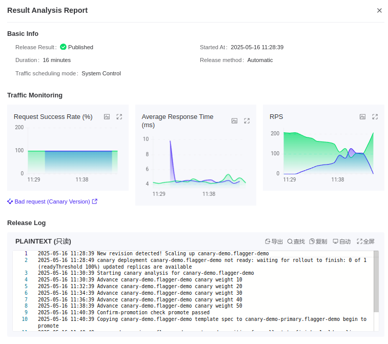

---
products:
  - Alauda Container Platform
kind:
  - Article
id: KB1751435394-1D7E
sourceSHA: a5b5c9533ddea61518a6514dd5602e3dab62dc97ee553445d7a0229142940712
---

# ACP 部署策略

## 概述

在 Kubernetes 集群中使用标准的滚动更新更新应用程序有时会引入风险。为了降低这种风险，蓝绿部署和金丝雀部署等高级部署策略被广泛采用。Alauda Container Platform 完全兼容 Kubernetes API，并支持这些方法。

让我们来看看这些策略的原则以及流量是如何管理的：

### 理解部署策略

#### 蓝绿部署

在蓝绿部署中，新版本被部署到非活动的绿色环境。一旦准备就绪，所有用户流量会立即从蓝色环境切换到绿色环境。

#### 金丝雀部署

金丝雀部署逐步将新版本引入到一小部分用户中，然后再进行全面推出。新版本与旧版本并行运行。流量会缓慢地以小增量转移到新版本，从而允许监控潜在问题。

### 理解实现方法

Alauda Container Platform 提供了四种蓝绿和金丝雀部署的实现方法。

| 章节 | 自动化          | 底层机制            | 流量类型              | 部署策略             |
| ---- | --------------- | ------------------- | --------------------- | -------------------- |
| 1    | ACP API        | K8S 服务            | 南北向和东西向        | 仅蓝绿部署           |
| 2    | ACP API        | ALB/Nginx Ingress   | 仅南北向              | 蓝绿和金丝雀部署     |
| 3    | ACP API        | Istio VirtualService | 南北向和东西向        | 蓝绿和金丝雀部署     |
| 4    | ASM API (Flagger) | Istio VirtualService | 南北向和东西向        | 蓝绿和金丝雀部署     |

**注意**：利用 Argo Rollouts 的替代方法在《使用 Argo Rollouts 的 ACP 部署策略》中进行了介绍。

#### 方法 1：使用 Kubernetes 服务实现蓝绿部署

此方法利用 Kubernetes 服务在版本之间切换流量：

1. 部署新版本（绿色），使用不同的 Pod 标签（例如，`version: green`），同时保持现有版本（蓝色）运行并使用其自己的标签（例如，`version: blue`）。
2. 最初，您的 Kubernetes 服务通过其选择器配置指向蓝色 Pod（例如，`app: web, version: blue`）。
3. 当准备切换时，更新服务的选择器以指向绿色版本，通过修改选择器中的 `version` 标签。
4. 流量会立即从蓝色 Pod 切换到绿色 Pod，且没有停机时间。
5. 确认新版本正常工作后，您可以安全地缩减或删除蓝色部署。

这种方法提供了一种简单的方法，使用原生 Kubernetes 资源实现蓝绿部署，而无需额外的工具。

#### 方法 2：使用 ALB 或 Nginx Ingress 实现蓝绿和金丝雀部署

此方法使用 ALB 负载均衡器或 Nginx Ingress 控制应用程序版本之间的流量：

1. 部署应用程序的两个版本：
   - 当前版本为 `app-v1`（部署和服务）
   - 新版本为 `app-v2`（部署和服务）
2. 对于蓝绿部署：
   - 最初，配置 Ingress/ALB 将 100% 的流量指向 `app-v1`
   - 当准备切换时，更新 Ingress/ALB 配置，将 100% 的流量发送到 `app-v2`
   - 这会创建一个即时切换，没有停机时间
3. 对于金丝雀部署：
   - 开始时将大部分流量（例如，95%）发送到 `app-v1`，将一小部分（例如，5%）发送到 `app-v2`
   - 在监控问题的同时，逐渐增加流量到 `app-v2`
   - 继续直到 100% 的流量流向 `app-v2`

这种方法提供了对南北向（外部）流量的入口级流量控制。

#### 方法 3：使用 Istio Virtual Service 实现蓝绿和金丝雀部署

此方法利用 Istio 强大的流量管理能力：

1. 部署应用程序的两个版本：
   - 当前版本为 `app-v1`（部署和服务）
   - 新版本为 `app-v2`（部署和服务）
2. 设置 Istio 资源：
   - 创建一个 Istio 网关来处理传入流量
   - 定义一个 VirtualService 来控制版本之间的流量分配
3. 对于蓝绿部署：
   - 最初配置 VirtualService 将 100% 的流量路由到 `app-v1`
   - 当准备切换时，更新 VirtualService 权重，将 100% 的流量指向 `app-v2`
   - 这会创建一个即时切换，风险最小
4. 对于金丝雀部署：
   - 开始时将最小流量（例如，5%）发送到 `app-v2`，将大部分流量（95%）发送到 `app-v1`
   - 在监控问题的同时，逐渐更新 VirtualService 权重以增加流量到 `app-v2`
   - 继续直到 100% 的流量流向 `app-v2`

这种方法为南北向（外部）和东西向（服务到服务）流量模式提供了全面的流量控制。

#### 方法 4：使用 Istio VirtualService 和 Flagger 实现蓝绿和金丝雀部署

此方法使用 Alauda Service Mesh 中的 Flagger 自动化高级部署策略：

1. 当您更新应用程序时，Flagger 创建一个新的临时部署（金丝雀）
2. 流量根据可配置的设置逐渐从原始版本转移到金丝雀版本
3. Flagger 持续监控关键指标，如错误率和响应时间
4. 如果出现问题，Flagger 会自动回滚到之前的稳定版本
5. 对于蓝绿部署，Flagger 处理瞬时流量切换，且没有停机时间

这种方法消除了部署过程中的人工干预，同时通过自动化的指标检查和回滚能力确保应用程序的可靠性。

## 第 1 章：使用 Kubernetes 服务实现蓝绿部署

在 ACP（Alauda Container Platform）中，用户可以使用通过 `kubectl` 命令管理的 Kubernetes 资源实现蓝绿部署策略。

该过程涉及两个相同的应用程序环境——`blue` 用于当前生产版本，`green` 用于即将发布的新版本。本文档将逐步讲解以下操作步骤：

1. 创建绿色（新）部署并行运行。
2. 在零停机时间内将流量从蓝色切换到绿色。
3. 验证流量路由。

该策略允许安全推出和即时回滚能力，使用标准的 Kubernetes 原语。

### 前提条件

1. 安装 Alauda Container Platform。
2. 由 ACP 管理的 Kubernetes 集群。
3. 创建命名空间的项目。
4. 集群中将要部署应用程序的命名空间。
5. 安装 `kubectl` 命令行工具，并安装 `kubectl-acp` 插件以进行 ACP 平台的身份验证。
6. 使用 `kubectl acp login` 命令对集群进行身份验证。

### 初始应用程序部署

首先定义应用程序的“蓝色”版本。这是用户将访问的当前版本。以下是蓝色部署的示例。容器镜像版本为 `hello:1.23.1`，适当的标签为 `app=web` 和 `version=blue`。

蓝色版本的示例部署 YAML 文件如下：

```yaml
apiVersion: apps/v1
kind: Deployment
metadata:
  name: blue
spec:
  replicas: 3
  selector:
    matchLabels:
      app: web
      version: blue
  template:
    metadata:
      labels:
        app: web
        version: blue
    spec:
      containers:
        - name: web
          image: hello:1.23.1
          ports:
            - containerPort: 80
```

将其保存为名为 `blue-deployment.yaml` 的 YAML 文件，并使用以下命令应用：

```shell
kubectl apply -f blue-deployment.yaml
```

该部署需要一个 `Service`，用于暴露蓝色部署。该服务将根据匹配的标签将流量转发到蓝色 Pod。最初，服务选择器的目标是标记为 `version=blue` 的 Pod。

```yaml
apiVersion: v1
kind: Service
metadata:
  name: web
spec:
  selector:
    app: web
    version: blue
  ports:
  - protocol: TCP
    port: 80
    targetPort: 80
```

通过列出 Pod 确认 `blue` 部署是否正常运行：

```shell
kubectl get pods -l app=web,version=blue
```

检查所有预期的副本（3）是否处于 `Running` 状态。这确保应用程序已准备好提供流量。

确保 `web` 服务正确地将流量转发到蓝色部署。使用以下命令：

```shell
kubectl describe service web | grep Endpoints
```

输出应列出蓝色 Pod 的 IP 地址。这些是接收流量的端点。

### 蓝绿部署操作步骤

#### 步骤 1：创建绿色部署

接下来，准备应用程序的新版本作为绿色部署。它与蓝色部署相似，但使用不同的镜像版本（例如，`hello:1.23.2`）和标签（`version=green`）。

```yaml
apiVersion: apps/v1
kind: Deployment
metadata:
  name: green
spec:
  replicas: 3
  selector:
    matchLabels:
      app: web
      version: green
  template:
    metadata:
      labels:
        app: web
        version: green
    spec:
      containers:
        - name: web
          image: hello:1.23.2
          ports:
            - containerPort: 80
```

**YAML 字段说明：**

- 与蓝色部署相同，唯一的区别是：
  - `metadata.name`：现在设置为 `green`。
  - `spec.selector.matchLabels.version`：设置为 `green`。
  - `spec.template.metadata.labels.version`：设置为 `green`。
  - `containers.image`：更新为新镜像版本。

将其保存为 `green-deployment.yaml` 并使用以下命令应用：

```shell
kubectl apply -f green-deployment.yaml
```

这为测试设置了新应用程序版本。

#### 步骤 2：验证绿色部署

使用以下命令确保绿色 Pod 正在正常运行：

```shell
kubectl get pods -l app=web,version=green
```

检查是否有 3 个正在运行的 Pod。这确认新版本已部署并正常运行。

#### 步骤 3：切换流量到绿色

要将绿色部署提升为生产版本，请更新 `web` 服务选择器以指向绿色版本：

```shell
kubectl patch service web -p '{"spec":{"selector":{"version":"green"}}}'
```

此更改是即时的，并将所有传入流量切换到绿色 Pod。

#### 步骤 4：验证流量路由到绿色

确认服务现在指向绿色部署：

```shell
kubectl describe service web | grep Endpoints
```

输出现在应显示绿色 Pod 的 IP，指示流量切换成功。

这完成了使用 ACP 和 Kubernetes 的零停机时间蓝绿部署。

## 第 2 章：使用 ALB 或 Nginx Ingress 实现蓝绿和金丝雀部署

在 ACP 中，您可以使用 ALB 作为网关 API 提供者来实现部署的流量控制。

### 概念

- **ALB**：ACP 负载均衡器，一个定制的 Nginx Ingress 控制器，提供高级流量管理功能。
- **网关**：定义流量如何路由到集群内服务的资源。
- **HTTPRoute**：指定如何根据规则和条件将 HTTP 流量路由到服务的资源。

### 前提条件

1. 安装 Alauda Container Platform，并且有一个可用的 Kubernetes 集群。
2. 创建命名空间的项目。
3. 在集群中部署 ALB，并分配给该项目。
4. 集群中将要部署应用程序的命名空间。
5. 安装 `kubectl` 命令行工具，并安装 `kubectl-acp` 插件以进行 ACP 平台的身份验证。
6. 使用 `kubectl acp login` 命令对集群进行身份验证。

### 初始应用程序部署

首先创建应用程序的稳定版本。这是用户将访问的初始版本。以下是具有适当副本数、容器镜像版本（例如，`hello:1.23.1`）和适当标签（如 `app=web-stable`）的部署。

您可以找到以下 YAML 示例：

```yaml
apiVersion: apps/v1
kind: Deployment
metadata:
  name: web-stable
spec:
  replicas: 2
  selector:
    matchLabels:
      app: web-stable
  template:
    metadata:
      labels:
        app: web-stable
    spec:
      containers:
        - name: web
          image: hello:1.23.1
          ports:
            - containerPort: 80
```

将其保存为 YAML 文件并使用以下命令应用：

```shell
kubectl apply -f web-stable-deployment.yaml
```

`Service` 将根据匹配的标签将流量转发到稳定版本的 Pod。最初，服务选择器的目标是标记为 `app=web-stable` 的 Pod。

```yaml
apiVersion: v1
kind: Service
metadata:
  name: web-stable
spec:
  selector:
    app: web-stable
  ports:
  - protocol: TCP
    port: 80
    targetPort: 80
```

使用 `example.com` 作为访问服务的示例域，创建一个 `Gateway` 以使用该域暴露服务：

```yaml
apiVersion: gateway.networking.k8s.io/v1
kind: Gateway
metadata:
  name: default
spec:
  gatewayClassName: exclusive-gateway
  listeners:
  - allowedRoutes:
      namespaces:
        from: All
    name: gateway-metric
    port: 11782
    protocol: TCP
  ## 这是指向服务的路由
  - allowedRoutes:
      namespaces:
        from: All
    hostname: example.com
    name: web
    port: 80
    protocol: HTTP
```

`Gateway` 将分配一个外部 IP 地址，从网关资源的 `status.addresses` 中获取类型为 `IPAddress` 的 IP 地址。

```yaml
apiVersion: gateway.networking.k8s.io/v1
kind: Gateway
metadata:
  name: default
...
status:
  addresses:
  - type: IPAddress
    value: 192.168.134.30
```

在您的 DNS 服务器中配置域名以将域名解析到网关的 IP 地址。使用以下命令验证 DNS 解析：

```shell
nslookup example.com
Server:         192.168.16.19
Address:        192.168.16.19#53

Non-authoritative answer:
Name:   example.com
Address: 192.168.134.30
```

它应返回网关的地址。

现在创建一个 `HTTPRoute` 将流量路由到服务。这将连接 `Gateway` 到 `Service` 并将流量路由到稳定版本的 Pod。

```yaml
apiVersion: gateway.networking.k8s.io/v1
kind: HTTPRoute
metadata:
  name: web
spec:
  hostnames:
  ## 确保主机名与域名相同
  - example.com
  parentRefs:
  ## 网关资源引用匹配
  - group: gateway.networking.k8s.io
    kind: Gateway
    name: default
    namespace: default # 根据需要更改命名空间
    sectionName: web
  rules:
  ## 将服务添加到路由
  - backendRefs:
    - group: ""
      kind: Service
      name: web-stable
      namespace: default # 根据需要更改命名空间
      port: 80
      weight: 100
    matches:
    - path:
        type: PathPrefix
        value: /
```

将其保存为 YAML 文件并使用以下命令应用：

```shell
kubectl apply -f httproute.yaml
```

### 蓝绿和金丝雀部署操作步骤

初始部署后，您可以创建应用程序的新版本（金丝雀）并将流量路由到它。这使您可以在完全切换之前测试新版本。

#### 步骤 1：创建金丝雀部署和服务

创建一个 Kubernetes `Service`，用于暴露金丝雀部署。该服务将根据匹配的标签将流量转发到金丝雀版本的 Pod。最初，服务选择器的目标是标记为 `app=web-canary` 的 Pod。

```yaml
# web-canary-deployment.yaml
apiVersion: apps/v1
kind: Deployment
metadata:
  name: web-canary
spec:
  replicas: 2
  selector:
    matchLabels:
      app: web-canary
  template:
    metadata:
      labels:
        app: web-canary
    spec:
      containers:
        - name: web
          # 应用程序的新版本
          image: hello:1.23.2
          ports:
            - containerPort: 80
---
# web-canary-service.yaml
apiVersion: v1
kind: Service
metadata:
  name: web-canary
spec:
  selector:
    app: web-canary
  ports:
  - protocol: TCP
    port: 80
    targetPort: 80
```

使用以下命令应用：

```shell
kubectl apply -f web-canary-deployment.yaml
kubectl apply -f web-canary-service.yaml
```

这允许外部访问金丝雀部署。

#### 步骤 2：更新 HTTPRoute 以添加金丝雀并切换流量

更新 `HTTPRoute` 以添加金丝雀版本：

```yaml
apiVersion: gateway.networking.k8s.io/v1
kind: HTTPRoute
metadata:
  name: web
spec:
  [...]
  rules:
  - backendRefs:
    ## 将金丝雀服务添加到路由
    ## 权重为 0
    - group: ""
      kind: Service
      name: web-canary
      namespace: default
      port: 80
      weight: 0
    ## 稳定路由不变
    - group: ""
      kind: Service
      name: web-stable
      namespace: default
      port: 80
      weight: 100
    matches:
    - path:
        type: PathPrefix
        value: /
```

使用以下命令应用：

```shell
kubectl apply -f httproute.yaml
```

#### 步骤 3：切换流量到金丝雀

更新 `HTTPRoute` 以将流量切换到金丝雀版本：

```yaml
apiVersion: gateway.networking.k8s.io/v1
kind: HTTPRoute
metadata:
  name: web
spec:
  [...]
  rules:
  - backendRefs:
    - group: ""
      kind: Service
      name: web-canary
      namespace: default
      port: 80
      ## 将流量切换到金丝雀
      weight: 100
    - group: ""
      kind: Service
      name: web-stable
      namespace: default
      port: 80
      ## 从稳定版本移除流量
      weight: 0
    matches:
    - path:
        type: PathPrefix
        value: /
```

使用以下命令应用：

```shell
kubectl apply -f httproute.yaml
```

对于蓝绿部署，将 `web-stable` 的权重设置为 0% 并将 `web-canary` 的权重设置为 100% 以瞬时切换所有流量从旧版本到新版本。对于金丝雀部署，在两个版本之间设置权重在 0% 到 100% 之间，以逐步在它们之间转移流量。

在成功验证新版本后，您可以删除或缩减旧版本。

## 第 3 章：使用 Istio VirtualService 实现蓝绿和金丝雀部署

利用 Istio 网关和 VirtualService 的能力，ACP 实现了高效的流量管理功能，能够有效地实施 Kubernetes 服务的蓝绿和金丝雀部署策略。

### 概念

- **网关**：定义来自网格外部的传入流量的处理方式，包括端口、协议和主机名。与 VirtualService 一起使用以控制入口流量。
- **Virtual Service**：用于定义请求如何路由到服务的 Istio 资源。

### 前提条件

1. 安装 Alauda Container Platform，并且有一个可用的 Kubernetes 集群。
2. 安装 Alauda Service Mesh 4.0 和 Istio 1.22。
3. 安装 `kubectl` 命令行工具，并安装 `kubectl-acp` 插件以进行 ACP 平台的身份验证。
4. 使用 `kubectl acp login` 命令对集群进行身份验证。

### 初始应用程序部署

首先定义应用程序的稳定版本。这是用户将访问的当前版本。我们使用相同的稳定部署。容器镜像版本为 `hello:1.23.1`，适当的标签为 `app=web` 和 `version=stable`。

```yaml
apiVersion: apps/v1
kind: Deployment
metadata:
  name: web-stable
spec:
  replicas: 2
  selector:
    matchLabels:
      app: web
      version: stable
  template:
    metadata:
      labels:
        app: web
        version: stable
    spec:
      containers:
        - name: web
          image: hello:1.23.1
          ports:
            - containerPort: 80
```

最初，服务选择器的目标是标记为 `app=web` 和 `version=stable` 的 Pod。

```yaml
apiVersion: v1
kind: Service
metadata:
  name: web-stable
spec:
  selector:
    app: web
    version: stable
  ports:
  - protocol: TCP
    port: 80
    targetPort: 80
```

`Gateway` 资源将暴露命名空间中的 `VirtualService`：

```yaml
apiVersion: networking.istio.io/v1alpha3
kind: Gateway
metadata:
  name: istio-rollout-gateway
spec:
  selector:
    istio: ingressgateway
  servers:
  - port:
      number: 80
      name: http
      protocol: HTTP
    hosts:
    - "*"
```

要将外部 IP 地址分配给网关，`istio-system` 命名空间中应有一个 LoadBalancer 服务。

```yaml
apiVersion: v1
kind: Service
metadata:
  labels:
    app: istio-ingressgateway
    istio: ingressgateway
    istio.io/rev: 1-22
  name: rollout-ingressgateway
  namespace: istio-system
spec:
  ports:
  - name: http2
    port: 80
    protocol: TCP
    targetPort: 8080
  - name: https
    port: 443
    protocol: TCP
    targetPort: 8443
  selector:
    app: istio-ingressgateway
    istio: ingressgateway
  sessionAffinity: None
  type: LoadBalancer
```

`VirtualService` 定义了流量如何路由到服务的不同版本（子集）。在此上下文中，它通过为不同服务版本分配流量权重来实现蓝绿或金丝雀部署策略的细粒度控制。这是通过在 HTTP 和/或 TCP 协议下指定路由规则来完成的，这些规则根据分配的权重拆分流量。

```yaml
apiVersion: networking.istio.io/v1
kind: VirtualService
metadata:
  name: web
spec:
  gateways:
  - istio-rollout-gateway
  hosts:
  - rollout-demo.asm.com
  - asm-demo
  http:
  - route:
    - destination:
        host: web-stable
      weight: 100
  tcp:
  - route:
    - destination:
        host: web-stable
      weight: 100
```

接下来，定义应用程序的“预览”版本。这是将逐步引入的新版本。创建一个 Kubernetes 部署，具有适当的副本数、容器镜像版本（例如，`hello:1.23.2`）和适当标签（如 `app=web` 和 `version=preview`）。

使用以下 YAML：

```yaml
apiVersion: apps/v1
kind: Deployment
metadata:
  name: web-preview
spec:
  replicas: 2
  selector:
    matchLabels:
      app: web
      version: preview
  template:
    metadata:
      labels:
        app: web
        version: preview
    spec:
      containers:
        - name: web
          image: hello:1.23.2
          ports:
            - containerPort: 80
```

使用 `kubectl` 应用配置：

```shell
kubectl apply -f preview-deployment.yaml
```

创建一个 Kubernetes `Service`，用于暴露预览部署。该服务将根据匹配的标签将流量转发到预览版本的 Pod。服务选择器的目标是标记为 `app=web` 和 `version=preview` 的 Pod。

```yaml
apiVersion: v1
kind: Service
metadata:
  name: web-preview
spec:
  selector:
    app: web
    version: preview
  ports:
  - protocol: TCP
    port: 80
    targetPort: 80
```

使用以下命令应用：

```shell
kubectl apply -f web-preview-service.yaml
```

这允许外部访问预览部署。

### 使用 VirtualService 进行蓝绿部署的操作步骤

要使用 VirtualService 进行蓝绿部署，您需要修改 YAML 定义中的 HTTP 或 TCP 路由部分的权重字段。最初，将 100% 的流量设置为蓝色（稳定）版本，将 0% 的流量设置为绿色（预览）版本。
一旦绿色版本经过验证，更新 YAML，将权重设置为绿色为 100，蓝色为 0。更新 YAML：

```yaml
apiVersion: networking.istio.io/v1
kind: VirtualService
metadata:
  name: web
spec:
  gateways:
  - istio-rollout-gateway
  hosts:
  - rollout-demo.asm.com
  - asm-demo
  http:
  - route:
    - destination:
        host: web-stable
      weight: 0
    - destination:
        host: web-preview
      weight: 100
  tcp:
  - route:
    - destination:
        host: web-stable
      weight: 0
    - destination:
        host: web-preview
      weight: 100
```

使用以下命令应用：

```shell
kubectl apply -f virtual-service.yaml
```

在应用此更改后，所有流量将被转发到预览部署。

### 使用 VirtualService 进行金丝雀部署的操作步骤

要使用 VirtualService 进行金丝雀部署，您需要修改 YAML 定义中的 HTTP 或 TCP 路由部分的权重字段。最初，将 100% 的流量设置为稳定版本，将 0% 的流量设置为金丝雀（预览）版本。

更新 YAML 定义以在稳定版本和金丝雀版本之间分配流量权重。例如，开始时设置权重：稳定版本为 90，金丝雀版本为 10。

随着新版本的稳定性逐步提高，逐步将更多流量转移到金丝雀版本（例如，30%、50% 然后 100%），通过更新权重并重新应用 YAML。

通过这种方法，流量将随着您调整权重而逐步转移到金丝雀部署。

## 第 4 章：使用 Istio VirtualService 和 Flagger 实现蓝绿和金丝雀部署

在 ACP 中，Flagger 通过利用 Istio 的流量管理能力来自动化渐进式交付策略，如金丝雀发布和蓝绿部署。本章将解释如何在 Alauda Service Mesh 中使用 Flagger 实现这些策略。

### 概念

- **Flagger**：一个渐进交付操作员，自动化在 Kubernetes 上运行的应用程序的发布过程。
- **CanaryDelivery**：定义 Flagger 应如何管理部署过程的自定义资源。
- **VirtualService**：Flagger 管理的 Istio 资源，用于控制版本之间的流量路由。

### 前提条件

1. 安装 Alauda Container Platform，并且有一个可用的 Kubernetes 集群。
2. 安装 Alauda Service Mesh 4.0 和 Istio 1.22。
3. 安装 `kubectl` 命令行工具，并安装 `kubectl-acp` 插件以进行 ACP 平台的身份验证。
4. 使用 `kubectl acp login` 命令对集群进行身份验证。

### 金丝雀部署操作步骤

金丝雀部署逐步将流量从稳定版本转移到新版本，同时监控指标以确保可靠性。

#### 步骤 1：创建金丝雀 Flagger 资源

创建一个定义金丝雀部署应如何管理的 `CanaryDelivery` 资源：

```yaml
apiVersion: asm.alauda.io/v1alpha1
kind: CanaryDelivery
metadata:
  annotations:
    argocd.argoproj.io/sync-wave: "600"
    argocd.argoproj.io/sync-options: SkipDryRunOnMissingResource=true
  name: canary-demo
  namespace: flagger-demo
spec:
  service:
    gateways:
    - flagger-demo/istio-rollout-gateway
    - mesh
    hosts:
    - canary-demo.asm.com
    - canary-demo.flagger-demo.svc.cluster.local  #您可以指定使用 fqdn 关联部署的 k8s svc 名称，支持多 svc
  analysis:
    interval: 2m
    maxWeight: 50
    stepWeight: 5
    threshold: 10
  delivertype: canary
  maxResponseTime: 500
  minSuccessRate: 95
  promoteControl: system
  targetRef:
    name: canary-demo
  trafficControl: system
```

使用以下命令应用：

```shell
kubectl apply -f canary-delivery.yaml
```

**YAML 字段说明：**

- `spec.service.gateways`：指定应使用哪些网关进行流量路由。
- `spec.service.hosts`：定义将用于访问服务的主机名。
- `spec.analysis`：配置金丝雀部署的分析参数：
  - `interval`：Flagger 应检查指标的频率（2 分钟）。
  - `maxWeight`：金丝雀的最大流量百分比（50%）。
  - `stepWeight`：每个间隔增加的百分比（5%）。
  - `threshold`：在提升之前的检查次数。
- `spec.delivertype`：指定部署策略（金丝雀）。
- `spec.maxResponseTime` 和 `spec.minSuccessRate`：定义指标阈值。
- `spec.targetRef.name`：引用要管理的部署。

#### 步骤 2：验证主部署的准备情况

创建 `CanaryDelivery` 资源后，Flagger 会自动设置必要的资源：

```shell
kubectl get deployments.apps -n flagger-demo
kubectl get svc -n flagger-demo
kubectl get ep -n flagger-demo
```

Flagger 创建：

- 一个带有 "-primary" 后缀的新部署以提供流量
- 名为 "-canary" 和 "-primary" 的服务端点
- 修改原始服务以选择主部署

流量流动如下所示：



#### 步骤 3：触发金丝雀部署

要开始金丝雀部署过程，请更新原始部署的镜像：

```shell
kubectl set image deploy canary-demo http=quay.io/codefresh/rollouts-demo:red -n flagger-demo
# 或者
kubectl set image deploy canary-demo http=quay.io/codefresh/rollouts-demo:green -n flagger-demo
```

这会触发 Flagger 开始金丝雀分析过程。

#### 步骤 4：监控部署进度

您可以通过以下方式监控金丝雀部署的进度：

1. Alauda Service Mesh UI 监控指标
   

2. 演示 UI
   

3. 观察 VirtualService 的变化

   ```shell
   kubectl get vs canary-demo -n flagger-demo -o yaml --watch
   ```

**Alauda Service Mesh 金丝雀提升阶段：**

1. 扫描金丝雀部署
2. 检查部署状态
3. 逐步增加流量权重（从 5% 开始）
4. 在每一步检查指标
5. 如果指标低于阈值，则中止
6. 当达到目标权重（50%）时，将金丝雀提升为主版本
7. 完成流量迁移
8. 缩减金丝雀部署


#### 步骤 5：提升和回滚选项

**选项 1：自动提升**
等待所有步骤完成，使用基于指标的提升。

**选项 2：手动回滚**
使用 CLI 方法回滚：

```shell
# 完整的一行命令（快速执行）
kubectl label $(kubectl get canaryevents.asm.alauda.io -n flagger-demo \
  -l asm.cpaas.io/msname=canary-demo \
  --sort-by='{.metadata.creationTimestamp}' \
  -o name | tail -n 1) action=rollback -n flagger-demo
```

命令分解：

```shell
# 步骤 1：获取当前金丝雀事件
# - 自动按创建时间戳排序
# - 按标签选择器过滤
# - 提取资源名称
CANARY_EVENT=$(kubectl get canaryevents.asm.alauda.io -n flagger-demo \
  -l asm.cpaas.io/msname=canary-demo \
  --sort-by='{.metadata.creationTimestamp}' \
  -o name | tail -n 1)

# 步骤 2：触发回滚
# - 将 'rollback' 标签应用于当前事件
# - 启动 Flagger 的回滚工作流
kubectl label ${CANARY_EVENT} action=rollback -n flagger-demo

```

**查看金丝雀历史：**

*UI 方法：*

1. 查看事件历史
   

2. 查看特定事件
   

*CLI 方法：*

```shell
kubectl get canaryevents.asm.alauda.io -l asm.cpaas.io/msname=canary-demo -n flagger-demo
```

### 蓝绿部署操作步骤

蓝绿部署创建一个完整的新环境，并在验证后一次性切换流量。

#### 步骤 1：创建蓝绿 Flagger 资源

创建一个配置为蓝绿部署的 `CanaryDelivery` 资源：

```yaml
apiVersion: asm.alauda.io/v1alpha1
kind: CanaryDelivery
metadata:
  name: bluegreen-demo
  namespace: flagger-demo
spec:
  service:
    gateways:
    - flagger-demo/istio-rollout-gateway
    - mesh
    hosts:
    - bluegreen-demo.flagger-demo.svc.cluster.local  #您可以指定使用 fqdn 关联部署的 k8s svc 名称，支持多 svc
    - bluegreen-demo.asm.com
  analysis:
    interval: 4m
    maxWeight: 100
    stepWeight: 100
    threshold: 10
  delivertype: canary
  maxResponseTime: 500
  minSuccessRate: 95
  promoteControl: system
  targetRef:
    name: bluegreen-demo
  trafficControl: system
```

使用以下命令应用：

```shell
kubectl apply -f bluegreen-delivery.yaml
```

**蓝绿配置的关键区别：**

- `stepWeight: 100`：确保流量一次性切换
- `maxWeight: 100`：允许完全流量切换
- `interval: 4m`：更长的验证间隔

#### 步骤 2：验证主部署的准备情况

检查 Flagger 是否创建了必要的资源：

```shell
kubectl get deployments.apps -n flagger-demo
kubectl get svc -n flagger-demo
kubectl get ep -n flagger-demo
```

#### 步骤 3：触发蓝绿部署

更新镜像以开始蓝绿部署过程：

```shell
kubectl set image deploy bluegreen-demo http=quay.io/codefresh/rollouts-demo:red -n flagger-demo
# 或者
kubectl set image deploy bluegreen-demo http=quay.io/codefresh/rollouts-demo:green -n flagger-demo
```

#### 步骤 4：监控蓝绿部署进度

**蓝绿推出步骤：**

1. 检测新修订版
2. 扩大金丝雀（绿色）
3. 将流量路由到金丝雀（一次性所有流量）
4. 将金丝雀规范提升为主版本（蓝色）
5. 等待主版本推出
6. 将流量路由到主版本
7. 缩减金丝雀

这确保了平稳过渡而不会丢失正在进行的请求。

#### 步骤 5：提升或回滚

提升和回滚过程与金丝雀部署相同，使用基于指标的自动提升或通过 UI 进行手动干预。

## 结论

Alauda Container Platform (ACP) 提供了多种实现蓝绿和金丝雀部署的策略，每种策略都有其自身的优点和用例。本文档探讨了四种不同的方法：

1. **使用 Kubernetes 服务进行蓝绿部署**：
   - 利用原生 Kubernetes 资源
   - 简单的实现，零停机时间
   - 适用于南北向和东西向流量
   - 仅限于蓝绿部署

2. **使用 ALB 或 Nginx Ingress**：
   - 提供入口级流量控制
   - 支持蓝绿和金丝雀部署
   - 仅限于南北向（外部）流量
   - 通过权重调整提供细粒度流量控制

3. **使用 Istio VirtualService**：
   - 利用 Istio 强大的流量管理能力
   - 支持蓝绿和金丝雀部署
   - 适用于南北向和东西向流量
   - 需要手动配置和监控

4. **使用 Istio VirtualService 和 Flagger**：
   - 通过渐进式流量转移自动化部署过程
   - 提供基于指标的自动提升或回滚
   - 支持蓝绿和金丝雀部署
   - 提供全面的监控和可视化
   - 适用于南北向和东西向流量

在选择部署策略时，请考虑以下因素：

- **流量类型**：如果您需要管理外部和服务到服务的流量，请考虑方法 1、3 或 4。
- **自动化要求**：对于完全自动化的部署，使用基于指标的提升，方法 4 是理想的选择。
- **复杂性**：方法 1 是实现最简单的，但功能有限，而方法 3 和 4 提供了更高级的功能，但需要额外的组件。
- **监控需求**：方法 4 提供了最全面的监控和自动回滚能力。

Alauda Container Platform 的灵活性使您能够根据特定需求选择最合适的部署策略，确保以最小的风险和停机时间可靠高效地更新应用程序。
