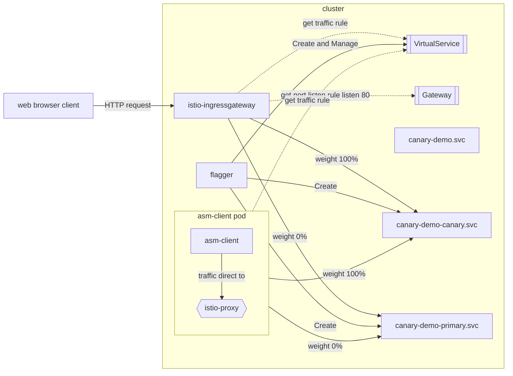

# ACP 部署策略

## Overview

在 Kubernetes 集群中使用标准滚动更新更新应用有时会带来风险。为降低风险，广泛采用了蓝绿部署和金丝雀部署等高级部署策略。Alauda Container Platform 完全兼容 Kubernetes API，并支持这些方法。

下面介绍这些策略的原理及流量管理方式：

### 理解部署策略

#### 蓝绿部署

蓝绿部署中，新版本部署到非活动的 Green 环境。准备就绪后，所有用户流量瞬间从 Blue 环境切换到 Green 环境。

#### 金丝雀部署

金丝雀部署逐步向少部分用户引入新版本，旧版本和新版本并行运行。流量逐渐以小幅度转移到新版本，便于监控问题。

### 理解实现方式

Alauda Container Platform 提供四种实现蓝绿和金丝雀部署的方法。

| 章节 | 自动化           | 底层机制             | 流量类型                  | 部署策略               |
| ----- | ---------------- | -------------------- | ------------------------- | ---------------------- |
| 1     | ACP API          | K8S Service          | 南北向和东西向            | 仅蓝绿部署             |
| 2     | ACP API          | ALB/Nginx Ingress    | 仅南北向                  | 蓝绿和金丝雀部署       |
| 3     | ACP API          | Istio VirtualService | 南北向和东西向            | 蓝绿和金丝雀部署       |
| 4     | ASM API (Flagger) | Istio VirtualService | 南北向和东西向            | 蓝绿和金丝雀部署       |

**注意**：基于 Argo Rollouts 的替代方法详见 ACP Deployment Strategies with Argo Rollouts。

#### 方法 1：使用 Kubernetes Service 实现蓝绿部署

该方法利用 Kubernetes Service 在版本间切换流量：

1. 部署新版本（green），使用不同的 Pod 标签（如 `version: green`），同时保持旧版本（blue）运行，标签为 `version: blue`。
2. 初始时，Kubernetes Service 通过选择器（如 `app: web, version: blue`）指向 blue pods。
3. 切换时，更新 Service 的选择器，将 `version` 标签改为 green。
4. 流量立即从 blue pods 切换到 green pods，实现零停机。
5. 确认新版本正常后，可安全缩减或删除 blue 部署。

此方法利用原生 Kubernetes 资源简单实现蓝绿部署，无需额外工具。

#### 方法 2：使用 ALB 或 Nginx Ingress 实现蓝绿和金丝雀部署

该方法使用 ALB 负载均衡器或 Nginx Ingress 控制应用版本间流量：

1. 部署两个版本：
   - 当前版本为 `app-v1`（Deployment 和 Service）
   - 新版本为 `app-v2`（Deployment 和 Service）
2. 蓝绿部署：
   - 初始时，Ingress/ALB 配置将 100% 流量导向 `app-v1`
   - 切换时，更新配置将 100% 流量导向 `app-v2`
   - 实现瞬时切换，零停机
3. 金丝雀部署：
   - 初始时，大部分流量（如 95%）导向 `app-v1`，少部分（如 5%）导向 `app-v2`
   - 逐步增加导向 `app-v2` 的流量，同时监控问题
   - 直至 100% 流量导向 `app-v2`

此方法仅对南北向（外部）流量提供入口级别的流量控制。

#### 方法 3：使用 Istio Virtual Service 实现蓝绿和金丝雀部署

该方法利用 Istio 强大的流量管理能力：

1. 部署两个版本：
   - 当前版本为 `app-v1`（Deployment 和 Service）
   - 新版本为 `app-v2`（Deployment 和 Service）
2. 配置 Istio 资源：
   - 创建 Istio Gateway 处理入站流量
   - 定义 VirtualService 控制版本间流量分配
3. 蓝绿部署：
   - 初始时，VirtualService 配置将 100% 流量导向 `app-v1`
   - 切换时，更新权重将 100% 流量导向 `app-v2`
   - 实现瞬时切换，风险极小
4. 金丝雀部署：
   - 初始时，少量流量（如 5%）导向 `app-v2`，大部分流量（95%）导向 `app-v1`
   - 逐步调整权重增加导向 `app-v2` 的流量，同时监控问题
   - 直至 100% 流量导向 `app-v2`

此方法对南北向（外部）和东西向（服务间）流量均提供全面控制。

#### 方法 4：使用 Istio VirtualService 和 Flagger 实现蓝绿和金丝雀部署

该方法利用 Alauda Service Mesh 中的 Flagger 自动化高级部署策略：

1. 更新应用时，Flagger 创建新的临时部署（canary）
2. 根据配置，流量逐步从原版本转移到 canary 版本
3. Flagger 持续监控关键指标，如错误率和响应时间
4. 出现问题时，自动回滚到之前稳定版本
5. 蓝绿部署时，Flagger 实现瞬时流量切换，零停机

此方法消除部署过程中的人工干预，通过自动指标检测和回滚确保应用可靠性。

## Chapter 1. 使用 Kubernetes Service 实现蓝绿部署

在 ACP（Alauda Container Platform）中，用户可通过 `kubectl` 命令管理 Kubernetes 资源，实现蓝绿部署策略。

该过程涉及两个相同的应用环境——`blue` 代表当前生产版本，`green` 代表待发布的新版本。本文档将逐步介绍如何：

1. 并行创建 green（新）部署。
2. 实现流量从 blue 到 green 的零停机切换。
3. 验证流量路由。

该策略利用标准 Kubernetes 原语实现安全发布和即时回滚。

### 前提条件

1. 已安装 Alauda Container Platform。
2. 由 ACP 管理的 Kubernetes 集群。
3. 一个项目用于创建命名空间。
4. 集群中用于部署应用的命名空间。
5. 安装带有 `kubectl-acp` 插件的 `kubectl` 命令行工具，用于 ACP 平台认证。
6. 使用 `kubectl acp login` 命令认证集群。

### 初始应用部署

首先定义“blue”版本应用，即用户当前访问的版本。示例中容器镜像版本为 `hello:1.23.1`，标签为 `app=web` 和 `version=blue`。

blue 版本的 Deployment YAML 示例：

```yaml
apiVersion: apps/v1
kind: Deployment
metadata:
  name: blue
spec:
  replicas: 3
  selector:
    matchLabels:
      app: web
      version: blue
  template:
    metadata:
      labels:
        app: web
        version: blue
    spec:
      containers:
        - name: web
          image: hello:1.23.1
          ports:
            - containerPort: 80
```

保存为 `blue-deployment.yaml`，执行：

```shell
kubectl apply -f blue-deployment.yaml
```

部署需要一个 Service 暴露 blue 部署，Service 通过标签选择器转发流量，初始选择器指向 `version=blue` 的 pods。

```yaml
apiVersion: v1
kind: Service
metadata:
  name: web
spec:
  selector:
    app: web
    version: blue
  ports:
  - protocol: TCP
    port: 80
    targetPort: 80
```

确认 blue 部署正常运行，列出 pods：

```shell
kubectl get pods -l app=web,version=blue
```

确保所有 3 个副本处于 `Running` 状态，表示应用已准备好接收流量。

确认 `web` 服务正确转发流量到 blue 部署，执行：

```shell
kubectl describe service web | grep Endpoints
```

输出应列出 blue pods 的 IP 地址，表示流量终端。

### 蓝绿部署操作步骤

#### 步骤 1：创建 green 部署

准备新版本 green 部署，配置与 blue 部署相同，但镜像版本（如 `hello:1.23.2`）和标签（`version=green`）不同。

```yaml
apiVersion: apps/v1
kind: Deployment
metadata:
  name: green
spec:
  replicas: 3
  selector:
    matchLabels:
      app: web
      version: green
  template:
    metadata:
      labels:
        app: web
        version: green
    spec:
      containers:
        - name: web
          image: hello:1.23.2
          ports:
            - containerPort: 80
```

**YAML 字段说明：**

- 与 blue 部署相同，区别在于：
  - `metadata.name` 改为 `green`
  - `spec.selector.matchLabels.version` 改为 `green`
  - `spec.template.metadata.labels.version` 改为 `green`
  - `containers.image` 更新为新镜像版本

保存为 `green-deployment.yaml`，执行：

```shell
kubectl apply -f green-deployment.yaml
```

完成新版本部署准备。

#### 步骤 2：验证 green 部署

执行以下命令确认 green pods 正常运行：

```shell
kubectl get pods -l app=web,version=green
```

确认有 3 个运行中的 pods，表示新版本已部署并可用。

#### 步骤 3：切换流量到 green

将 `web` 服务选择器更新为指向 green 版本：

```shell
kubectl patch service web -p '{"spec":{"selector":{"version":"green"}}}'
```

此操作立即生效，所有流量切换到 green pods。

#### 步骤 4：验证流量路由到 green

确认服务已指向 green 部署：

```shell
kubectl describe service web | grep Endpoints
```

输出应显示 green pods 的 IP，表示流量切换成功。

至此，使用 ACP 和 Kubernetes 完成零停机蓝绿部署。

## Chapter 2. 使用 ALB 或 Nginx Ingress 实现蓝绿和金丝雀部署

在 ACP 中，可使用 ALB 作为 Gateway API Provider 实现部署的流量控制。

### 概念

- **ALB**：ACP 负载均衡器，定制的 Nginx ingress 控制器，提供高级流量管理功能。
- **Gateway**：定义集群内服务流量路由方式的资源。
- **HTTPRoute**：基于规则和条件定义 HTTP 流量如何路由到服务的资源。

### 前提条件

1. 已安装 Alauda Container Platform，且有可用 Kubernetes 集群。
2. 一个项目用于创建命名空间。
3. 集群中已部署 ALB 并分配给项目。
4. 集群中用于部署应用的命名空间。
5. 安装带有 `kubectl-acp` 插件的 `kubectl` 命令行工具，用于 ACP 平台认证。
6. 使用 `kubectl acp login` 命令认证集群。

### 初始应用部署

创建稳定版本应用，即用户当前访问的版本。示例中副本数、容器镜像版本（如 `hello:1.23.1`）和标签（如 `app=web-stable`）均已配置。

示例 YAML：

```yaml
apiVersion: apps/v1
kind: Deployment
metadata:
  name: web-stable
spec:
  replicas: 2
  selector:
    matchLabels:
      app: web-stable
  template:
    metadata:
      labels:
        app: web-stable
    spec:
      containers:
        - name: web
          image: hello:1.23.1
          ports:
            - containerPort: 80
```

保存并应用：

```shell
kubectl apply -f web-stable-deployment.yaml
```

Service 根据标签选择器转发流量，初始选择器指向 `app=web-stable` 的 pods。

```yaml
apiVersion: v1
kind: Service
metadata:
  name: web-stable
spec:
  selector:
    app: web-stable
  ports:
  - protocol: TCP
    port: 80
    targetPort: 80
```

以 `example.com` 为示例域名，创建 Gateway 以域名暴露服务：

```yaml
apiVersion: gateway.networking.k8s.io/v1
kind: Gateway
metadata:
  name: default
spec:
  gatewayClassName: exclusive-gateway
  listeners:
  - allowedRoutes:
      namespaces:
        from: All
    name: gateway-metric
    port: 11782
    protocol: TCP
  ## 该路由指向
  ## 服务
  - allowedRoutes:
      namespaces:
        from: All
    hostname: example.com
    name: web
    port: 80
    protocol: HTTP
```

Gateway 会分配外部 IP，从资源的 `status.addresses` 中获取 IP 地址：

```yaml
apiVersion: gateway.networking.k8s.io/v1
kind: Gateway
metadata:
  name: default
...
status:
  addresses:
  - type: IPAddress
    value: 192.168.134.30
```

在 DNS 服务器配置域名解析到该 IP，使用命令验证：

```shell
nslookup example.com
Server:         192.168.16.19
Address:        192.168.16.19#53

Non-authoritative answer:
Name:   example.com
Address: 192.168.134.30
```

应返回 Gateway 的 IP。

创建 HTTPRoute，将流量路由到服务，连接 Gateway 和 Service，路由到稳定版本 pods：

```yaml
apiVersion: gateway.networking.k8s.io/v1
kind: HTTPRoute
metadata:
  name: web
spec:
  hostnames:
  ## 确保主机名与域名一致
  - example.com
  parentRefs:
  ## Gateway 资源引用匹配
  - group: gateway.networking.k8s.io
    kind: Gateway
    name: default
    namespace: default # 根据实际命名空间修改
    sectionName: web
  rules:
  ## 添加服务到路由
  - backendRefs:
    - group: ""
      kind: Service
      name: web-stable
      namespace: default # 根据实际命名空间修改
      port: 80
      weight: 100
    matches:
    - path:
        type: PathPrefix
        value: /
```

保存为 yaml 文件，应用：

```shell
kubectl apply -f httproute.yaml
```

### 蓝绿和金丝雀部署操作步骤

部署完成后，可创建新版本（canary）并路由流量测试新版本，验证后再切换。

#### 步骤 1：创建 canary 部署和服务

创建 Kubernetes Service 暴露 canary 部署，Service 根据标签选择器转发流量，初始选择器指向 `app=web-canary` 的 pods。

```yaml
# web-canary-deployment.yaml
apiVersion: apps/v1
kind: Deployment
metadata:
  name: web-canary
spec:
  replicas: 2
  selector:
    matchLabels:
      app: web-canary
  template:
    metadata:
      labels:
        app: web-canary
    spec:
      containers:
        - name: web
          # 新版本应用
          image: hello:1.23.2
          ports:
            - containerPort: 80
---
# web-canary-service.yaml
apiVersion: v1
kind: Service
metadata:
  name: web-canary
spec:
  selector:
    app: web-canary
  ports:
  - protocol: TCP
    port: 80
    targetPort: 80
```

应用：

```shell
kubectl apply -f web-canary-deployment.yaml
kubectl apply -f web-canary-service.yaml
```

允许外部访问 canary 部署。

#### 步骤 2：更新 HTTPRoute 添加 canary 并切换流量

更新 HTTPRoute，添加 canary 版本：

```yaml
apiVersion: gateway.networking.k8s.io/v1
kind: HTTPRoute
metadata:
  name: web
spec:
  [...]
  rules:
  - backendRefs:
    ## 添加 canary 服务，权重为 0
    - group: ""
      kind: Service
      name: web-canary
      namespace: default
      port: 80
      weight: 0
    ## 稳定版本保持不变
    - group: ""
      kind: Service
      name: web-stable
      namespace: default
      port: 80
      weight: 100
    matches:
    - path:
        type: PathPrefix
        value: /
```

应用：

```shell
kubectl apply -f httproute.yaml
```

#### 步骤 3：切换流量到 canary

更新 HTTPRoute，切换流量到 canary 版本：

```yaml
apiVersion: gateway.networking.k8s.io/v1
kind: HTTPRoute
metadata:
  name: web
spec:
  [...]
  rules:
  - backendRefs:
    - group: ""
      kind: Service
      name: web-canary
      namespace: default
      port: 80
      ## 切换流量到 canary
      weight: 100
    - group: ""
      kind: Service
      name: web-stable
      namespace: default
      port: 80
      ## 移除稳定版本流量
      weight: 0
    matches:
    - path:
        type: PathPrefix
        value: /
```

应用：

```shell
kubectl apply -f httproute.yaml
```

蓝绿部署时，将 `web-stable` 权重设为 0%，`web-canary` 权重设为 100%，实现流量瞬时切换。金丝雀部署时，两版本权重介于 0% 和 100% 之间，逐步转移流量。

验证新版本后，可删除或缩减旧版本。

## Chapter 3. 使用 Istio VirtualService 实现蓝绿和金丝雀部署

利用 Istio Gateway 和 VirtualService 功能，ACP 实现高效的流量管理，支持 Kubernetes 服务的蓝绿和金丝雀部署策略。

### 概念

- **Gateway**：定义网格外部入站流量的处理方式，包括端口、协议和主机名。与 VirtualService 配合控制入口流量。
- **Virtual Service**：Istio 资源，用于定义请求如何路由到服务。

### 前提条件

1. 已安装 Alauda Container Platform，且有可用 Kubernetes 集群。
2. 安装 Alauda Service Mesh 4.0，包含 Istio 1.22。
3. 安装带有 `kubectl-acp` 插件的 `kubectl` 命令行工具，用于 ACP 平台认证。
4. 使用 `kubectl acp login` 命令认证集群。

### 初始应用部署

定义稳定版本应用，即用户当前访问版本。使用相同的稳定部署，容器镜像版本为 `hello:1.23.1`，标签为 `app=web` 和 `version=stable`。

```yaml
apiVersion: apps/v1
kind: Deployment
metadata:
  name: web-stable
spec:
  replicas: 2
  selector:
    matchLabels:
      app: web
      version: stable
  template:
    metadata:
      labels:
        app: web
        version: stable
    spec:
      containers:
        - name: web
          image: hello:1.23.1
          ports:
            - containerPort: 80
```

服务选择器初始指向 `app=web` 和 `version=stable` 的 pods。

```yaml
apiVersion: v1
kind: Service
metadata:
  name: web-stable
spec:
  selector:
    app: web
    version: stable
  ports:
  - protocol: TCP
    port: 80
    targetPort: 80
```

Gateway 资源用于暴露命名空间中的 VirtualService：

```yaml
apiVersion: networking.istio.io/v1alpha3
kind: Gateway
metadata:
  name: istio-rollout-gateway
spec:
  selector:
    istio: ingressgateway
  servers:
  - port:
      number: 80
      name: http
      protocol: HTTP
    hosts:
    - "*"
```

为 Gateway 分配外部 IP，需在 `istio-system` 命名空间中存在 LoadBalancer 类型的服务：

```yaml
apiVersion: v1
kind: Service
metadata:
  labels:
    app: istio-ingressgateway
    istio: ingressgateway
    istio.io/rev: 1-22
  name: rollout-ingressgateway
  namespace: istio-system
spec:
  ports:
  - name: http2
    port: 80
    protocol: TCP
    targetPort: 8080
  - name: https
    port: 443
    protocol: TCP
    targetPort: 8443
  selector:
    app: istio-ingressgateway
    istio: ingressgateway
  sessionAffinity: None
  type: LoadBalancer
```

VirtualService 定义流量如何路由到不同版本（子集）的服务，实现蓝绿或金丝雀部署的细粒度流量控制，通过 HTTP 和/或 TCP 路由规则按权重分配流量。

```yaml
apiVersion: networking.istio.io/v1
kind: VirtualService
metadata:
  name: web
spec:
  gateways:
  - istio-rollout-gateway
  hosts:
  - rollout-demo.asm.com
  - asm-demo
  http:
  - route:
    - destination:
        host: web-stable
      weight: 100
  tcp:
  - route:
    - destination:
        host: web-stable
      weight: 100
```

接下来定义“preview”版本应用，即将逐步引入的新版本。创建 Deployment，配置副本数、容器镜像版本（如 `hello:1.23.2`）和标签 `app=web`、`version=preview`。

示例 YAML：

```yaml
apiVersion: apps/v1
kind: Deployment
metadata:
  name: web-preview
spec:
  replicas: 2
  selector:
    matchLabels:
      app: web
      version: preview
  template:
    metadata:
      labels:
        app: web
        version: preview
    spec:
      containers:
        - name: web
          image: hello:1.23.2
          ports:
            - containerPort: 80
```

应用配置：

```shell
kubectl apply -f preview-deployment.yaml
```

创建 Kubernetes Service 暴露 preview 部署，选择器指向 `app=web` 和 `version=preview` 的 pods。

```yaml
apiVersion: v1
kind: Service
metadata:
  name: web-preview
spec:
  selector:
    app: web
    version: preview
  ports:
  - protocol: TCP
    port: 80
    targetPort: 80
```

应用：

```shell
kubectl apply -f web-preview-service.yaml
```

允许外部访问 preview 部署。

### VirtualService 蓝绿部署操作步骤

使用 VirtualService 实现蓝绿部署，通过修改 HTTP 或 TCP 路由中权重字段。初始时，100% 流量导向蓝色（stable）版本，0% 导向绿色（preview）版本。验证 green 版本后，更新 YAML，将 green 权重设为 100，blue 权重设为 0。

更新 YAML：

```yaml
apiVersion: networking.istio.io/v1
kind: VirtualService
metadata:
  name: web
spec:
  gateways:
  - istio-rollout-gateway
  hosts:
  - rollout-demo.asm.com
  - asm-demo
  http:
  - route:
    - destination:
        host: web-stable
      weight: 0
    - destination:
        host: web-preview
      weight: 100
  tcp:
  - route:
    - destination:
        host: web-stable
      weight: 0
    - destination:
        host: web-preview
      weight: 100
```

应用：

```shell
kubectl apply -f virtual-service.yaml
```

应用此变更后，所有流量转发至 preview 部署。

### VirtualService 金丝雀部署操作步骤

使用 VirtualService 实现金丝雀部署，通过修改 HTTP 或 TCP 路由中权重字段。初始时，100% 流量导向稳定版本，0% 导向金丝雀（preview）版本。

更新 YAML，设置稳定和金丝雀版本间的流量权重。例如，初始 90/10，`web-stable` 权重 90，`web-canary` 权重 10。

随着新版本稳定，逐步调整权重（如 30%、50%、100%），并重新应用 YAML。

通过此方式，流量逐步转移到金丝雀部署。

## Chapter 4. 使用 Istio VirtualService 和 Flagger 实现蓝绿和金丝雀部署

在 ACP 中，Flagger 利用 Istio 流量管理能力自动化渐进式交付策略，如金丝雀发布和蓝绿部署。本章介绍如何在 Alauda Service Mesh 中使用 Flagger 实现这些策略。

### 概念

- **Flagger**：渐进式交付 operator，自动化 Kubernetes 上应用的发布流程。
- **CanaryDelivery**：定义 Flagger 管理部署流程的自定义资源。
- **VirtualService**：Istio 资源，Flagger 管理以控制版本间流量路由。

### 前提条件

1. 已安装 Alauda Container Platform，且有可用 Kubernetes 集群。
2. 安装 Alauda Service Mesh 4.0，包含 Istio 1.22。
3. 安装带有 `kubectl-acp` 插件的 `kubectl` 命令行工具，用于 ACP 平台认证。
4. 使用 `kubectl acp login` 命令认证集群。

### 金丝雀部署操作步骤

金丝雀部署逐步将流量从稳定版本转移到新版本，同时监控指标确保可靠性。

#### 步骤 1：创建 canary Flagger 资源

创建 `CanaryDelivery` 资源，定义金丝雀部署管理方式：

```yaml
apiVersion: asm.alauda.io/v1alpha1
kind: CanaryDelivery
metadata:
  annotations:
    argocd.argoproj.io/sync-wave: "600"
    argocd.argoproj.io/sync-options: SkipDryRunOnMissingResource=true
  name: canary-demo
  namespace: flagger-demo
spec:
  service:
    gateways:
    - flagger-demo/istio-rollout-gateway
    - mesh
    hosts:
    - canary-demo.asm.com
    - canary-demo.flagger-demo.svc.cluster.local  #you can specify k8s svc name use fqdn assocaite the deployment,support multi svc
  analysis:
    interval: 2m
    maxWeight: 50
    stepWeight: 5
    threshold: 10
  delivertype: canary
  maxResponseTime: 500
  minSuccessRate: 95
  promoteControl: system
  targetRef:
    name: canary-demo
  trafficControl: system
```

应用：

```shell
kubectl apply -f canary-delivery.yaml
```

**YAML 字段说明：**

- `spec.service.gateways`：指定用于流量路由的网关。
- `spec.service.hosts`：定义访问服务的主机名。
- `spec.analysis`：配置金丝雀部署的分析参数：
  - `interval`：Flagger 检查指标的频率（2 分钟）。
  - `maxWeight`：金丝雀最大流量百分比（50%）。
  - `stepWeight`：每次增加的流量百分比（5%）。
  - `threshold`：晋升前的检查次数。
- `spec.delivertype`：部署策略（canary）。
- `spec.maxResponseTime` 和 `spec.minSuccessRate`：指标阈值。
- `spec.targetRef.name`：引用管理的部署。

#### 步骤 2：验证主部署准备就绪

创建 `CanaryDelivery` 后，Flagger 自动创建所需资源：

```shell
kubectl get deployments.apps -n flagger-demo
kubectl get svc -n flagger-demo
kubectl get ep -n flagger-demo
```

Flagger 创建：

- 带 `-primary` 后缀的新部署用于服务流量
- 名为 `-canary` 和 `-primary` 的服务端点
- 修改原服务以选择 primary 部署

流量流程示意：



#### 步骤 3：触发金丝雀部署

更新原部署镜像，启动金丝雀流程：

```shell
kubectl set image deploy canary-demo http=quay.io/codefresh/rollouts-demo:red -n flagger-demo
# OR
kubectl set image deploy canary-demo http=quay.io/codefresh/rollouts-demo:green -n flagger-demo
```

Flagger 开始金丝雀分析。

#### 步骤 4：监控部署进度

可通过以下方式监控金丝雀部署：

1. Alauda Service Mesh UI 监控指标  
   

2. 演示 UI  
   

3. 观察 VirtualService 变化

   ```shell
   kubectl get vs canary-demo -n flagger-demo -o yaml --watch
   ```

**Alauda Service Mesh 金丝雀晋升阶段：**

1. 扫描金丝雀部署
2. 检查部署状态
3. 逐步增加流量权重（起始 5%）
4. 每步检查指标
5. 指标不达标时中止
6. 达到目标权重（50%）时晋升为主版本
7. 完成流量迁移
8. 缩减金丝雀部署


#### 步骤 5：晋升和回滚选项

**选项 1：自动晋升**  
等待所有步骤完成，基于指标自动晋升。

**选项 2：手动回滚**  
使用 CLI 回滚：

```shell
# 一行命令快速执行
kubectl label $(kubectl get canaryevents.asm.alauda.io -n flagger-demo \
  -l asm.cpaas.io/msname=canary-demo \
  --sort-by='{.metadata.creationTimestamp}' \
  -o name | tail -n 1) action=rollback -n flagger-demo
```

命令解析：

```shell
# 第 1 步：获取当前 Canary 事件
# - 按创建时间自动排序
# - 通过标签选择器过滤
# - 提取资源名称
CANARY_EVENT=$(kubectl get canaryevents.asm.alauda.io -n flagger-demo \
  -l asm.cpaas.io/msname=canary-demo \
  --sort-by='{.metadata.creationTimestamp}' \
  -o name | tail -n 1)

# 第 2 步：触发回滚
# - 给当前事件打上 rollback 标签
# - 启动 Flagger 回滚流程
kubectl label ${CANARY_EVENT} action=rollback -n flagger-demo
```

**查看金丝雀历史：**

*UI 方式：*

1. 查看事件历史  
   

2. 查看具体事件详情  
   

*CLI 方式：*

```shell
kubectl get canaryevents.asm.alauda.io -l asm.cpaas.io/msname=canary-demo -n flagger-demo
```

### 蓝绿部署操作步骤

蓝绿部署创建完整新环境，验证后一次性切换流量。

#### 步骤 1：创建蓝绿 Flagger 资源

创建配置为蓝绿部署的 `CanaryDelivery` 资源：

```yaml
apiVersion: asm.alauda.io/v1alpha1
kind: CanaryDelivery
metadata:
  name: bluegreen-demo
  namespace: flagger-demo
spec:
  service:
    gateways:
    - flagger-demo/istio-rollout-gateway
    - mesh
    hosts:
    - bluegreen-demo.flagger-demo.svc.cluster.local  #you can specify k8s svc name use fqdn assocaite the deployment,support multi svc
    - bluegreen-demo.asm.com
  analysis:
    interval: 4m
    maxWeight: 100
    stepWeight: 100
    threshold: 10
  delivertype: canary
  maxResponseTime: 500
  minSuccessRate: 95
  promoteControl: system
  targetRef:
    name: bluegreen-demo
  trafficControl: system
```

应用：

```shell
kubectl apply -f bluegreen-delivery.yaml
```

**蓝绿配置关键区别：**

- `stepWeight: 100`：确保流量一次性切换
- `maxWeight: 100`：允许全量流量切换
- `interval: 4m`：更长的验证间隔

#### 步骤 2：验证主部署准备就绪

检查 Flagger 创建的资源：

```shell
kubectl get deployments.apps -n flagger-demo
kubectl get svc -n flagger-demo
kubectl get ep -n flagger-demo
```

#### 步骤 3：触发蓝绿部署

更新镜像启动蓝绿部署：

```shell
kubectl set image deploy bluegreen-demo http=quay.io/codefresh/rollouts-demo:red -n flagger-demo
# OR
kubectl set image deploy bluegreen-demo http=quay.io/codefresh/rollouts-demo:green -n flagger-demo
```

#### 步骤 4：监控蓝绿部署进度

蓝绿发布步骤：

1. 发现新版本
2. 扩容 canary（green）
3. 将流量全部路由到 canary
4. 将 canary 规格覆盖主版本（blue）
5. 等待主版本滚动更新
6. 将流量路由到主版本
7. 缩减 canary

确保平滑切换，无请求丢失。

#### 步骤 5：晋升或回滚

晋升和回滚流程与金丝雀部署相同，支持基于指标自动晋升或通过 UI 手动干预。

## 结论

Alauda Container Platform (ACP) 提供多种蓝绿和金丝雀部署策略，各有优势和适用场景。本文介绍了四种不同方法：

1. **使用 Kubernetes Service 实现蓝绿部署**：
   - 利用原生 Kubernetes 资源
   - 简单实现，零停机
   - 适用于南北向和东西向流量
   - 仅支持蓝绿部署

2. **使用 ALB 或 Nginx Ingress**：
   - 在入口层提供流量控制
   - 支持蓝绿和金丝雀部署
   - 仅限南北向（外部）流量
   - 通过权重调整实现细粒度流量控制

3. **使用 Istio VirtualService**：
   - 利用 Istio 强大流量管理能力
   - 支持蓝绿和金丝雀部署
   - 适用于南北向和东西向流量
   - 需手动配置和监控

4. **使用 Istio VirtualService 和 Flagger**：
   - 自动化部署流程，渐进式流量切换
   - 提供基于指标的自动晋升或回滚
   - 支持蓝绿和金丝雀部署
   - 提供全面监控和可视化
   - 适用于南北向和东西向流量

选择部署策略时，请考虑：

- **流量类型**：若需管理外部及服务间流量，优先考虑方法 1、3 或 4。
- **自动化需求**：需全自动、基于指标晋升，方法 4 最佳。
- **复杂度**：方法 1 最简单但功能有限，方法 3 和 4 功能更强但需额外组件。
- **监控需求**：方法 4 提供最全面监控和自动回滚能力。

Alauda Container Platform 灵活支持多种部署策略，助您根据需求选择最合适方案，实现可靠高效的应用更新，最大限度降低风险和停机。
